# GL&R ERP — Complete Documentation Bundle

This file concatenates all 12 documentation files for the GL&R HR & Sales ERP,
generated from the actual codebase (database schema V21). Hand this whole file to
Claude together with the report-generation prompt to produce a consolidated report.

---


<!-- ============================================================ -->
<!-- SOURCE FILE: 01_ERP_Overview.md -->
<!-- ============================================================ -->

# GL&R ERP — System Overview

| | |
|---|---|
| **System** | GL&R HR & Sales ERP (HR Portal) |
| **Document** | 01 — ERP Overview |
| **Version** | 1.0 |
| **Date** | 2 July 2026 |
| **Status** | Current — reflects the system as built (database schema V21) |
| **Repository** | `GL-R-ERP` (frontend: React + Vite · backend: Spring Boot · agents: Python) |

---

## Table of Contents

1. [Executive Summary](#1-executive-summary)
2. [Business Context](#2-business-context)
3. [Module Map](#3-module-map)
4. [User Roles & Access Model](#4-user-roles--access-model)
5. [Technology Stack](#5-technology-stack)
6. [Scope: Proposed vs. Delivered](#6-scope-proposed-vs-delivered)
7. [Document Set Guide](#7-document-set-guide)
8. [Appendix A — Future Work & Roadmap](#appendix-a--future-work--roadmap)

---

## 1. Executive Summary

The GL&R ERP is an integrated web application that digitizes the company's core Human Resources (HR) and Sales operations. It replaces manual, spreadsheet-driven processes with a single system covering:

- **Employee management** — a complete employee master file with self-service profile-change requests.
- **Attendance** — automatic collection of clock-in/out events from the ZKTeco SC700 card scanner via an on-premise agent.
- **Overtime (OT) and leave** — request → approval workflows with automatic quota and rate enforcement.
- **Sales tickets, quotations & documents** — a full sales-ticket lifecycle from customer inquiry through price approval to issued quotation/deposit-notice documents.
- **Commission** — tiered commission calculation on closed deals, with clawback support, feeding directly into payroll.
- **Payroll** — automatic calculation of salary, OT, commission, social security (SSO), progressive withholding tax and deductions, with a downloadable bank-transfer text file.

The system is accessed through a web browser on desktop or mobile. All access is authenticated, role-based, and audited: HR access to sensitive personal data is written to a tamper-evident audit log.

**Current deployment:** a cloud demo runs at `gl-r-erp.onrender.com` (backend on Render, frontend on Vercel, database on Supabase PostgreSQL). Production operation on the company's own Dell T360 server is the planned next step (see [Appendix A](#appendix-a--future-work--roadmap)).

## 2. Business Context

GL&R previously handled HR and sales administration manually. The original project proposals (the Thai-language *HR System Summary* and the *GL_R Sales System Proposal*) defined two systems that were built as one integrated ERP on a shared employee master and login:

| Source document | Scope it defined |
|---|---|
| สรุปรายละเอียดเรื่องระบบ HR (HR System Summary) | Employee management, dashboards, attendance, OT, leave, sales commission, payroll, AI assistant |
| GL_R Sales System Proposal | Sales ticket workflow, quotation/price-approval flow, sales documents |
| 01 Diagram Network GL_R | On-premise network: server, NAS, card scanner on one LAN |

## 3. Module Map

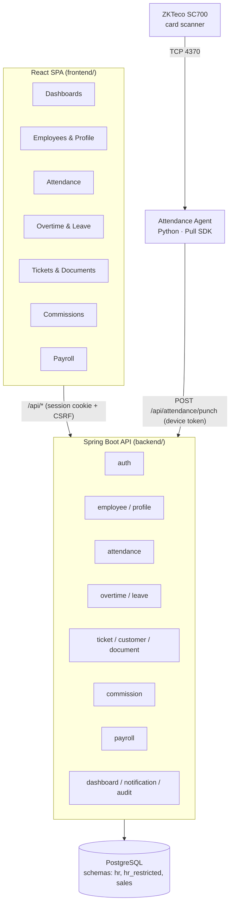

| Module | What it does | Key backend package |
|---|---|---|
| Employee Management | Employee master CRUD, assignment history, salary history, restricted PII vault | `employee`, `profile` |
| Dashboards | Role-aware summary for HR and employees | `dashboard` |
| Attendance | Device punch ingestion, `.dat` import/backfill, punch history, per-device agent tokens | `attendance` + `agents/attendance` |
| Overtime | Pre-approval OT requests, 1.5×/3.0× rates, division-manager approval | `overtime` |
| Leave | Sick/vacation/personal leave with quota enforcement and attachments flag | `leave` |
| Sales Tickets | Ticket lifecycle: submit → pickup → propose price → approve → quotation → close | `ticket` |
| Customers & Documents | Customer directory; quotation / deposit-notice document generation with revisions | `customer`, `document` |
| Commission | Tiered commission on invoices, approval, clawback, payroll feed | `commission` |
| Payroll | Preview/process monthly payroll; bank-transfer text export | `payroll` |
| Notifications | In-app notification feed | `notification` |
| Audit | Immutable log of sensitive-data access and payroll actions | `audit` |

## 4. User Roles & Access Model

Roles are **derived from HR data** (division/ฝ่าย and position), not assigned by hand — so they survive employee re-imports. See `backend/src/main/java/th/co/glr/hr/auth/DivisionAccessPolicy.java`.

| Role | Derived from | Access highlights |
|---|---|---|
| `ceo` | MD division or กรรมการ-family position | Company-wide; approves ticket prices, commissions |
| `hr` | HR (บุคคล) division | Employee master, approvals, payroll, audit-logged PII access |
| `sales_manager` | Sales (SA) division + manager position (ผู้จัดการ) | Ticket price approval, commission approval/clawback |
| `sales` | Sales (SA) division | Own tickets, customers, documents, commissions |
| `import` | Foreign purchasing (PCIM) division | Foreign-purchase price proposals on tickets |
| `employee` | Everyone else | Own profile, attendance, OT, leave, dashboard |
| `admin` | System bootstrap account | Full access (operations) |

Additionally, any employee whose position contains **ผู้จัดการ** (manager, incl. assistant manager) is flagged a **division manager**: they approve OT for — and can view attendance of — everyone sharing their ฝ่าย (division).

## 5. Technology Stack

| Layer | Technology | Notes |
|---|---|---|
| Frontend | React 18 + Vite | SPA, ESLint + jsx-a11y, Vitest + React Testing Library |
| Backend | Spring Boot 3.5.x LTS on Java 21 LTS | REST API, Spring Security, Spring Session JDBC |
| Database | PostgreSQL 16 | Flyway migrations **V1–V21**; schemas `hr`, `hr_restricted`, `sales` |
| Device agent | Python 3 | ZKTeco **Pull SDK** (`plcommpro.dll`) on Windows (Dell T360) |
| Cloud (demo) | Render (backend, Docker, Singapore) · Vercel (frontend + `/api` proxy) · Supabase (Postgres) | Blueprint in `render.yaml`, proxy in `vercel.json` |
| CI/CD | GitHub Actions | Backend tests, frontend lint/tests, Flyway-against-real-Postgres check, Dependabot + dependency-review SCA gate |

## 6. Scope: Proposed vs. Delivered

Honest status of every headline feature from the original proposals:

| # | Proposed feature | Status | Evidence / Note |
|---|---|---|---|
| 1 | Employee management + self-service edit requests | ✅ Delivered | `employee`, `profile` modules; V1–V4 schema |
| 2 | HR & employee dashboards | ✅ Delivered | `dashboard` module, role-aware frontend |
| 3 | Attendance from card scanner | ✅ Delivered | SC700 Pull SDK agent, punch API, `.dat` backfill |
| 4 | Overtime request/approve/auto-calc | ✅ Delivered | V14 schema; 1.5× workday / 3.0× holiday |
| 5 | Leave with quota auto-check | ✅ Delivered | V13 schema; SICK 30 d, VACATION 6 d, PERSONAL 3 d |
| 6 | Sales deals + commission auto-calc into payroll | ✅ Delivered | Tickets + V12 commission schema; `payroll-ready` feed |
| 7 | Payroll (salary, OT, commission, SSO, tax, deductions) | ✅ Delivered | `PayrollCalculator`; preview/process/audit |
| 7a | Bank transfer file | ⚠️ Partial | Generic pipe-delimited text export exists (`/api/payroll/{id}/bank-export`); **KBank-specific format not yet implemented** |
| 7b | PDF payslips e-mailed to employees | ❌ Not built | No PDF/e-mail pipeline in code |
| 7c | Automatic accounting summary e-mail | ❌ Not built | No e-mail integration (SendGrid) in code |
| 8 | AI assistant (policy chatbot, Gemini) | ❌ Not built | No AI integration in code |
| — | Lateness deduction in payroll | ⚠️ Partial | `attendance_daily.late_minutes` tracked in schema; not yet wired into payroll deduction |
| — | On-premise production hosting | ⏳ Pending | Cloud demo live; T360 go-live pending (see Appendix A) |

## 7. Document Set Guide

| Doc | Audience | Contents |
|---|---|---|
| [02_User_Manual](02_User_Manual.md) | End users | Per-role, per-screen walkthroughs |
| [03_Feature_Documentation](03_Feature_Documentation.md) | Business + engineering | Rules, workflows, state machines |
| [04_Technical_Architecture](04_Technical_Architecture.md) | Engineering | Components, security, CI/CD |
| [05_Database_Documentation](05_Database_Documentation.md) | Engineering / DBA | Schemas, ERD, migration history |
| [06_API_Documentation](06_API_Documentation.md) | Engineering / integrators | Every REST endpoint |
| [07_Hardware_Network_Documentation](07_Hardware_Network_Documentation.md) | IT / operations | LAN topology, SC700, agent ops |
| [08_Deployment_Guide](08_Deployment_Guide.md) | DevOps | Local, Docker, Render/Vercel |
| [09_Backup_Recovery](09_Backup_Recovery.md) | IT / operations | Backup & restore procedures |
| [10_Troubleshooting_Guide](10_Troubleshooting_Guide.md) | Support | Known failure modes & fixes |
| [11_UAT_Test_Cases](11_UAT_Test_Cases.md) | QA / business testers | Acceptance test cases |
| [12_Change_Log](12_Change_Log.md) | All | Release history by wave |

---

## Appendix A — Future Work & Roadmap

Items from the original proposals **not yet implemented**, plus gaps found in code review. Priority: 🔴 high · 🟡 medium · 🟢 nice-to-have.

### A.1 Payroll distribution pipeline 🔴

| Item | Why it matters | Effort | Dependencies |
|---|---|---|---|
| **KBank bank-file format** | The current export (`GLR_PAYROLL\|month\|count\|total` header + `account\|code\|name\|net` lines) is a placeholder; KBank requires its own fixed format for salary upload | Small — reformat existing data | KBank format spec from the bank |
| **PDF payslip generation** | Employees must receive individual payslips; today only HR sees payroll lines in-app | Medium — PDF template + per-line render | Payroll module (done) |
| **E-mail delivery (SendGrid)** | Payslips e-mailed to each employee; monthly summary e-mailed to accounting — both promised in the proposal | Medium — SendGrid API integration, retry/bounce handling | SendGrid account, PDF payslips |

### A.2 AI policy assistant (Gemini) 🟡

Chatbot answering policy questions 24/7 with regulation citations ("ฉันเหลือวันลาพักร้อนกี่วัน?"), refusing questions about other people's data. Requires: Gemini API key, employee-handbook corpus, retrieval layer, and strict per-user data scoping tied to the existing session role model. Effort: medium–large. Estimated running cost per the proposal: ~100–300 THB/month.

### A.3 Attendance → payroll integration 🟡

- **Lateness deduction** — `hr.attendance_daily` already computes `late_minutes`; wire an HR-configurable deduction rule into `PayrollCalculator`.
- **Absence detection** — mark no-show days from attendance and feed unpaid-leave deduction automatically (today unpaid-leave days are an HR input).

### A.4 Production go-live on premises 🔴

Per the network diagram and cost plan, production should run on the company's Dell T360 server (zero hosting cost) with the SC700 and NAS on the same LAN:

1. Provision PostgreSQL 16 + backend service on T360 (Docker compose already exists).
2. Domain name + Let's Encrypt TLS (~500–800 THB/yr per proposal).
3. Mint production per-device agent token; run the attendance agent as a Windows service.
4. **Parallel run** against the manual payroll for one full pay cycle, then go-live sign-off (proposal week 8 — not yet executed).

### A.5 Smaller items 🟢

| Item | Note |
|---|---|
| Company-wide leave calendar view | Leave data exists; a calendar visualization for HR/managers was proposed |
| Customer management UI (create/edit) | Backend has a read-only customer directory today (`GET /api/customers`) |
| Attendance device health monitoring | Agent logs locally; no server-side device-down alerting |
| Password reset by e-mail | Today: HR resets; forced change-password gate exists |
| Mobile app packaging | Web app is responsive; a native wrapper was not in scope |

*End of document.*


<!-- ============================================================ -->
<!-- SOURCE FILE: 02_User_Manual.md -->
<!-- ============================================================ -->

# GL&R ERP — User Manual

| | |
|---|---|
| **Document** | 02 — User Manual |
| **Version** | 1.0 · 2 July 2026 |
| **Audience** | All system users (employees, managers, HR, sales, executives) |

---

## Table of Contents

1. [Getting Started](#1-getting-started)
2. [For Every Employee](#2-for-every-employee)
3. [For Division Managers (ผู้จัดการฝ่าย)](#3-for-division-managers-ผู้จัดการฝ่าย)
4. [For HR](#4-for-hr)
5. [For Sales](#5-for-sales)
6. [For Sales Managers & Executives](#6-for-sales-managers--executives)
7. [For Foreign Purchasing (Import)](#7-for-foreign-purchasing-import)
8. [Notifications](#8-notifications)
9. [Frequently Asked Questions](#9-frequently-asked-questions)

---

## 1. Getting Started

### 1.1 Signing in

1. Open the portal in any modern browser (desktop or mobile).
   - Demo environment: `https://gl-r-erp.vercel.app` (API at `gl-r-erp.onrender.com`).
2. Enter your **company e-mail** and password.
3. **First sign-in:** the system forces you to set a new password before you can continue (temporary passwords are single-use by policy).

> 🔒 After several failed attempts the account is temporarily locked (rate limiting). Wait and retry, or contact HR.

### 1.2 What you see depends on who you are

Your menu is built from your role, which the system derives automatically from your division (ฝ่าย) and position — there is nothing to configure. See [01_ERP_Overview §4](01_ERP_Overview.md#4-user-roles--access-model).

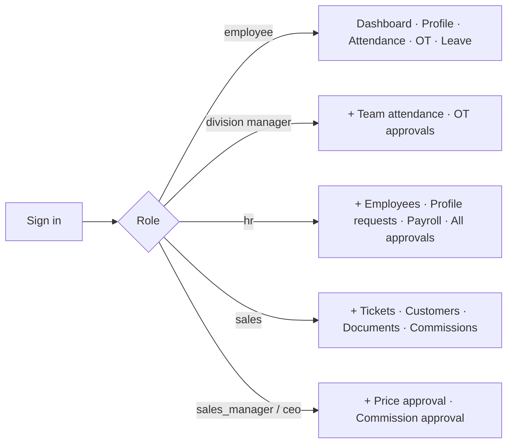

### 1.3 Changing your password

**Menu → Change password** (or `POST /api/auth/change-password` behind the scenes). Enter your current password and the new one twice.

---

## 2. For Every Employee

### 2.1 Your dashboard

Shows your leave balances, recent attendance, pending requests, and company announcements.

### 2.2 Your profile & requesting corrections

You can view your own profile (personal details, assignment history). You **cannot edit it directly** — instead:

1. Open **Profile → Request change**.
2. Enter the corrected value (phone, address, emergency contact, …).
3. Submit. HR reviews the request; you can track its status under **My Requests** (`pending → approved / rejected`).

### 2.3 Attendance

**Attendance** shows your own clock-in/out history in real time, as collected from the SC700 card scanner. If a punch is missing, notify HR (they can backfill from the device's `.dat` archive).

### 2.4 Requesting overtime (OT)

OT must be requested **in advance** and approved before it counts toward pay:

1. **Overtime → New request**.
2. Choose the date, planned start/end time, day type (**workday** = 1.5× rate, **holiday** = 3.0× rate) and a reason (required).
3. Submit → status `SUBMITTED`. Your division manager (or HR) approves or rejects it.
4. After approval, actual worked minutes are recorded and the payable amount flows into that month's payroll automatically.
5. You can **cancel** your own request while it is still pending.

### 2.5 Requesting leave

1. **Leave → New request**.
2. Choose the type — the annual quotas are enforced automatically:

   | Type | Thai | Annual quota | Attachment |
   |---|---|---|---|
   | Sick | ลาป่วย | 30 days | Required (e.g., medical certificate) |
   | Vacation | ลาพักร้อน | 6 days | — |
   | Personal | ลากิจ | 3 days | — |

3. If your remaining balance is insufficient the system rejects the request immediately and tells you why.
4. Track status under **Leave**; you may cancel a pending request.

---

## 3. For Division Managers (ผู้จัดการฝ่าย)

Anyone whose position contains **ผู้จัดการ** (including assistant managers) automatically gets manager access over their own ฝ่าย:

| Action | Where |
|---|---|
| View attendance of everyone in your division | **Attendance** (division filter applied automatically) |
| Approve / reject OT requests from your division | **Overtime → Pending** |
| See the list of employees you can act on | **Overtime → Employees** |

Approving OT records you as the approver; rejected requests require no further action from the employee.

---

## 4. For HR

### 4.1 Employee management

- **Employees** lists the full employee master with search and filters (division, department, status). Large lists support pagination.
- **Add employee** creates the full record: personal data, assignment (division/department/position), bank account, addresses, family, education, salary history.
- **Edit** updates any section; assignment changes keep a dated history automatically.
- Access to sensitive fields (PII, salary) is **audit-logged** — every view/change of restricted data leaves a permanent trail.

### 4.2 Profile-change requests

**Profile Requests** shows all employee-submitted corrections. Approve (applies the change to the master record) or reject with a note.

### 4.3 Attendance administration

- View all punches across sites/devices; filter by employee, division, or date.
- **Import `.dat` file** (`Attendance → Import`) to backfill historical punches exported from the device or ZKAccess software.
- **Rotate device token** if an agent credential must be replaced (see [07_Hardware_Network_Documentation](07_Hardware_Network_Documentation.md)).

### 4.4 OT & leave administration

HR sees all OT and leave requests company-wide and can approve, reject, or cancel any of them, alongside division managers.

### 4.5 Payroll (monthly)

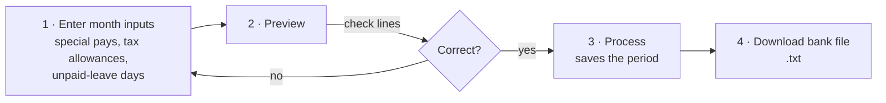

1. **Payroll → Preview**: pick the month. The system pulls every active employee, their approved OT pay and approved commissions for that month, applies SSO and progressive withholding tax, and shows the complete calculation per person.
2. Adjust per-employee inputs (special pays 1–8, tax allowances, unpaid-leave days, student-loan / legal-execution deductions) and re-preview.
3. **Process** finalizes the period. Processing is recorded with your identity and audit-logged.
4. **Bank export** downloads `glr-payroll-<period>.txt` — one line per employee (`bank account | employee code | name | net pay`).
   > ⚠️ This is a generic format. The KBank-specific upload format is on the roadmap ([01 Overview, Appendix A.1](01_ERP_Overview.md#a1-payroll-distribution-pipeline-)). Payslip PDF/e-mail is also not yet available — distribute statements manually for now.

---

## 5. For Sales

### 5.1 Sales tickets

A **ticket** tracks one customer deal from inquiry to closure:

1. **Tickets → New**: enter customer, items (product, size, quantity), and notes.
2. **Submit** the ticket into the queue.
3. Track its lifecycle on the ticket detail page — every action is recorded as an event, and you can comment on the ticket at any point.
4. When pricing is approved and the customer confirms, generate documents (below) and **close** the ticket.

See the full state machine in [03_Feature_Documentation §5](03_Feature_Documentation.md#5-sales-tickets).

### 5.2 Customers

**Customers** is a searchable directory used when creating tickets and documents.

### 5.3 Documents (quotation / deposit notice)

From a ticket: **Create document draft** → pick a note template → edit line items and notes → **Preview** → **Issue**. Issued documents get a running document number and a downloadable file. Corrections after issue go through a **revision** (the ticket's revision number increments; the old document stays on file).

### 5.4 Commissions

1. After a deal closes, **Commissions → Submit** with the invoice details (tax-invoice reference, amounts).
2. The system computes the commission from the configured tier structure automatically.
3. A sales manager approves it; approved commissions for the month flow into payroll automatically.
4. Use the **simulator** to preview a commission before submitting.

---

## 6. For Sales Managers & Executives

| Action | Where |
|---|---|
| Approve / reject proposed ticket prices | Ticket detail → price proposal |
| Approve commissions | **Commissions → Pending** |
| Record a **clawback** (e.g., cancelled invoice) | Commission detail → Clawback; the negative amount offsets the next payroll |
| Adjust commission deductions | Commission detail → Deductions |

Executives (`ceo`) see all of the above company-wide.

## 7. For Foreign Purchasing (Import)

The `import` role (PCIM division) participates in the ticket flow by picking up tickets that need foreign-purchase pricing and submitting **price proposals** for manager approval.

## 8. Notifications

The bell icon shows in-app notifications (e.g., a ticket assigned to you, a request decided). Click one to mark it read. *E-mail notifications are not yet implemented.*

## 9. Frequently Asked Questions

| Question | Answer |
|---|---|
| I forgot my password | Contact HR — they reset it; you'll be forced to set a new one at next sign-in. |
| My clock-in is missing | The device may have been offline; HR can backfill from the device `.dat` archive. |
| Why was my leave rejected instantly? | Your remaining quota for that leave type was insufficient — the system checks automatically. |
| Can I do OT without prior request? | No. OT must be requested and approved in advance to be payable. |
| Who can see my salary? | Only HR/payroll roles; every access is written to the audit log. |
| Can I use my phone? | Yes — the portal is responsive and works in any mobile browser. |

*End of document.*


<!-- ============================================================ -->
<!-- SOURCE FILE: 03_Feature_Documentation.md -->
<!-- ============================================================ -->

# GL&R ERP — Feature Documentation

| | |
|---|---|
| **Document** | 03 — Feature Documentation |
| **Version** | 1.0 · 2 July 2026 |
| **Audience** | Business owners, engineers, QA |
| **Scope** | Every implemented feature, its business rules and edge cases. Unbuilt items live in [01 Overview, Appendix A](01_ERP_Overview.md#appendix-a--future-work--roadmap). |

---

## Table of Contents

1. [Authentication & Access Control](#1-authentication--access-control)
2. [Employee Management](#2-employee-management)
3. [Attendance](#3-attendance)
4. [Overtime & Leave](#4-overtime--leave)
5. [Sales Tickets](#5-sales-tickets)
6. [Customers & Documents](#6-customers--documents)
7. [Commission](#7-commission)
8. [Payroll](#8-payroll)
9. [Dashboards, Notifications & Audit](#9-dashboards-notifications--audit)

---

## 1. Authentication & Access Control

**Code:** `backend/src/main/java/th/co/glr/hr/auth/`

| Rule | Detail |
|---|---|
| Credentials | Company e-mail + BCrypt-hashed password (`hr.employee.password_hash`, V11). E-mails are normalized on login. |
| First login | `must_change_password` forces a password change before any other action. |
| Rate limiting | `LoginRateLimitFilter` + `LoginAttemptTracker` lock out repeated failures. |
| Session | Server-side `HttpSession`, persisted to Postgres via Spring Session JDBC (V19) — sessions survive backend restarts and support horizontal scaling. |
| CSRF | Double-submit cookie pattern on mutating requests. |
| Role derivation | `DivisionAccessPolicy` maps division (ฝ่าย) + position → role at login. Roles: `admin`, `ceo`, `sales_manager`, `hr`, `sales`, `import`, `employee` (`ApplicationRoles`). No manually-assigned user table — V5 removed `app_user` UAM in favor of data-driven derivation. |
| Manager capability | Position containing **ผู้จัดการ** ⇒ `manager=true` on the session principal, scoped to the holder's `division_id`. |
| Enforcement | `SessionSecurityFilter` converts the session role to `ROLE_*` authorities; controllers guard with `@PreAuthorize` (e.g., payroll = `hasAnyRole('HR','ADMIN')`). Null-division employees fall back safely to `employee` (fixed in PR #55). |

## 2. Employee Management

**Code:** `employee/`, `profile/` · **Schema:** V1–V4

- Full employee master: identity, assignment (division → department → position with dated history), bank accounts, addresses, family, children, education, prior employment, salary history, resignation.
- **Restricted PII vault:** national-ID-grade fields live in a separate schema `hr_restricted.employee_pii`; HR reads of sensitive data are audit-logged (`aca8867`, V18).
- **Employee codes** are generated from a dedicated sequence (V3).
- **Self-service change requests** (`hr.profile_change_request`, V2): employees submit corrections; HR approves (auto-applies) or rejects. Performance indexes added in V4.
- **List pagination** is opt-in via query parameters (PR #59), keeping backward compatibility for existing consumers.

## 3. Attendance

**Code:** backend `attendance/` + Python agent `agents/attendance/` · **Schema:** V7, V20

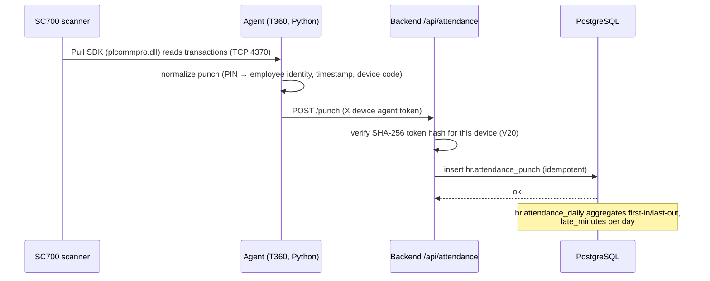

| Rule | Detail |
|---|---|
| Device | ZKTeco SC700; the device **requires the Pull SDK** (`plcommpro.dll`) — the older `pyzk` protocol does not work with it (PR #66). Identity on device = employee **PIN**. |
| Agent auth | Each device has its own token; only the SHA-256 hash is stored (`attendance_device.agent_token_hash`). HR can **rotate** a token via `POST /api/attendance/devices/{deviceCode}/agent-token` (PR #61). |
| Historical backfill | `.dat` transaction files (from the device or ZKAccess) can be imported via `POST /api/attendance/imports/dat` or the CLI; an exporter regenerates `.dat` from device memory for backfill (PR #68). Import files and row-level errors are recorded (`attendance_import_file`, `attendance_import_error`). |
| Upload safety | `.dat` uploads are size-capped (hardening commit `96d768d`). |
| Coexistence | `pause-for-zkaccess.ps1` / `resume-agent.ps1` stop and restart the agent so ZKAccess maintenance can hold the single device session (PR #67). |
| Visibility | Employees see their own punches; division managers see their division; HR sees everything. |
| Lateness | `attendance_daily.late_minutes` is computed and stored. ⚠️ Not yet fed into payroll deductions (roadmap A.3). |

## 4. Overtime & Leave

**Code:** `overtime/`, `leave/` · **Schema:** V14, V13

### Overtime rules

| Rule | Value |
|---|---|
| Request timing | In advance, with mandatory reason |
| Day types & rates | `WORKDAY` → **1.50×** · `HOLIDAY` → **3.00×** (DB-enforced: `chk_overtime_multiplier`) |
| Statuses | `SUBMITTED → APPROVED / REJECTED / CANCELLED` (DB-enforced) |
| Approver | Division manager for their ฝ่าย, or HR/admin |
| Payroll feed | Approved OT's payable minutes × hourly rate × multiplier lands in that month's payroll automatically |
| Integrity | Planned end > start; actual minutes non-negative (DB constraints) |

### Leave rules

| Type | Quota/yr | Attachment required |
|---|---|---|
| ลาป่วย (Sick) | 30.00 days | ✅ |
| ลาพักร้อน (Vacation) | 6.00 days | — |
| ลากิจ (Personal) | 3.00 days | — |

- Balance check is automatic at submission; insufficient quota ⇒ immediate rejection with reason.
- Balances tracked per employee per type (`hr.leave_balance`).
- Approve/reject/cancel mirror the OT workflow.
- V13's duplicate `leave_type` creation vs. V1 was fixed for fresh databases (PR #52); CI now runs all migrations against real Postgres to prevent regressions (PR #53).

## 5. Sales Tickets

**Code:** `ticket/` · **Schema:** V6, V8–V10, V17

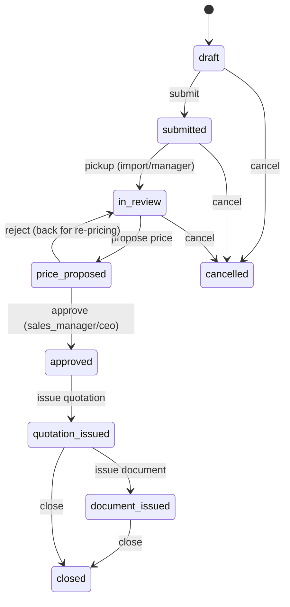

- Tickets carry customer info, line items (product, **size** (V9), quantity), priority (`LOW/NORMAL/HIGH`), payment/delivery status.
- Every transition writes a `ticket_event` (kind, from→to status, actor) — a complete audit trail per ticket. Comments are events too.
- Item edits after submission flag the ticket (`has_edits`, V10) so approvers see it changed.
- Item inserts are batched into a single round-trip (perf commit `888c645`).
- **Revisions:** correcting an issued document increments `ticket.revision_no` (V17) and keeps prior documents on file.

## 6. Customers & Documents

**Code:** `customer/`, `document/` · **Schema:** V16, V17

- **Customer directory** (`sales.customer`): searchable read-only list feeding tickets/documents (PR #56).
- **Note templates** (`sales.document_note_template`): reusable standard clauses for documents.
- **Documents** (quotations, deposit notices): drafted from a ticket → line items copied/edited (`sales.document_item`) → previewed → **issued** with a number from `sales.document_sequence` → file downloadable via `GET /api/documents/{id}/file`.
- Document types/plans originate from `docs/QUOTATION_AND_REVISION_PLAN` and the quotation template workbook (`docs/quotation_template_source.xlsx`).

## 7. Commission

**Code:** `commission/` · **Schema:** V12

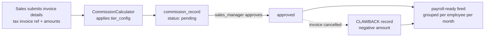

- **Tier structure** (`sales.tier_config`, seeded in V12): progressive rate by cumulative sales volume — 0.25 % on the first 250 000 THB, rising by 0.25 pp per 250 000 THB band (2.25 % at the 2.0–2.25 M band), with a high-roller flag for the top band. Rates are data — HR/management can retune without code changes.
- Kinds: `SALE` and `CLAWBACK` (negative, offsets future payroll).
- Deductions on a record are adjustable pre-approval (`PATCH /deductions`).
- A **simulator** endpoint lets sales preview a commission without saving.
- `GET /api/commissions/payroll-ready` aggregates approved amounts per employee for a payroll month — this is the contract the payroll module consumes.

## 8. Payroll

**Code:** `payroll/` · **Schema:** V15 (extends V1's `payroll_period`/`payroll_line`)

### Calculation pipeline (`PayrollCalculator`)

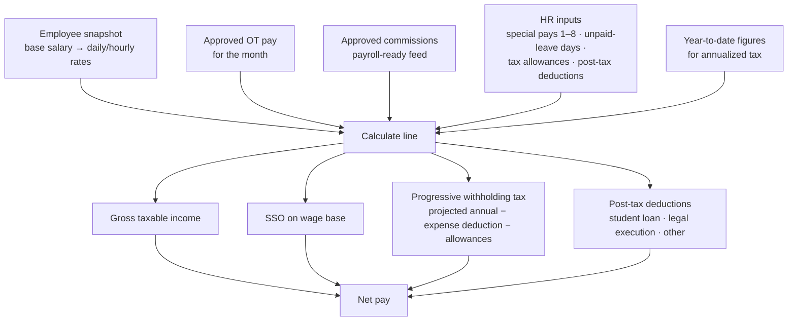

| Rule | Detail |
|---|---|
| Preview vs. process | **Preview** is side-effect-free; **Process** persists the period + lines with the processor's identity and timestamp. Both are HR/admin-only and audit-logged (`PROCESS_PAYROLL`). |
| Tax | Thai progressive PIT: projected annual income → expense deduction → allowances → annual tax → monthly withholding, using year-to-date data for accuracy. |
| SSO | Calculated on a capped wage base. |
| Bank export | `GET /api/payroll/{periodId}/bank-export` → `glr-payroll-<id>.txt`: header `GLR_PAYROLL\|month\|lineCount\|totalNet`, then `bankAccount\|employeeCode\|name\|netPay` per line. Export is audit-logged (`EXPORT_PAYROLL_BANK_FILE`). ⚠️ KBank's own format is roadmap A.1. |

## 9. Dashboards, Notifications & Audit

- **Dashboard** (`GET /api/dashboard/summary`): role-aware aggregates (headcounts, pending approvals, attendance summary) rendered as HR or employee dashboard in the SPA.
- **Notifications**: in-app feed with per-item mark-as-read (`PATCH /api/notifications/{id}/read`); populated by ticket-flow events. *No e-mail channel yet.*
- **Audit log** (`hr.audit_log`, V18): sensitive reads and payroll actions record actor, action, target, and touched fields (e.g., `bank_account,net_pay`). Log output is redaction-hardened (`96d768d`).

*End of document.*


<!-- ============================================================ -->
<!-- SOURCE FILE: 04_Technical_Architecture.md -->
<!-- ============================================================ -->

# GL&R ERP — Technical Architecture

| | |
|---|---|
| **Document** | 04 — Technical Architecture |
| **Version** | 1.0 · 2 July 2026 |
| **Audience** | Engineering |

---

## Table of Contents

1. [System Context](#1-system-context)
2. [Repository Layout](#2-repository-layout)
3. [Runtime Architecture](#3-runtime-architecture)
4. [Request Flow & Session Model](#4-request-flow--session-model)
5. [Security Architecture](#5-security-architecture)
6. [Data Architecture](#6-data-architecture)
7. [CI/CD](#7-cicd)
8. [Quality & Testing](#8-quality--testing)
9. [Key Architectural Decisions](#9-key-architectural-decisions)

---

## 1. System Context

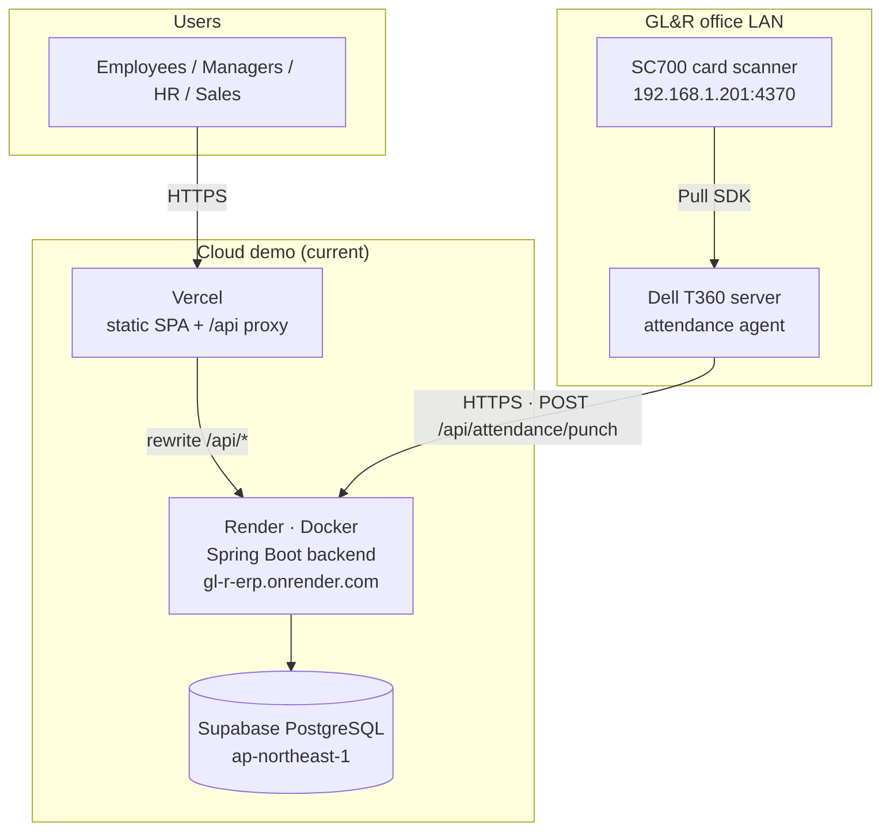

The Vercel rewrite keeps browser calls **same-origin** (`/api/* → gl-r-erp.onrender.com`), so CORS is only a fallback and cookies stay first-party.

## 2. Repository Layout

```text
GL-R-ERP/
├── frontend/          React 18 + Vite SPA (features/, components/, api/)
├── backend/           Spring Boot 3.5.x (Java 21), Maven
│   └── src/main/java/th/co/glr/hr/
│       ├── auth/         login, sessions, role derivation, rate limiting
│       ├── employee/     employee master CRUD
│       ├── profile/      self-service change requests
│       ├── attendance/   punch ingestion, .dat import, device tokens
│       ├── overtime/     OT workflow
│       ├── leave/        leave workflow
│       ├── ticket/       sales ticket lifecycle
│       ├── customer/     customer directory
│       ├── document/     quotation / deposit-notice generation
│       ├── commission/   tier calc, approval, clawback
│       ├── payroll/      calculation, processing, bank export
│       ├── dashboard/    role-aware summary
│       ├── notification/ in-app notifications
│       ├── audit/        audit log writes
│       ├── common/       ApiException + handler
│       └── config/       CORS, properties, seeding
│   └── src/main/resources/db/migration/   Flyway V1–V21
├── agents/attendance/  Python SC700 agent + ops scripts (Windows)
├── docker-compose.yml  local Postgres 16 + backend
├── render.yaml         Render blueprint (backend)
└── vercel.json         frontend build + /api proxy + security headers
```

Backend modules follow **package-by-feature**: each domain owns its controller, service, repository (plain JDBC/SQL), and DTOs. There is no shared ORM layer; repositories issue explicit SQL against Flyway-managed schemas.

## 3. Runtime Architecture

| Component | Technology | Responsibility |
|---|---|---|
| SPA | React 18, Vite | All UI; talks only to `/api/*`; role-gated navigation |
| API | Spring Boot 3.5.16, Java 21 | Business rules, authorization, persistence |
| DB | PostgreSQL 16 | Three schemas: `hr`, `hr_restricted`, `sales`; also stores HTTP sessions |
| Agent | Python 3 + Pull SDK DLL | Reads SC700 transactions, posts normalized punches |
| Proxy/CDN | Vercel | Static hosting, `/api` rewrite, security headers (CSP, HSTS, XFO…) |

## 4. Request Flow & Session Model

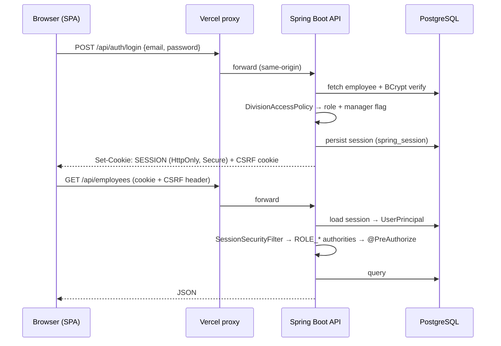

- `UserPrincipal` (serializable record) carries `id, email, name, role, employeeId, active, mustChangePassword, divisionId, manager`.
- Sessions live in `hr.spring_session` (V19) — restart-safe and multi-instance-ready.
- Unknown routes return **404** (not 500) via the API exception handler (PR #65).

## 5. Security Architecture

| Control | Implementation |
|---|---|
| Password storage | BCrypt (`password_hash`, V11); startup backfill runner for legacy rows |
| Forced rotation | `must_change_password` gate blocks all other endpoints |
| Brute-force defense | Login rate limiting + account lockout (`LoginRateLimitFilter`) |
| CSRF | Double-submit cookie |
| Transport/browser | Vercel headers: CSP (`default-src 'self'`), HSTS, `X-Frame-Options: DENY`, `nosniff`, no-referrer |
| AuthZ | `@PreAuthorize` role guards per endpoint; division-scoped manager checks in services |
| PII isolation | `hr_restricted.employee_pii` schema; HR reads audit-logged |
| Audit | `hr.audit_log` (V18): actor, action, target, fields — used for PII access, payroll process/export |
| Device auth | Per-device agent tokens, SHA-256-hashed at rest, rotatable (V20) |
| Upload safety | `.dat` size cap; log redaction; non-root container (`96d768d`) |
| Supply chain | Dependabot + `dependency-review-action` SCA gate; `npm audit` in CI |

## 6. Data Architecture

Details in [05_Database_Documentation](05_Database_Documentation.md). Principles:

- **Flyway-only schema changes** — V1..V21, forward-fix policy (no down-migrations).
- **Constraint-enforced business rules** — OT multipliers, ticket statuses, leave quotas are CHECK-constrained/seeded in the DB, not just app code.
- **Separation of sensitive data** — `hr_restricted` schema isolates PII from routine queries.
- **Event sourcing (light)** — `sales.ticket_event` records every ticket transition for traceability.

## 7. CI/CD

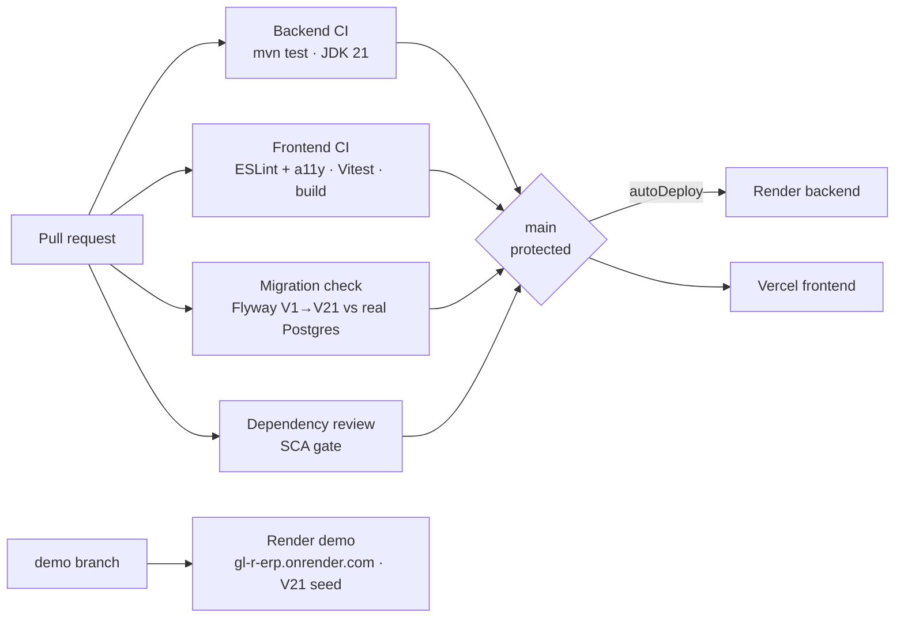

- `main` is protected; work lands via feature branch + PR (one issue per PR).
- Dependabot keeps GitHub Actions and dependencies current.

## 8. Quality & Testing

| Layer | Harness |
|---|---|
| Backend unit/controller | JUnit + Spring MockMvc (`backend/src/test/...`), incl. negative auth-access cases |
| Backend repositories | **Real-Postgres integration tests** (PR #63) — SQL runs against an actual database in CI |
| Migrations | Full Flyway run against real Postgres in CI (PR #53) |
| Frontend | Vitest + React Testing Library harness (PR #62); ESLint + `jsx-a11y` |
| Accessibility | Modal focus management, toast live regions, labeled controls (`36dac76`) |

## 9. Key Architectural Decisions

| Decision | Rationale |
|---|---|
| **Data-driven roles** (V5 removed `app_user` UAM) | Roles derive from division/position so bulk employee re-imports can't orphan permissions |
| **Pull SDK over pyzk** (PR #66) | The SC700 does not speak the pyzk protocol; `plcommpro.dll` verified against the real device |
| **Sessions in Postgres** (PR #60) | Restart-safe login on Render's ephemeral containers; enables scale-out |
| **LTS stack pin** (PR #51) | Spring Boot 3.5.x / Java 21 / Node LTS chosen over bleeding-edge (JDK 25 CI retired) for stability |
| **Same-origin proxy on Vercel** | Avoids CORS/third-party-cookie problems entirely |
| **Plain SQL repositories** | Transparent queries, no ORM magic; pairs with real-Postgres integration tests |
| **Forward-fix migrations** | V13's fresh-DB collision was fixed forward (PR #52) and guarded by CI, not rolled back |

*End of document.*


<!-- ============================================================ -->
<!-- SOURCE FILE: 05_Database_Documentation.md -->
<!-- ============================================================ -->

# GL&R ERP — Database Documentation

| | |
|---|---|
| **Document** | 05 — Database Documentation |
| **Version** | 1.0 · 2 July 2026 |
| **Engine** | PostgreSQL 16 |
| **Migrations** | Flyway `backend/src/main/resources/db/migration/` — **V1 → V21** (forward-fix policy) |

---

## Table of Contents

1. [Schema Overview](#1-schema-overview)
2. [Entity-Relationship Diagram](#2-entity-relationship-diagram)
3. [Table Catalog — HR Domain](#3-table-catalog--hr-domain)
4. [Table Catalog — Sales Domain](#4-table-catalog--sales-domain)
5. [Migration History](#5-migration-history)
6. [Conventions & Integrity Rules](#6-conventions--integrity-rules)

---

## 1. Schema Overview

| Schema | Purpose | Access posture |
|---|---|---|
| `hr` | Employee master, attendance, OT, leave, payroll, sessions, audit | Application role |
| `hr_restricted` | High-sensitivity PII (`employee_pii`) | Restricted; HR reads are audit-logged |
| `sales` | Tickets, quotations, documents, customers, commissions | Application role |

## 2. Entity-Relationship Diagram

Core entities and relationships (attribute lists abridged for readability):

```mermaid
erDiagram
    EMPLOYEE ||--o{ EMPLOYEE_ASSIGNMENT : "has history of"
    EMPLOYEE ||--o{ SALARY_HISTORY : has
    EMPLOYEE ||--o{ EMPLOYEE_BANK_ACCOUNT : has
    EMPLOYEE ||--o| EMPLOYEE_PII : "restricted vault"
    EMPLOYEE ||--o{ PROFILE_CHANGE_REQUEST : submits
    DIVISION ||--o{ DEPARTMENT : contains
    DIVISION ||--o{ EMPLOYEE : "ฝ่าย of"
    POSITION ||--o{ EMPLOYEE_ASSIGNMENT : "role in"

    EMPLOYEE ||--o{ ATTENDANCE_PUNCH : generates
    ATTENDANCE_DEVICE ||--o{ ATTENDANCE_PUNCH : records
    ATTENDANCE_SITE ||--o{ ATTENDANCE_DEVICE : hosts
    EMPLOYEE ||--o{ ATTENDANCE_DAILY : "aggregated per day"

    EMPLOYEE ||--o{ OVERTIME_REQUEST : requests
    EMPLOYEE ||--o{ LEAVE_REQUEST : requests
    LEAVE_TYPE ||--o{ LEAVE_REQUEST : classifies
    LEAVE_TYPE ||--o{ LEAVE_BALANCE : quotas
    EMPLOYEE ||--o{ LEAVE_BALANCE : holds

    PAYROLL_PERIOD ||--o{ PAYROLL_LINE : contains
    EMPLOYEE ||--o{ PAYROLL_LINE : "paid via"

    CUSTOMER ||--o{ TICKET : "subject of"
    TICKET ||--o{ TICKET_ITEM : contains
    TICKET ||--o{ TICKET_EVENT : "audit trail"
    TICKET ||--o{ QUOTATION : produces
    TICKET ||--o{ DOCUMENT : produces
    DOCUMENT ||--o{ DOCUMENT_ITEM : contains

    EMPLOYEE ||--o{ COMMISSION_RECORD : earns
    INVOICE_DETAILS ||--o{ COMMISSION_RECORD : "basis of"
    TIER_CONFIG ||..o{ COMMISSION_RECORD : "rates applied"

    EMPLOYEE ||--o{ AUDIT_LOG : "actions logged"
```

## 3. Table Catalog — HR Domain

### 3.1 Employee master (V1–V5, V11)

| Table | Purpose |
|---|---|
| `hr.employee` | Core employee record incl. `password_hash`, `must_change_password` (V11) |
| `hr.division` / `hr.department` | ฝ่าย / แผนก hierarchy |
| `hr.position`, `hr.employee_level`, `hr.title` | Position catalog, band (L/M…), name titles |
| `hr.employee_assignment` | Dated division/department/position history |
| `hr.salary_history` | Salary changes over time |
| `hr.employee_bank_account`, `hr.bank` | Payout account per employee |
| `hr.employee_address`, `hr.country` | Addresses |
| `hr.employee_family`, `hr.employee_child` | Family data |
| `hr.education_history`, `hr.prior_employment` | Background |
| `hr.employee_foreign_doc` | Work permits / foreign documents |
| `hr.employment_status`, `hr.resignation`, `hr.resignation_type` | Lifecycle |
| `hr.employee_emergency_contact` (V2) | Emergency contacts |
| `hr.profile_change_request` (V2, indexes V4) | Self-service corrections; status pending/approved/rejected |
| `hr_restricted.employee_pii` | Sensitive identifiers, isolated schema |
| `hr.employee_code_seq` (V3) | Employee-code generation |
| `hr.etl_error_log` | Import error capture |

> V5 dropped the standalone `app_user`/role/permission UAM tables — authentication now runs off `hr.employee` with data-derived roles.

### 3.2 Attendance (V7, V20)

| Table | Purpose |
|---|---|
| `hr.attendance_site` | Physical sites (e.g., SHOWROOM) |
| `hr.attendance_device` | Devices per site; `agent_token_hash CHAR(64)` + `agent_token_rotated_at` (V20) |
| `hr.attendance_punch` | Raw punches (employee, device, timestamp, direction) |
| `hr.attendance_daily` | Per-day aggregate: first-in/last-out, `late_minutes ≥ 0` |
| `hr.attendance_import_file` / `hr.attendance_import_error` | `.dat` import bookkeeping + row errors |

### 3.3 Leave & overtime (V13, V14)

| Table | Purpose / key constraints |
|---|---|
| `hr.leave_type` | Seeded: SICK 30 d (attachment ✅), VACATION 6 d, PERSONAL 3 d |
| `hr.leave_balance` | Remaining quota per employee/type/year |
| `hr.leave_request` | Status workflow; FK cascade on employee |
| `hr.overtime_request` | `day_type ∈ (WORKDAY, HOLIDAY)`; `pay_rate_multiplier ∈ (1.50, 3.00)`; `status ∈ (SUBMITTED, APPROVED, REJECTED, CANCELLED)`; planned/actual minute integrity checks; `payroll_month` link |

### 3.4 Payroll (V1 base, V15)

| Table | Purpose |
|---|---|
| `hr.payroll_period` | One row per processed month; `processed_at`, `processed_by_id` (V15) |
| `hr.payroll_line` | Per-employee result: base salary, daily/hourly rates, special pays 1–8 (+ total), `overtime_pay`, `commission_pay`, unpaid-leave days/deduction, gross taxable income, `sso_wage_base` + `social_security`, projected annual income → expense deduction → allowances → `annual_tax` → `withholding_tax`, student-loan / legal-execution / other post-tax deductions, `calculation_note` (V15) |

### 3.5 Platform (V18, V19)

| Table | Purpose |
|---|---|
| `hr.audit_log` (V18) | Actor, action (e.g., `PROCESS_PAYROLL`, `EXPORT_PAYROLL_BANK_FILE`), target, touched fields, timestamp |
| `hr.spring_session` + `hr.spring_session_attributes` (V19) | Server-side session store (Spring Session JDBC) |

## 4. Table Catalog — Sales Domain

### 4.1 Tickets & quotations (V6, V8–V10, V17)

| Table | Purpose / key constraints |
|---|---|
| `sales.ticket` | Deal record; `status ∈ (draft, submitted, in_review, price_proposed, approved, quotation_issued, document_issued, closed, cancelled)`; `priority ∈ (LOW, NORMAL, HIGH)`; `has_edits` (V10); `revision_no` (V17); payment/delivery status |
| `sales.ticket_item` | Line items; product fields (V8) + `size` (V9) |
| `sales.ticket_event` | Every transition/comment: kind, from→to status, actor |
| `sales.quotation` | Issued quotations |
| `sales.notification` | In-app notification feed |

### 4.2 Documents & customers (V16, V17)

| Table | Purpose |
|---|---|
| `sales.customer` (V16) | Customer directory |
| `sales.document_note_template` (V16) | Reusable clauses |
| `sales.document_sequence` (V17) | Running document numbers per type |
| `sales.document` (V17) | Quotation / deposit-notice header, status (draft→issued), file |
| `sales.document_item` (V17) | Document line items |

### 4.3 Commission (V12)

| Table | Purpose |
|---|---|
| `sales.invoice_details` | Tax-invoice metadata backing a commission |
| `sales.commission_record` | Kind `SALE`/`CLAWBACK`, amounts, deductions, status, payroll month |
| `sales.tier_config` | Seeded progressive bands: 0.25 % per 250 k THB band up to 2.25 %+, `is_high_roller` top band; `upper_bound NULL` = open-ended; rates retunable as data |

## 5. Migration History

| Version | Name | Summary |
|---|---|---|
| V1 | `employee_master_schema` | Full HR master, lookup tables, PII vault, base leave/payroll/UAM |
| V2 | `backend_extensions` | Emergency contacts, profile change requests |
| V3 | `employee_code_sequence` | Employee code generator |
| V4 | `profile_request_performance_indexes` | Indexes for request queues |
| V5 | `remove_app_user_uam` | Drop manual UAM → data-derived roles |
| V6 | `sales_ticket_schema` | Tickets, items, events, quotations, notifications |
| V7 | `attendance_schema` | Sites, devices, punches, daily aggregates, import bookkeeping |
| V8 | `ticket_item_product_fields` | Product attributes on items |
| V9 | `ticket_item_add_size` | `size` column |
| V10 | `ticket_has_edits` | Post-submit edit flag |
| V11 | `employee_password_hash` | BCrypt hash + forced-change flag |
| V12 | `sales_commission_schema` | Invoices, commission records, tier config (seeded) |
| V13 | `leave_management_schema` | Leave types (seeded), balances, requests |
| V14 | `overtime_management_schema` | OT requests with rate/day-type constraints |
| V15 | `payroll_processing_schema` | Full payroll-line calculation columns, processing metadata |
| V16 | `customers_and_note_templates` | Customer directory, note templates |
| V17 | `documents_and_revision` | Documents, items, sequences, ticket revisions |
| V18 | `audit_log` | Audit trail table |
| V19 | `spring_session_jdbc` | Session persistence |
| V20 | `attendance_device_agent_token` | Per-device token hash + rotation timestamp |
| V21 | `demo_seed_accounts` | Demo-branch seed accounts (Demo@2026, one per role) — demo environments only |

## 6. Conventions & Integrity Rules

- **Identity:** `BIGINT GENERATED ALWAYS AS IDENTITY` primary keys throughout.
- **Time:** `TIMESTAMPTZ` for instants; `DATE` for calendar concepts (payroll month normalized to day 1).
- **Money:** `NUMERIC(12,2)` (rates `NUMERIC(12,4)`, annual figures `NUMERIC(14,2)`) — never floating point.
- **Business rules in CHECK constraints** wherever stable (OT multipliers, statuses, tier bounds) so no code path can write invalid states.
- **Bilingual lookups:** reference tables carry `name_th` / `name_en`.
- **Forward-fix migrations:** never edit an applied migration; fix with a new version (see V13 incident, PR #52). CI executes the full chain against real Postgres on every PR.
- **Idempotent seeds:** `ON CONFLICT DO NOTHING` for seeded reference data.

*End of document.*


<!-- ============================================================ -->
<!-- SOURCE FILE: 06_API_Documentation.md -->
<!-- ============================================================ -->

# GL&R ERP — API Documentation

| | |
|---|---|
| **Document** | 06 — API Documentation |
| **Version** | 1.0 · 2 July 2026 |
| **Base URL** | `/api` (browser calls are same-origin via the Vercel proxy → `https://gl-r-erp.onrender.com/api`) |
| **Auth** | Session cookie (`SESSION`, HttpOnly/Secure) + CSRF double-submit header on mutations |
| **Content type** | `application/json` unless noted |

---

## Table of Contents

1. [Conventions](#1-conventions)
2. [Authentication](#2-authentication--apiauth)
3. [Employees](#3-employees--apiemployees)
4. [Profile Requests](#4-profile-requests--apiprofile-requests)
5. [Attendance](#5-attendance--apiattendance)
6. [Overtime](#6-overtime--apiovertime)
7. [Leave](#7-leave--apileave)
8. [Sales Tickets](#8-sales-tickets--apitickets)
9. [Customers](#9-customers--apicustomers)
10. [Documents](#10-documents--api)
11. [Commissions](#11-commissions--apicommissions)
12. [Payroll](#12-payroll--apipayroll)
13. [Dashboard & Notifications](#13-dashboard--notifications)

---

## 1. Conventions

- **Roles** referenced below map to `@PreAuthorize` guards in the controllers. Where no role is listed, any authenticated user may call it (service-layer scoping still applies — e.g., employees only see their own records).
- **Errors** use a consistent JSON envelope from `ApiExceptionHandler`. Unknown routes return **404** (PR #65); auth failures **401/403**; validation **400**.
- **Auth-logged** endpoints write to `hr.audit_log`.
- IDs are `BIGINT`. Money is decimal. Timestamps are ISO-8601 with offset.

## 2. Authentication — `/api/auth`

| Method | Path | Role | Description |
|---|---|---|---|
| POST | `/api/auth/login` | public | Log in with `{email, password}`; sets session + CSRF cookies. Enforces lockout on repeated failure. |
| POST | `/api/auth/change-password` | authenticated | `{currentPassword, newPassword}`; clears the forced-change gate. |
| POST | `/api/auth/logout` | authenticated | Invalidates the session. |
| GET | `/api/auth/me` | authenticated | Returns the current `UserPrincipal` (id, email, name, role, employeeId, divisionId, manager, mustChangePassword). |

## 3. Employees — `/api/employees`

| Method | Path | Role | Description |
|---|---|---|---|
| GET | `/api/employees` | HR/ADMIN (full list); others scoped | List/search employees; filters (division, department, status); opt-in pagination. |
| POST | `/api/employees` | HR/ADMIN | Create a full employee record. |
| GET | `/api/employees/{id}` | HR/ADMIN or self | Fetch one employee; sensitive fields audit-logged. |
| PATCH | `/api/employees/{id}` | HR/ADMIN | Partial update; assignment changes keep dated history. |

## 4. Profile Requests — `/api/profile-requests`

| Method | Path | Role | Description |
|---|---|---|---|
| GET | `/api/profile-requests` | HR (all) / employee (own) | List change requests. |
| POST | `/api/profile-requests` | authenticated | Submit a correction to own profile. |
| PATCH | `/api/profile-requests/{id}` | HR | Approve (applies change) or reject with note. |

## 5. Attendance — `/api/attendance`

| Method | Path | Role / Auth | Description |
|---|---|---|---|
| POST | `/api/attendance/punch` | **Device agent token** | Ingest a normalized punch from the SC700 agent. Token verified against the device's stored SHA-256 hash. |
| POST | `/api/attendance/devices/{deviceCode}/agent-token` | HR/ADMIN | Mint/rotate a device agent token; returns the plaintext once. |
| POST | `/api/attendance/imports/dat` | HR/ADMIN | Upload a `.dat` transaction file for historical backfill (size-capped). |
| GET | `/api/attendance/punches` | scoped | Punch history: employees see own, managers see division, HR all. Filters by employee/date. |

## 6. Overtime — `/api/overtime`

| Method | Path | Role | Description |
|---|---|---|---|
| GET | `/api/overtime` | scoped | List OT requests (own / division / all). |
| POST | `/api/overtime` | authenticated | Create an OT request (date, planned times, day type, reason). |
| GET | `/api/overtime/employees` | manager/HR | Employees whose OT the caller may approve. |
| POST | `/api/overtime/{id}/approve` | manager/HR | Approve; payable OT flows to payroll. |
| POST | `/api/overtime/{id}/reject` | manager/HR | Reject with reason. |
| POST | `/api/overtime/{id}/cancel` | owner (pending) | Cancel own pending request. |

## 7. Leave — `/api/leave`

| Method | Path | Role | Description |
|---|---|---|---|
| GET | `/api/leave` | scoped | List leave requests. |
| POST | `/api/leave` | authenticated | Submit leave; quota checked automatically. |
| GET | `/api/leave/employees` | manager/HR | Employees in approval scope. |
| GET | `/api/leave/types` | authenticated | Leave types + quotas. |
| GET | `/api/leave/balances` | scoped | Remaining balances. |
| POST | `/api/leave/{id}/approve` | manager/HR | Approve. |
| POST | `/api/leave/{id}/reject` | manager/HR | Reject. |
| POST | `/api/leave/{id}/cancel` | owner (pending) | Cancel own pending request. |

## 8. Sales Tickets — `/api/tickets`

| Method | Path | Role | Description |
|---|---|---|---|
| GET | `/api/tickets` | sales+ | List/search tickets. |
| POST | `/api/tickets` | sales+ | Create a draft ticket. |
| GET | `/api/tickets/{id}` | sales+ | Ticket detail incl. events. |
| POST | `/api/tickets/{id}/submit` | owner | Submit into queue. |
| POST | `/api/tickets/{id}/pickup` | import/manager | Take ownership for pricing. |
| POST | `/api/tickets/{id}/propose-price` | import/sales | Propose a price. |
| POST | `/api/tickets/{id}/approve` | SALES_MANAGER/CEO/ADMIN | Approve proposed price. |
| POST | `/api/tickets/{id}/reject` | SALES_MANAGER/CEO/ADMIN | Send back for re-pricing. |
| POST | `/api/tickets/{id}/quotation` | sales+ | Issue a quotation. |
| POST | `/api/tickets/{id}/close` | sales+ | Close the deal. |
| POST | `/api/tickets/{id}/cancel` | sales+ | Cancel the ticket. |
| PATCH | `/api/tickets/{id}/items` | sales+ | Edit line items (flags `has_edits`). |
| POST | `/api/tickets/{id}/comments` | sales+ | Add a comment (recorded as an event). |

## 9. Customers — `/api/customers`

| Method | Path | Role | Description |
|---|---|---|---|
| GET | `/api/customers` | sales+ | Searchable customer directory. |

## 10. Documents — `/api/...`

| Method | Path | Role | Description |
|---|---|---|---|
| GET | `/api/document-note-templates` | sales+ | List reusable note templates. |
| POST | `/api/tickets/{ticketId}/document/draft` | sales+ | Create a document draft from a ticket. |
| GET | `/api/tickets/{ticketId}/documents` | sales+ | List a ticket's documents. |
| GET | `/api/documents/{docId}` | sales+ | Fetch a document. |
| PUT | `/api/documents/{docId}` | sales+ | Edit a draft document. |
| POST | `/api/documents/{docId}/preview` | sales+ | Render a preview. |
| POST | `/api/documents/{docId}/issue` | sales+ | Issue with a running number. |
| GET | `/api/documents/{docId}/file` | sales+ | Download the generated file. |
| POST | `/api/tickets/{ticketId}/revision` | sales+ | Open a revision (bumps `revision_no`). |

## 11. Commissions — `/api/commissions`

| Method | Path | Role | Description |
|---|---|---|---|
| GET | `/api/commissions` | scoped | List commission records. |
| POST | `/api/commissions` | SALES/SALES_MANAGER/CEO/ADMIN | Submit a commission from invoice details. |
| PATCH | `/api/commissions/{id}/deductions` | SALES_MANAGER/CEO/ADMIN | Adjust deductions pre-approval. |
| POST | `/api/commissions/{id}/approve` | SALES_MANAGER/CEO/ADMIN | Approve; feeds payroll. |
| POST | `/api/commissions/{id}/clawback` | SALES_MANAGER/CEO/ADMIN | Record a negative clawback. |
| POST | `/api/commissions/simulator` | SALES/SALES_MANAGER/CEO/ADMIN | Preview commission without saving. |
| GET | `/api/commissions/payroll-ready` | HR/payroll | Approved amounts aggregated per employee/month. |

## 12. Payroll — `/api/payroll`

| Method | Path | Role | Description |
|---|---|---|---|
| GET | `/api/payroll` | HR/ADMIN | List processed periods. |
| POST | `/api/payroll/preview` | HR/ADMIN | Side-effect-free calculation for a month + inputs. |
| POST | `/api/payroll/process` | HR/ADMIN | Persist the period (audit-logged `PROCESS_PAYROLL`). |
| GET | `/api/payroll/{periodId}/bank-export` | HR/ADMIN | Download `glr-payroll-<id>.txt` (audit-logged `EXPORT_PAYROLL_BANK_FILE`). |

## 13. Dashboard & Notifications

| Method | Path | Role | Description |
|---|---|---|---|
| GET | `/api/dashboard/summary` | authenticated | Role-aware summary aggregates. |
| GET | `/api/notifications` | authenticated | In-app notification feed. |
| PATCH | `/api/notifications/{id}/read` | owner | Mark a notification read. |

*End of document.*


<!-- ============================================================ -->
<!-- SOURCE FILE: 07_Hardware_Network_Documentation.md -->
<!-- ============================================================ -->

# GL&R ERP — Hardware & Network Documentation

| | |
|---|---|
| **Document** | 07 — Hardware & Network Documentation |
| **Version** | 1.0 · 2 July 2026 |
| **Audience** | IT / operations |
| **Sources** | `01 Diagram Network GL_R.pdf`, `agents/attendance/` (README, field-test & setup guides) |

---

## Table of Contents

1. [Overview](#1-overview)
2. [On-Premise Network Topology](#2-on-premise-network-topology)
3. [Hardware Inventory](#3-hardware-inventory)
4. [Attendance Device — ZKTeco SC700](#4-attendance-device--zkteco-sc700)
5. [The Attendance Agent](#5-the-attendance-agent)
6. [Network Security Rules](#6-network-security-rules)
7. [Connectivity Checks](#7-connectivity-checks)

---

## 1. Overview

GL&R's design keeps the **capture** of attendance on the local network (server, NAS, card scanner on one LAN — per the network diagram) while the **application** currently runs in the cloud demo. The only bridge between the two is the attendance agent, which pulls punches locally and posts them outbound over HTTPS to the backend. No inbound port to the office is required.

## 2. On-Premise Network Topology

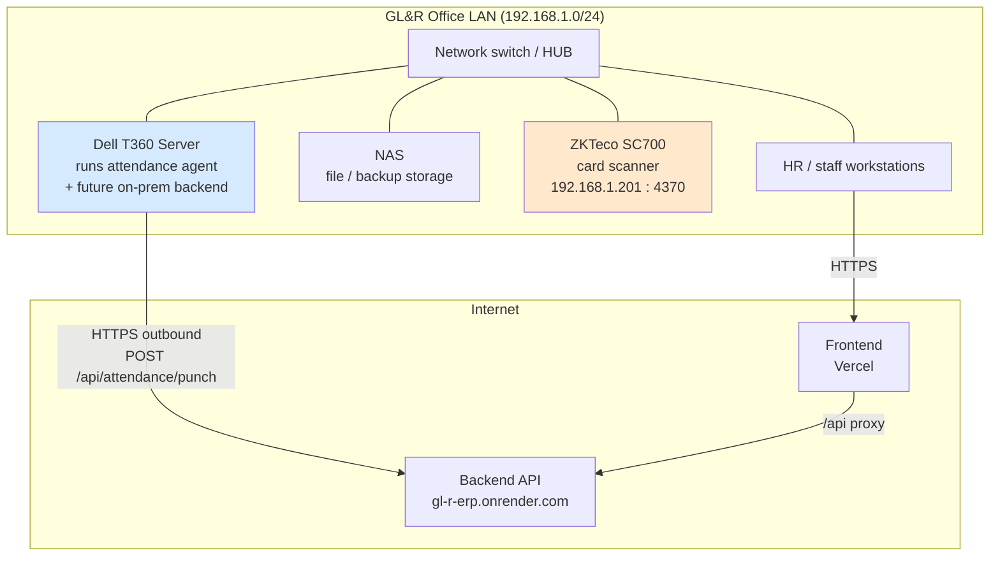

> In the **target production** design, the backend and PostgreSQL move onto the T360 (see [08 Deployment](08_Deployment_Guide.md) and [01 Overview, Appendix A.4](01_ERP_Overview.md#a4-production-go-live-on-premises-)), so the whole system stays inside the LAN with only the web portal exposed via a domain + TLS.

## 3. Hardware Inventory

| Device | Role | Notes |
|---|---|---|
| **Dell T360 server** | Hosts the attendance agent (Windows service); planned host for backend + PostgreSQL in production | Zero incremental hosting cost — company-owned |
| **NAS** | File and backup storage on the LAN | Backup target for DB dumps (see [09 Backup & Recovery](09_Backup_Recovery.md)) |
| **ZKTeco SC700** | Fingerprint/card attendance terminal | IP `192.168.1.201`, TCP `4370`, comm key `0` (showroom default) |
| **Network switch/HUB** | Connects server, NAS, scanner, workstations | Single flat LAN in the current showroom setup |
| Workstations | HR/staff browser access | Any modern browser, desktop or mobile |

## 4. Attendance Device — ZKTeco SC700

| Property | Value |
|---|---|
| Model | ZKTeco SC700 |
| IP / Port | `192.168.1.201` / `4370` (TCP) |
| Communication key | `0` (showroom default) |
| Employee identity | Device **PIN** = employee identifier used to match punches |
| SDK | **Pull SDK via `plcommpro.dll`** — required; the older `pyzk` protocol does **not** work with this device (PR #66, verified against the real device) |

> ⚠️ **Single-session device.** The SC700 is unreliable with multiple simultaneous SDK sessions. Do not run ZKAccess and the agent at the same time — use the maintenance scripts in [§5](#5-the-attendance-agent).

## 5. The Attendance Agent

**Location:** `agents/attendance/` · **Runtime:** Python 3 on the Dell T360 (Windows), intended to run as a service.

| Script | Purpose |
|---|---|
| `showroom_agent.py` | Production agent: reads device transactions and posts punches to the backend. |
| `sc700_pull_test.py` | Pull SDK connectivity/diagnostic test. |
| `sc700_simple_test.py` / `sc700_local_test.py` | Scanner-only tests (no backend), for field validation. |
| `export_transactions_dat.py` | Export device memory to a `.dat` file for historical backfill (PR #68). |
| `import_dat.py` | CLI to import a `.dat` file into the backend. |
| `pause-for-zkaccess.ps1` | Stop the agent so ZKAccess can hold the device session (PR #67). |
| `resume-agent.ps1` | Restart the agent after maintenance. |

### Agent configuration (environment variables)

```powershell
$env:ZK_HOST = "192.168.1.201"
$env:ZK_PORT = "4370"
$env:ZK_PASSWORD = "0"
$env:ATTENDANCE_SITE_CODE = "SHOWROOM"
$env:ATTENDANCE_DEVICE_CODE = "SHOWROOM_SC700"
$env:ATTENDANCE_API_URL = "http://127.0.0.1:8080/api/attendance/punch"   # prod: the Render/T360 URL
$env:ATTENDANCE_AGENT_TOKEN = "replace-with-server-token"                # per-device token (rotatable)
$env:ATTENDANCE_AGENT_DATA_DIR = "C:\glr-attendance-agent"
```

### Agent → backend authentication

```mermaid
sequenceDiagram
    participant HR as HR (portal)
    participant API as Backend
    participant AG as Agent (T360)
    HR->>API: POST /api/attendance/devices/SHOWROOM_SC700/agent-token
    API-->>HR: plaintext token (shown once)
    Note over API: stores SHA-256(token) in attendance_device.agent_token_hash
    HR->>AG: set ATTENDANCE_AGENT_TOKEN
    AG->>API: POST /punch (token header)
    API->>API: hash and compare; accept if match
```

Tokens are per-device and rotatable; only the hash is stored server-side (V20).

## 6. Network Security Rules

- **Never expose** the scanner IP or TCP `4370` to the public internet (field-test guide).
- The agent connects **outbound** only — no inbound firewall opening to the office is needed for the cloud demo.
- One active device session at a time (ZKAccess vs. agent — use pause/resume).
- Production web exposure should be domain + Let's Encrypt TLS only; the API and DB stay on the LAN in the target design.
- Device tokens are secrets — set via environment, never committed (`APP_ATTENDANCE_AGENT_TOKEN` is `sync:false` in `render.yaml`).

## 7. Connectivity Checks

Run from the **T360 server** (not a laptop) to confirm it can reach the scanner:

```powershell
ping 192.168.1.201
Test-NetConnection 192.168.1.201 -Port 4370
```

Then validate the SDK path without touching the backend:

```powershell
python agents\attendance\sc700_pull_test.py --check
python agents\attendance\showroom_agent.py --once-catchup --dry-run
```

| Symptom | Likely cause |
|---|---|
| `ping` ok, port `4370` fails | Windows Firewall, VLAN/subnet ACL, device comms settings, or another app holding the session |
| SDK connects but no new punches | Another session open (ZKAccess) — run `pause-for-zkaccess.ps1` |
| Punches read but backend rejects | Wrong/rotated agent token — re-mint via the portal |

See [10 Troubleshooting](10_Troubleshooting_Guide.md) for the full matrix.

*End of document.*


<!-- ============================================================ -->
<!-- SOURCE FILE: 08_Deployment_Guide.md -->
<!-- ============================================================ -->

# GL&R ERP — Deployment Guide

| | |
|---|---|
| **Document** | 08 — Deployment Guide |
| **Version** | 1.0 · 2 July 2026 |
| **Audience** | DevOps / engineering |

---

## Table of Contents

1. [Environments](#1-environments)
2. [Prerequisites](#2-prerequisites)
3. [Local Development](#3-local-development)
4. [Docker Compose](#4-docker-compose)
5. [Cloud Demo — Render + Vercel + Supabase](#5-cloud-demo--render--vercel--supabase)
6. [Configuration Reference](#6-configuration-reference)
7. [Database Migrations](#7-database-migrations)
8. [Target Production — On-Premise T360](#8-target-production--on-premise-t360)

---

## 1. Environments

| Environment | Frontend | Backend | Database | Purpose |
|---|---|---|---|---|
| Local | Vite dev server (`:5173/5174`) | `mvn spring-boot:run` (`:8080`) | Local Postgres or Docker | Development |
| Docker | — | `docker-compose` backend (`:8080`) | `docker-compose` Postgres 16 (`:5432`) | Integrated local run |
| Cloud demo | Vercel | Render (Docker, Singapore) | Supabase Postgres (ap-northeast-1) | Showcase — `gl-r-erp.onrender.com`, DB at V21 with demo accounts |
| Production (target) | LAN / domain | Dell T360 | T360 Postgres | On-premise go-live (pending) |

## 2. Prerequisites

- **Java 21** (LTS) and **Maven** for the backend.
- **Node.js LTS** + npm for the frontend.
- **PostgreSQL 16** (local, Docker, or Supabase).
- **Docker** (optional, for the compose path).

## 3. Local Development

### Backend

```bash
cd backend
# Secrets live in the git-ignored .env.local (copy from .env.example)
set -a; source .env.local; set +a
mvn spring-boot:run
```

### Frontend

```bash
cd frontend
npm install
# Point the SPA at a local backend:
VITE_API_BASE_URL=http://127.0.0.1:8080 npm run dev
```

### Tests & build

```bash
cd backend && mvn test                 # unit + controller + real-Postgres integration tests
cd backend && mvn -DskipTests package  # build jar
cd frontend && npm run build           # build SPA
```

## 4. Docker Compose

`docker-compose.yml` brings up Postgres 16 + the backend with Flyway enabled:

```bash
docker compose up --build
```

| Service | Detail |
|---|---|
| `db` | `postgres:16-alpine`, DB `hris`, healthcheck via `pg_isready`, volume `pgdata` |
| `backend` | Built from `backend/Dockerfile`, waits for DB health, `:8080`, `APP_FLYWAY_ENABLED=true` |

The backend container is configured for a frontend origin of `http://127.0.0.1:5174` (CORS) and non-secure cookies for local HTTP.

## 5. Cloud Demo — Render + Vercel + Supabase

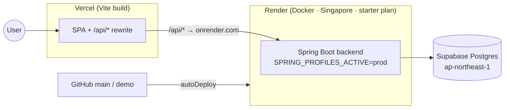

### Render (backend) — `render.yaml`

- `type: web`, `runtime: docker`, `rootDir: backend`, region **Singapore** (closest to the Supabase `ap-northeast-1` DB).
- **starter plan** (not free) — the free tier's CPU throttling makes slow cold-starts lose Render's port scan.
- `autoDeploy: true` on the connected branch.
- Secrets are `sync:false` (set in the Render dashboard, never in git): `SPRING_DATASOURCE_URL/USERNAME/PASSWORD`, `APP_CORS_ALLOWED_ORIGINS`, `APP_ATTENDANCE_AGENT_TOKEN`.
- Service name pinned so the URL is deterministic: `https://gl-r-erp.onrender.com`.

### Vercel (frontend) — `vercel.json`

- Framework `vite`; builds `frontend/`, output `frontend/dist`.
- **Rewrites:** `/api/:path* → https://gl-r-erp.onrender.com/api/:path*` (same-origin calls, no CORS/third-party cookies); SPA fallback `/(.*) → /index.html`.
- **Security headers on every response:** CSP (`default-src 'self'`, no inline scripts), `X-Content-Type-Options: nosniff`, `X-Frame-Options: DENY`, `Referrer-Policy: no-referrer`, `Strict-Transport-Security` (1 year, includeSubDomains).

> **Demo branch:** the `demo` branch deploys to `gl-r-erp.onrender.com` with the database at V21 (`Demo@2026` accounts, one per role). It is an intentional showcase, not real production data.

## 6. Configuration Reference

| Variable | Where | Meaning |
|---|---|---|
| `SPRING_DATASOURCE_URL/USERNAME/PASSWORD` | backend | Postgres connection (secret in prod) |
| `SPRING_PROFILES_ACTIVE` | backend | `prod` on Render; default local |
| `APP_FLYWAY_ENABLED` | backend | Run migrations on startup |
| `APP_CORS_ALLOWED_ORIGINS` | backend | Allowed browser origins (CORS fallback) |
| `SERVER_SESSION_COOKIE_SECURE` | backend | `true` in prod (HTTPS), `false` local |
| `APP_ATTENDANCE_AGENT_TOKEN` | backend | Device agent auth secret (`sync:false`) |
| `VITE_API_BASE_URL` | frontend | API base for local dev (prod uses the proxy) |

Local secrets belong in `backend/.env.local` (git-ignored); commit only `backend/.env.example`.

## 7. Database Migrations

- Flyway runs automatically when `APP_FLYWAY_ENABLED=true`, applying `V1..V21` in order.
- **Never edit an applied migration** — add a new version (forward-fix). The V13 fresh-DB collision was fixed this way (PR #52).
- CI runs the full migration chain against a real Postgres on every PR (PR #53) to catch ordering/collision issues before merge.

## 8. Target Production — On-Premise T360

Planned go-live (not yet executed — see [01 Overview, Appendix A.4](01_ERP_Overview.md#a4-production-go-live-on-premises-)):

1. Install PostgreSQL 16 and deploy the backend on the Dell T360 (the compose file is a starting point).
2. Register a domain (`~500–800 THB/yr`) and issue TLS via Let's Encrypt (free).
3. Serve the SPA and reverse-proxy `/api` to the local backend.
4. Mint a **production** per-device agent token; install the attendance agent as a Windows service on the T360.
5. Configure NAS-based database backups ([09 Backup & Recovery](09_Backup_Recovery.md)).
6. **Parallel run** against the manual payroll for one full pay cycle, reconcile, then sign off go-live.

*End of document.*


<!-- ============================================================ -->
<!-- SOURCE FILE: 09_Backup_Recovery.md -->
<!-- ============================================================ -->

# GL&R ERP — Backup & Recovery

| | |
|---|---|
| **Document** | 09 — Backup & Recovery |
| **Version** | 1.0 · 2 July 2026 |
| **Audience** | IT / operations |
| **Status note** | The procedures below are the **recommended operational runbook**. Automated backup jobs are not yet codified in the repository (roadmap item). |

---

## Table of Contents

1. [What Must Be Protected](#1-what-must-be-protected)
2. [Backup Strategy](#2-backup-strategy)
3. [Database Backup Procedures](#3-database-backup-procedures)
4. [Restore Procedures](#4-restore-procedures)
5. [Schema Recovery via Flyway](#5-schema-recovery-via-flyway)
6. [Session & Application Recovery](#6-session--application-recovery)
7. [Disaster Recovery Runbook](#7-disaster-recovery-runbook)
8. [Known Gaps](#8-known-gaps)

---

## 1. What Must Be Protected

| Asset | Store | Criticality | Notes |
|---|---|---|---|
| PostgreSQL database | Supabase (demo) / T360 (prod) | 🔴 Critical | All HR, payroll, sales, attendance data |
| Restricted PII | `hr_restricted` schema (inside DB) | 🔴 Critical | Encrypt backups at rest |
| Payroll periods & bank exports | DB + generated `.txt` | 🔴 Critical | Financial record retention |
| Attendance `.dat` archives | Device / T360 / NAS | 🟡 Important | Source for backfill/replay |
| Device agent tokens | Environment secrets | 🟡 Important | Re-mintable, not backed up as data |
| Application secrets | Render dashboard / `.env.local` | 🟡 Important | Store in a password manager, not git |

## 2. Backup Strategy

Recommended baseline (3-2-1 aligned):

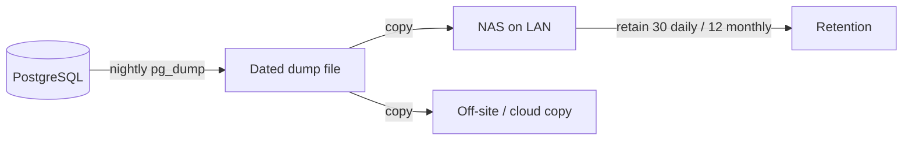

| Backup type | Frequency | Retention |
|---|---|---|
| Full logical dump (`pg_dump`) | Nightly | 30 daily + 12 monthly |
| Point-in-time (WAL) — prod option | Continuous | 7 days |
| Attendance `.dat` export | Weekly / on demand | Keep per pay cycle |
| Config/secrets snapshot | On change | Current + previous |

> On **Supabase** (demo), managed automated backups are available on the platform; treat the demo DB as reproducible (it is seeded to V21) rather than a source of record.

## 3. Database Backup Procedures

### Full logical backup

```bash
pg_dump \
  --host="$PGHOST" --port=5432 --username="$PGUSER" \
  --dbname=hris \
  --format=custom --file="glr-hris-$(date +%Y%m%d).dump"
```

### Verify the dump

```bash
pg_restore --list "glr-hris-YYYYMMDD.dump" | head
```

### Copy to NAS (LAN)

Store dated dumps on the NAS (same LAN as the T360 per the network diagram), and keep at least one off-site copy.

## 4. Restore Procedures

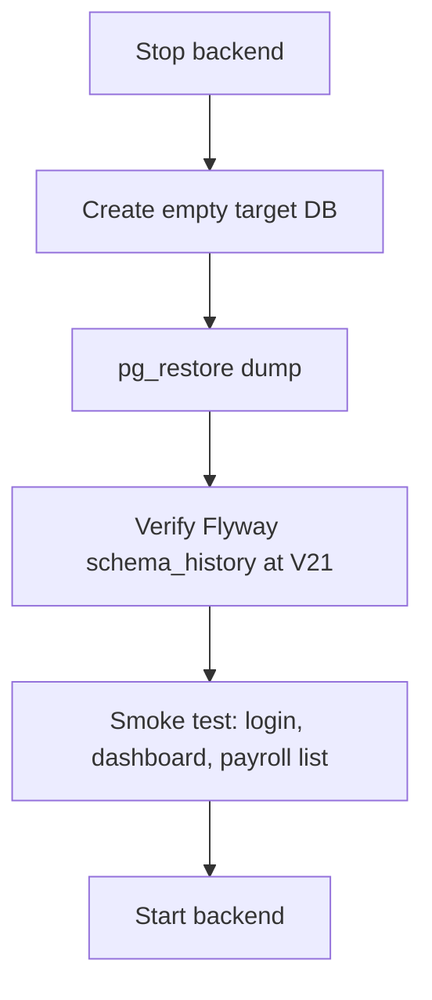

```bash
# 1. Stop the backend so nothing writes during restore.
# 2. (Re)create the database.
createdb --username="$PGUSER" hris_restore

# 3. Restore.
pg_restore --host="$PGHOST" --username="$PGUSER" \
  --dbname=hris_restore --clean --if-exists \
  "glr-hris-YYYYMMDD.dump"

# 4. Verify migration state.
psql --dbname=hris_restore -c \
  "SELECT MAX(version) FROM flyway_schema_history WHERE success;"
```

Expected max version: **21**.

## 5. Schema Recovery via Flyway

If the **data** is intact but the **schema** is in doubt, Flyway is the source of truth:

- On startup with `APP_FLYWAY_ENABLED=true`, Flyway applies any missing migrations up to V21.
- Migrations are **forward-only** (no down scripts). To recover a bad state, restore from a dump, then let Flyway re-apply.
- CI proves the full `V1→V21` chain against a clean Postgres on every PR, so a fresh rebuild from migrations is a supported recovery path.

## 6. Session & Application Recovery

- **Sessions** live in `hr.spring_session` (Spring Session JDBC, V19). A backend restart or redeploy does **not** log users out — sessions survive in the database.
- A full DB restore also restores active sessions as of the dump; users simply re-authenticate if their session is gone.
- The backend is stateless otherwise; redeploying the Render service (or T360 service) requires no local state.

## 7. Disaster Recovery Runbook

| Scenario | Action | Target time |
|---|---|---|
| Backend down (Render/T360) | Redeploy from `main`/image; sessions and data intact | Minutes |
| Database corruption | Restore latest nightly dump → verify V21 → smoke test | < 1 hour |
| Full environment loss | Provision Postgres → restore dump (or rebuild schema via Flyway + import) → redeploy backend + frontend | Hours |
| Attendance data gap | Re-import device `.dat` for the affected window (`import_dat.py`) | Minutes–hours |
| Lost device token | Re-mint via portal; update agent env | Minutes |

## 8. Known Gaps

These are recommended but **not yet automated in the repo**:

- No scheduled backup job is committed — set one up on the DB host / Supabase.
- No automated restore-verification (test-restore) job.
- Backup encryption for PII-bearing dumps must be configured operationally.
- Document a formal retention policy aligned to Thai payroll record-keeping requirements.

*End of document.*


<!-- ============================================================ -->
<!-- SOURCE FILE: 10_Troubleshooting_Guide.md -->
<!-- ============================================================ -->

# GL&R ERP — Troubleshooting Guide

| | |
|---|---|
| **Document** | 10 — Troubleshooting Guide |
| **Version** | 1.0 · 2 July 2026 |
| **Audience** | Support, IT, engineering |

---

## Table of Contents

1. [How to Use This Guide](#1-how-to-use-this-guide)
2. [Authentication & Login](#2-authentication--login)
3. [Attendance & Device](#3-attendance--device)
4. [Overtime, Leave & Approvals](#4-overtime-leave--approvals)
5. [Payroll & Commission](#5-payroll--commission)
6. [Sales Tickets & Documents](#6-sales-tickets--documents)
7. [Deployment & Database](#7-deployment--database)
8. [Diagnostic Quick Reference](#8-diagnostic-quick-reference)

---

## 1. How to Use This Guide

Each entry lists a **symptom**, the **likely cause**, and the **resolution**. Start with the module that matches the symptom; the [quick reference](#8-diagnostic-quick-reference) at the end maps common signals to sections.

## 2. Authentication & Login

| Symptom | Likely cause | Resolution |
|---|---|---|
| Cannot log in, credentials correct | Account temporarily locked after repeated failures (rate limiting) | Wait for the lockout window; if persistent, HR resets the password |
| Forced to a change-password screen | `must_change_password` set (first login or HR reset) | Set a new password to continue — expected behavior |
| Logged in but menu is missing modules | Role derived from division/position doesn't grant that module | Verify the employee's division (ฝ่าย) and position; roles are data-driven (`DivisionAccessPolicy`) |
| Login returns 500 for some users | Historically a null `division_id` NPE | Fixed in PR #55 — null-division employees safely fall back to `employee`; if seen again, check the employee's division mapping |
| Session lost after redeploy | Should not happen — sessions persist in Postgres (V19) | If it does, verify `hr.spring_session` exists and the DB is reachable |
| Mutating request fails with 403 | Missing/expired CSRF token | Reload the page to obtain a fresh CSRF cookie |

## 3. Attendance & Device

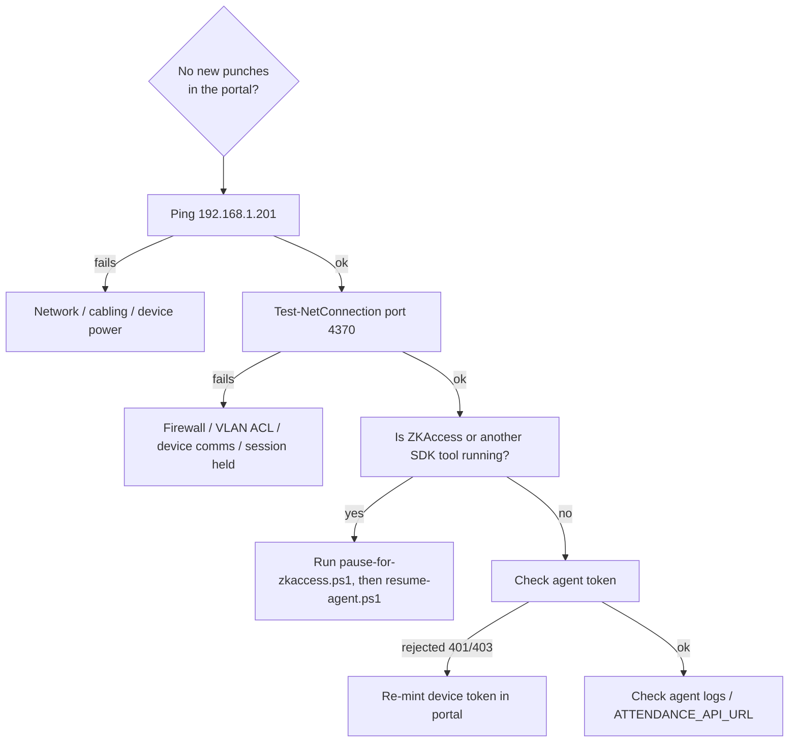

| Symptom | Likely cause | Resolution |
|---|---|---|
| Ping ok, port 4370 fails | Firewall, VLAN ACL, device comm settings, or another app holding the session | Open 4370 on the LAN path; ensure only one SDK session |
| Agent connects but reads nothing | ZKAccess or another tool holds the single device session | `pause-for-zkaccess.ps1` before maintenance; `resume-agent.ps1` after |
| Punches read locally but backend rejects (401/403) | Wrong or rotated device token | Re-mint via `POST /api/attendance/devices/{code}/agent-token`; update `ATTENDANCE_AGENT_TOKEN` |
| `pyzk` errors / no connection | SC700 requires the **Pull SDK** (`plcommpro.dll`), not pyzk | Use `showroom_agent.py` / `sc700_pull_test.py` (PR #66) |
| Historical punches missing | Device was offline during capture | Export `.dat` (`export_transactions_dat.py`) and import (`import_dat.py` or `POST /api/attendance/imports/dat`) |
| `.dat` upload rejected | File exceeds the size cap (hardening) | Split the file or import via CLI in batches |
| Punch not linked to an employee | Device PIN doesn't match an employee identifier | Correct the PIN↔employee mapping |

## 4. Overtime, Leave & Approvals

| Symptom | Likely cause | Resolution |
|---|---|---|
| Leave rejected instantly | Insufficient remaining quota for that type | Check balance; quotas: Sick 30, Vacation 6, Personal 3 (days/yr) |
| OT didn't reach payroll | Request not **approved**, or wrong `payroll_month` | Ensure a manager/HR approved it before payroll preview for that month |
| Manager can't approve a request | Requester is outside the manager's ฝ่าย (division) | Only division managers/HR can approve within scope |
| OT save rejected by DB | Invalid multiplier/day-type or times | Multiplier must be 1.50/3.00; planned end > start (CHECK constraints) |
| Sick-leave submission blocked | Attachment required for sick leave | Attach the required document |

## 5. Payroll & Commission

| Symptom | Likely cause | Resolution |
|---|---|---|
| Bank file format rejected by bank | Export is generic, not KBank's format | Interim: reformat manually; permanent fix is roadmap A.1 |
| Employees didn't get payslips | PDF/e-mail pipeline not built | Distribute manually until roadmap A.1 lands |
| OT/commission missing from a payroll line | Not approved for that month, or approved after preview | Re-preview after approvals; process again |
| Commission amount looks wrong | Tier config or invoice amount | Check `sales.tier_config` bands and the invoice details; use the simulator to reproduce |
| Cannot access payroll endpoints | Role not HR/ADMIN | Payroll is `@PreAuthorize("hasAnyRole('HR','ADMIN')")` |
| Late minutes not deducted | Lateness→payroll link not implemented | Tracked (`attendance_daily.late_minutes`); deduction is roadmap A.3 |

## 6. Sales Tickets & Documents

| Symptom | Likely cause | Resolution |
|---|---|---|
| Cannot approve a price | Not `SALES_MANAGER`/`CEO`/`ADMIN` | Only those roles approve proposed prices |
| Ticket stuck after edits | `has_edits` flag set for approver review | Approver re-reviews the changed items |
| Document number missing | Document still a draft (not issued) | Issue the document to draw a number from `document_sequence` |
| Need to correct an issued document | Immutable once issued | Open a **revision** (`POST /api/tickets/{id}/revision`) — bumps `revision_no`, keeps the original |
| Notification list broke on empty | Historically a bare-array response | Guarded (`09c8713`); if seen, check the notifications payload shape |

## 7. Deployment & Database

| Symptom | Likely cause | Resolution |
|---|---|---|
| Unknown API route returns 500 | Old behavior | Now returns **404** via the exception handler (PR #65) |
| Render deploy slow / times out on port scan | Free-tier CPU throttling | Use the **starter** plan (already set in `render.yaml`) |
| Flyway fails on a fresh DB | Migration ordering/collision (historical V13 vs V1) | Fixed forward (PR #52); never edit applied migrations — add a new version |
| CORS error in the browser | Direct cross-origin call bypassing the proxy | Use the same-origin `/api` path (Vercel rewrite); check `APP_CORS_ALLOWED_ORIGINS` |
| Backend can't reach DB | Wrong `SPRING_DATASOURCE_*` or DB down | Verify secrets in the Render dashboard; confirm Supabase/DB availability |
| Migration state unclear after restore | — | `SELECT MAX(version) FROM flyway_schema_history WHERE success;` should be **21** |

## 8. Diagnostic Quick Reference

| Signal | Go to |
|---|---|
| 401 / 403 | [§2 Auth](#2-authentication--login) (users) · [§3](#3-attendance--device) (device token) |
| 404 on API | [§7](#7-deployment--database) — expected for unknown routes |
| No attendance data | [§3](#3-attendance--device) |
| Instant leave rejection | [§4](#4-overtime-leave--approvals) |
| Payroll numbers off | [§5](#5-payroll--commission) |
| Bank file / payslip issues | [§5](#5-payroll--commission) + roadmap A.1 |
| Deploy/migration failures | [§7](#7-deployment--database) |

*End of document.*


<!-- ============================================================ -->
<!-- SOURCE FILE: 11_UAT_Test_Cases.md -->
<!-- ============================================================ -->

# GL&R ERP — UAT Test Cases

| | |
|---|---|
| **Document** | 11 — User Acceptance Test Cases |
| **Version** | 1.0 · 2 July 2026 |
| **Audience** | QA, business testers |
| **How to run** | Execute each case in order; record Pass/Fail and notes. Use the demo environment (`Demo@2026` accounts, one per role) or a seeded test DB. |

---

## Table of Contents

1. [Test Approach](#1-test-approach)
2. [Authentication & Access](#2-authentication--access)
3. [Employee Management](#3-employee-management)
4. [Attendance](#4-attendance)
5. [Overtime](#5-overtime)
6. [Leave](#6-leave)
7. [Sales Tickets & Documents](#7-sales-tickets--documents)
8. [Commission](#8-commission)
9. [Payroll](#9-payroll)
10. [Security & Authorization](#10-security--authorization)
11. [Sign-off](#11-sign-off)

---

## 1. Test Approach

- **Roles under test:** `employee`, division manager, `hr`, `sales`, `sales_manager`, `ceo`, `import`.
- **Pass criteria:** actual result matches expected; no error dialog; audit entries written where noted.
- **Priority:** 🔴 must-pass for go-live · 🟡 should-pass.

## 2. Authentication & Access

| ID | Priority | Steps | Expected result |
|---|---|---|---|
| AUTH-01 | 🔴 | Log in with valid credentials | Session established; role-appropriate menu shown |
| AUTH-02 | 🔴 | First login with a temporary password | Forced change-password screen; cannot proceed until changed |
| AUTH-03 | 🔴 | Enter wrong password several times | Account locks out temporarily (rate limiting) |
| AUTH-04 | 🔴 | Change password via menu | New password works; old one rejected next login |
| AUTH-05 | 🟡 | Log in, then redeploy/restart backend | Still logged in (sessions persisted in DB) |
| AUTH-06 | 🔴 | Log out | Session invalidated; protected pages redirect to login |

## 3. Employee Management

| ID | Priority | Steps | Expected result |
|---|---|---|---|
| EMP-01 | 🔴 | HR creates a new employee (all sections) | Record saved; employee code auto-generated |
| EMP-02 | 🔴 | HR edits assignment (division/position) | Change saved; prior assignment kept in history |
| EMP-03 | 🔴 | HR searches/filters by division & status | Correct subset returned; pagination works on large lists |
| EMP-04 | 🔴 | Employee views own profile | Sees own data; cannot directly edit |
| EMP-05 | 🔴 | Employee submits a profile-change request | Appears under My Requests as `pending` |
| EMP-06 | 🔴 | HR approves the request | Master record updated; status `approved` |
| EMP-07 | 🟡 | HR rejects a request with a note | Status `rejected`; note visible to employee |
| EMP-08 | 🔴 | HR opens a sensitive (PII/salary) field | Access recorded in `hr.audit_log` |

## 4. Attendance

| ID | Priority | Steps | Expected result |
|---|---|---|---|
| ATT-01 | 🔴 | Tap a card on the SC700 with the agent running | Punch appears in the portal shortly after |
| ATT-02 | 🔴 | Employee opens Attendance | Sees only own punches |
| ATT-03 | 🔴 | Division manager opens Attendance | Sees own division's punches |
| ATT-04 | 🔴 | HR imports a `.dat` file | Punches backfilled; import file + any row errors recorded |
| ATT-05 | 🟡 | HR rotates the device token | New token works; old token rejected (401/403) |
| ATT-06 | 🟡 | Upload an oversized `.dat` | Rejected by size cap |

## 5. Overtime

| ID | Priority | Steps | Expected result |
|---|---|---|---|
| OT-01 | 🔴 | Employee submits a workday OT request | Created `SUBMITTED`, multiplier 1.50 |
| OT-02 | 🔴 | Employee submits a holiday OT request | Multiplier 3.00 |
| OT-03 | 🔴 | Manager approves an OT request | Status `APPROVED`; payable minutes recorded |
| OT-04 | 🔴 | Approved OT appears in that month's payroll preview | OT pay included on the employee's line |
| OT-05 | 🟡 | Employee cancels a pending request | Status `CANCELLED` |
| OT-06 | 🟡 | Submit OT with end before start | Rejected (validation/DB constraint) |
| OT-07 | 🔴 | Manager tries to approve OT outside their division | Not permitted |

## 6. Leave

| ID | Priority | Steps | Expected result |
|---|---|---|---|
| LV-01 | 🔴 | Submit vacation leave within quota | Accepted; balance reduced |
| LV-02 | 🔴 | Submit leave exceeding remaining quota | Immediately rejected with reason |
| LV-03 | 🔴 | Submit sick leave without attachment | Blocked — attachment required |
| LV-04 | 🔴 | Manager/HR approves a leave request | Status approved |
| LV-05 | 🟡 | Employee cancels a pending leave | Status cancelled; balance restored |
| LV-06 | 🟡 | View leave types & balances | Correct quotas (Sick 30 / Vacation 6 / Personal 3) |

## 7. Sales Tickets & Documents

| ID | Priority | Steps | Expected result |
|---|---|---|---|
| TKT-01 | 🔴 | Sales creates & submits a ticket | Status `draft` → `submitted`; event logged |
| TKT-02 | 🔴 | Import/manager picks up & proposes a price | `in_review` → `price_proposed` |
| TKT-03 | 🔴 | Sales manager approves the price | `approved`; event logged |
| TKT-04 | 🟡 | Sales manager rejects the price | Returns for re-pricing |
| TKT-05 | 🔴 | Edit items after submission | `has_edits` flagged for approver |
| TKT-06 | 🔴 | Issue a quotation/document | Draft → issued; running number assigned; file downloadable |
| TKT-07 | 🔴 | Open a revision on an issued document | `revision_no` increments; original retained |
| TKT-08 | 🟡 | Add a comment to a ticket | Comment recorded as an event |
| TKT-09 | 🔴 | Close the ticket | Status `closed` |

## 8. Commission

| ID | Priority | Steps | Expected result |
|---|---|---|---|
| COM-01 | 🔴 | Sales submits a commission from invoice details | Amount computed from tier config; status pending |
| COM-02 | 🟡 | Use the simulator before submitting | Shows expected commission; nothing saved |
| COM-03 | 🔴 | Sales manager approves | Status approved |
| COM-04 | 🔴 | Approved commission appears in payroll-ready feed | Aggregated per employee/month |
| COM-05 | 🟡 | Record a clawback | Negative record offsets future payroll |

## 9. Payroll

| ID | Priority | Steps | Expected result |
|---|---|---|---|
| PAY-01 | 🔴 | HR previews payroll for a month | Every active employee listed with full breakdown |
| PAY-02 | 🔴 | Verify OT + commission on lines | Approved OT and commissions included |
| PAY-03 | 🔴 | Verify SSO & withholding tax | SSO on capped base; progressive tax via annualized calc |
| PAY-04 | 🟡 | Enter special pays / allowances / unpaid-leave days | Net pay recalculates correctly |
| PAY-05 | 🔴 | Process the period | Saved with processor identity; audit entry `PROCESS_PAYROLL` |
| PAY-06 | 🔴 | Download the bank export | `glr-payroll-<id>.txt`; audit entry `EXPORT_PAYROLL_BANK_FILE` |
| PAY-07 | 🔴 | **Parallel-run reconciliation** vs. manual payroll for one cycle | Figures match within tolerance (go-live gate) |

## 10. Security & Authorization

| ID | Priority | Steps | Expected result |
|---|---|---|---|
| SEC-01 | 🔴 | Employee calls an HR-only endpoint | 403 Forbidden |
| SEC-02 | 🔴 | Employee requests another person's data | Denied / scoped out |
| SEC-03 | 🔴 | Sales (non-manager) approves a price | Denied |
| SEC-04 | 🔴 | Post a punch without a valid device token | Rejected |
| SEC-05 | 🟡 | Request an unknown API route | 404 (not 500) |
| SEC-06 | 🟡 | Inspect response headers | CSP, HSTS, X-Frame-Options, nosniff present |

## 11. Sign-off

| Role | Name | Date | Result |
|---|---|---|---|
| Business owner | | | ☐ Pass ☐ Fail |
| HR lead | | | ☐ Pass ☐ Fail |
| Sales lead | | | ☐ Pass ☐ Fail |
| IT / technical | | | ☐ Pass ☐ Fail |

> **Go-live gate:** all 🔴 cases pass **and** PAY-07 parallel-run reconciles for one full pay cycle before production go-live (proposal week 8).

*End of document.*


<!-- ============================================================ -->
<!-- SOURCE FILE: 12_Change_Log.md -->
<!-- ============================================================ -->

# GL&R ERP — Change Log

| | |
|---|---|
| **Document** | 12 — Change Log |
| **Version** | 1.0 · 2 July 2026 |
| **Source** | Reconstructed from git history and pull requests (`main`) |
| **Convention** | Grouped by delivery wave, newest first. Migration versions and PR/commit refs included where useful. |

---

## Table of Contents

1. [Release Waves at a Glance](#1-release-waves-at-a-glance)
2. [Wave 4 — Attendance Hardening & Device SDK](#2-wave-4--attendance-hardening--device-sdk)
3. [Wave 3 — Platform Hardening & Test Infrastructure](#3-wave-3--platform-hardening--test-infrastructure)
4. [Wave 2 — HR & Sales Modules](#4-wave-2--hr--sales-modules)
5. [Wave 1 — Security Hardening](#5-wave-1--security-hardening)
6. [Wave 0 — Attendance & Sales Foundations](#6-wave-0--attendance--sales-foundations)
7. [Genesis — Platform & Employee Master](#7-genesis--platform--employee-master)
8. [Migration Timeline](#8-migration-timeline)

---

## 1. Release Waves at a Glance

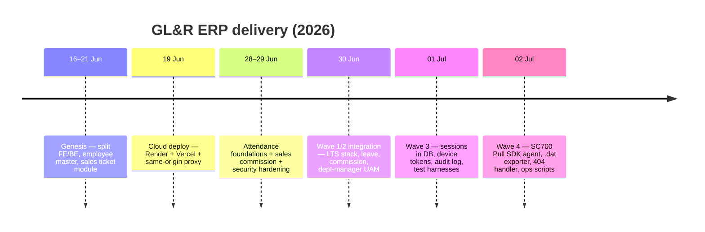

## 2. Wave 4 — Attendance Hardening & Device SDK
*(2 Jul 2026)*

| Change | Ref |
|---|---|
| Device transaction `.dat` exporter for historical backfill | #68 |
| Pause/resume helper scripts for ZKAccess maintenance | #67 |
| **SC700 Pull SDK agent (`plcommpro.dll`) replacing pyzk** — verified against the real device | #66 |
| API returns **404** instead of 500 for unknown/unmapped routes | #65 |

## 3. Wave 3 — Platform Hardening & Test Infrastructure
*(1 Jul 2026)*

| Change | Migration | Ref |
|---|---|---|
| Real-Postgres repository integration tests | — | #63 |
| Frontend test harness (Vitest + React Testing Library) | — | #62 |
| Per-device attendance agent tokens with rotation | V20 | #61 |
| Externalize HTTP session to Postgres (Spring Session JDBC) | V19 | #60 |
| HR audit log + opt-in list pagination | V18 | #59 |
| Dependency scanning (SCA) + audit-logging groundwork | — | (Wave 3) |

## 4. Wave 2 — HR & Sales Modules
*(30 Jun – 1 Jul 2026)*

| Change | Migration | Ref |
|---|---|---|
| Customer directory + deposit-notice document generation | V16, V17 | #56 |
| Department-manager UAM access for OT + attendance | — | #55 |
| Overtime + payroll modules | V14, V15 | #54 |
| Leave management | V13 | #4878d07 |
| Sales commission management (tiered, clawback) | V12 | #eb73345 |
| Move to stable **LTS stack** (Spring Boot 3.5.16, Java 21, Node LTS) | — | #51 |
| Fix: V13 fresh-DB collision with V1 `leave_type` | V13 | #52 |
| CI: run Flyway migrations against real Postgres | — | #53 |
| Frontend ESLint + a11y + CI; audit fixes | — | #57 |

## 5. Wave 1 — Security Hardening
*(29–30 Jun 2026)*

| Change | Migration | Ref |
|---|---|---|
| Replace employee-code login with **BCrypt-hashed** credentials | V11 | c180e73 |
| Forced change-password gate + self-service UI | V11 | a73715d |
| Login rate limiting and lockout | — | 4c86127 |
| Log HR access to sensitive employee PII (audit) | — | aca8867 |
| Security hardening: headers, `.dat` size cap, non-root container, log redaction | — | 96d768d |
| Accessibility: modal focus, toast live region, control labels | — | 36dac76 |
| Perf: batch ticket-item inserts | — | 888c645 |
| Dependabot + dependency-review SCA gate | — | 8c6b2b6 |

## 6. Wave 0 — Attendance & Sales Foundations
*(21–28 Jun 2026)*

| Change | Migration | Ref |
|---|---|---|
| Attendance Flyway schema | V7 | 7e95d7b |
| Attendance punch endpoint | V7 | a1f1975 |
| Attendance import + history APIs | V7 | cb11ac7 |
| Attendance `.dat` import CLI | — | 60c80a8 |
| Attendance frontend views | — | 065c0c1 |
| Showroom attendance agent (initial) | — | 7d9c19e |
| SC700 field-test & new-computer setup docs | — | 3c46b5d, 6b85173 |
| Sales ticket module (M1–M4.5) | V6, V8–V10 | 892965d |
| Split ticket dashboard into its own gated tab | — | #19, #20 |
| Assign sales role to showroom/sales-support divisions | — | 8055732 |

## 7. Genesis — Platform & Employee Master
*(16–21 Jun 2026)*

| Change | Migration | Ref |
|---|---|---|
| Initial React SPA scaffold | — | 303e90b |
| **Split into `frontend/` + `backend/`**; Spring Boot API introduced | V1, V2 | 9f7a6ea |
| Employee master schema + backend extensions | V1, V2 | — |
| Employee-code sequence; profile-request indexes | V3, V4 | — |
| Remove `app_user` UAM → data-derived roles | V5 | — |
| Render backend deploy + same-origin Vercel `/api` proxy | — | 24cffd9 |
| CSRF protection (double-submit cookie) | — | 1013650 |
| Secure session cookie; restrict passwordless login to demo | — | 6e11065 |
| Perf: eliminate post-mutation full reload; fix users.list N+1 | — | c4a15a5 |
| Division-based role access (UAM) | — | #14 |
| Senior cleanup / refactor / dead-code removal | — | #13 |

## 8. Migration Timeline

| V | Migration | Wave |
|---|---|---|
| V1 | employee_master_schema | Genesis |
| V2 | backend_extensions | Genesis |
| V3 | employee_code_sequence | Genesis |
| V4 | profile_request_performance_indexes | Genesis |
| V5 | remove_app_user_uam | Genesis |
| V6 | sales_ticket_schema | Wave 0 |
| V7 | attendance_schema | Wave 0 |
| V8 | ticket_item_product_fields | Wave 0 |
| V9 | ticket_item_add_size | Wave 0 |
| V10 | ticket_has_edits | Wave 0 |
| V11 | employee_password_hash | Wave 1 |
| V12 | sales_commission_schema | Wave 2 |
| V13 | leave_management_schema | Wave 2 |
| V14 | overtime_management_schema | Wave 2 |
| V15 | payroll_processing_schema | Wave 2 |
| V16 | customers_and_note_templates | Wave 2 |
| V17 | documents_and_revision | Wave 2 |
| V18 | audit_log | Wave 3 |
| V19 | spring_session_jdbc | Wave 3 |
| V20 | attendance_device_agent_token | Wave 3 |
| V21 | demo_seed_accounts | Demo env |

---

### Roadmap (not yet released)

See [01 Overview, Appendix A](01_ERP_Overview.md#appendix-a--future-work--roadmap): KBank bank-file format, PDF payslips + e-mail (SendGrid), AI policy assistant (Gemini), lateness→payroll deduction, and on-premise production go-live with parallel-run sign-off.

*End of document.*

