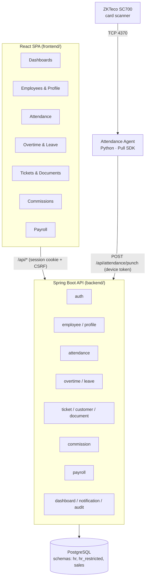

# GL&R ERP — System Overview

| | |
|---|---|
| **System** | GL&R HR & Sales ERP (HR Portal) |
| **Document** | 01 — ERP Overview |
| **Version** | 1.0 |
| **Date** | 2 July 2026 |
| **Status** | Current — reflects the system as built (database schema V21) |
| **Repository** | `GL-R-ERP` (frontend: React + Vite · backend: Spring Boot · agents: Python) |

---

## Table of Contents

1. [Executive Summary](#1-executive-summary)
2. [Business Context](#2-business-context)
3. [Module Map](#3-module-map)
4. [User Roles & Access Model](#4-user-roles--access-model)
5. [Technology Stack](#5-technology-stack)
6. [Scope: Proposed vs. Delivered](#6-scope-proposed-vs-delivered)
7. [Document Set Guide](#7-document-set-guide)
8. [Appendix A — Future Work & Roadmap](#appendix-a--future-work--roadmap)

---

## 1. Executive Summary

The GL&R ERP is an integrated web application that digitizes the company's core Human Resources (HR) and Sales operations. It replaces manual, spreadsheet-driven processes with a single system covering:

- **Employee management** — a complete employee master file with self-service profile-change requests.
- **Attendance** — automatic collection of clock-in/out events from the ZKTeco SC700 card scanner via an on-premise agent.
- **Overtime (OT) and leave** — request → approval workflows with automatic quota and rate enforcement.
- **Sales tickets, quotations & documents** — a full sales-ticket lifecycle from customer inquiry through price approval to issued quotation/deposit-notice documents.
- **Commission** — tiered commission calculation on closed deals, with clawback support, feeding directly into payroll.
- **Payroll** — automatic calculation of salary, OT, commission, social security (SSO), progressive withholding tax and deductions, with a downloadable bank-transfer text file.

The system is accessed through a web browser on desktop or mobile. All access is authenticated, role-based, and audited: HR access to sensitive personal data is written to a tamper-evident audit log.

**Current deployment:** a cloud demo runs at `gl-r-erp.onrender.com` (backend on Render, frontend on Vercel, database on Supabase PostgreSQL). Production operation on the company's own Dell T360 server is the planned next step (see [Appendix A](#appendix-a--future-work--roadmap)).

## 2. Business Context

GL&R previously handled HR and sales administration manually. The original project proposals (the Thai-language *HR System Summary* and the *GL_R Sales System Proposal*) defined two systems that were built as one integrated ERP on a shared employee master and login:

| Source document | Scope it defined |
|---|---|
| สรุปรายละเอียดเรื่องระบบ HR (HR System Summary) | Employee management, dashboards, attendance, OT, leave, sales commission, payroll, AI assistant |
| GL_R Sales System Proposal | Sales ticket workflow, quotation/price-approval flow, sales documents |
| 01 Diagram Network GL_R | On-premise network: server, NAS, card scanner on one LAN |

## 3. Module Map

| Module | What it does | Key backend package |
|---|---|---|
| Employee Management | Employee master CRUD, assignment history, salary history, restricted PII vault | `employee`, `profile` |
| Dashboards | Role-aware summary for HR and employees | `dashboard` |
| Attendance | Device punch ingestion, `.dat` import/backfill, punch history, per-device agent tokens | `attendance` + `agents/attendance` |
| Overtime | Pre-approval OT requests, 1.5×/3.0× rates, division-manager approval | `overtime` |
| Leave | Sick/vacation/personal leave with quota enforcement and attachments flag | `leave` |
| Sales Tickets | Ticket lifecycle: submit → pickup → propose price → approve → quotation → close | `ticket` |
| Customers & Documents | Customer directory; quotation / deposit-notice document generation with revisions | `customer`, `document` |
| Commission | Tiered commission on invoices, approval, clawback, payroll feed | `commission` |
| Payroll | Preview/process monthly payroll; bank-transfer text export | `payroll` |
| Notifications | In-app notification feed | `notification` |
| Audit | Immutable log of sensitive-data access and payroll actions | `audit` |

## 4. User Roles & Access Model

Roles are **derived from HR data** (division/ฝ่าย and position), not assigned by hand — so they survive employee re-imports. See `backend/src/main/java/th/co/glr/hr/auth/DivisionAccessPolicy.java`.

| Role | Derived from | Access highlights |
|---|---|---|
| `ceo` | MD division or กรรมการ-family position | Company-wide; approves ticket prices, commissions |
| `hr` | HR (บุคคล) division | Employee master, approvals, payroll, audit-logged PII access |
| `sales_manager` | Sales (SA) division + manager position (ผู้จัดการ) | Ticket price approval, commission approval/clawback |
| `sales` | Sales (SA) division | Own tickets, customers, documents, commissions |
| `import` | Foreign purchasing (PCIM) division | Foreign-purchase price proposals on tickets |
| `employee` | Everyone else | Own profile, attendance, OT, leave, dashboard |
| `admin` | System bootstrap account | Full access (operations) |

Additionally, any employee whose position contains **ผู้จัดการ** (manager, incl. assistant manager) is flagged a **division manager**: they approve OT for — and can view attendance of — everyone sharing their ฝ่าย (division).

## 5. Technology Stack

| Layer | Technology | Notes |
|---|---|---|
| Frontend | React 18 + Vite | SPA, ESLint + jsx-a11y, Vitest + React Testing Library |
| Backend | Spring Boot 3.5.x LTS on Java 21 LTS | REST API, Spring Security, Spring Session JDBC |
| Database | PostgreSQL 16 | Flyway migrations **V1–V21**; schemas `hr`, `hr_restricted`, `sales` |
| Device agent | Python 3 | ZKTeco **Pull SDK** (`plcommpro.dll`) on Windows (Dell T360) |
| Cloud (demo) | Render (backend, Docker, Singapore) · Vercel (frontend + `/api` proxy) · Supabase (Postgres) | Blueprint in `render.yaml`, proxy in `vercel.json` |
| CI/CD | GitHub Actions | Backend tests, frontend lint/tests, Flyway-against-real-Postgres check, Dependabot + dependency-review SCA gate |

## 6. Scope: Proposed vs. Delivered

Honest status of every headline feature from the original proposals:

| # | Proposed feature | Status | Evidence / Note |
|---|---|---|---|
| 1 | Employee management + self-service edit requests | ✅ Delivered | `employee`, `profile` modules; V1–V4 schema |
| 2 | HR & employee dashboards | ✅ Delivered | `dashboard` module, role-aware frontend |
| 3 | Attendance from card scanner | ✅ Delivered | SC700 Pull SDK agent, punch API, `.dat` backfill |
| 4 | Overtime request/approve/auto-calc | ✅ Delivered | V14 schema; 1.5× workday / 3.0× holiday |
| 5 | Leave with quota auto-check | ✅ Delivered | V13 schema; SICK 30 d, VACATION 6 d, PERSONAL 3 d |
| 6 | Sales deals + commission auto-calc into payroll | ✅ Delivered | Tickets + V12 commission schema; `payroll-ready` feed |
| 7 | Payroll (salary, OT, commission, SSO, tax, deductions) | ✅ Delivered | `PayrollCalculator`; preview/process/audit |
| 7a | Bank transfer file | ⚠️ Partial | Generic pipe-delimited text export exists (`/api/payroll/{id}/bank-export`); **KBank-specific format not yet implemented** |
| 7b | PDF payslips e-mailed to employees | ❌ Not built | No PDF/e-mail pipeline in code |
| 7c | Automatic accounting summary e-mail | ❌ Not built | No e-mail integration (SendGrid) in code |
| 8 | AI assistant (policy chatbot, Gemini) | ❌ Not built | No AI integration in code |
| — | Lateness deduction in payroll | ⚠️ Partial | `attendance_daily.late_minutes` tracked in schema; not yet wired into payroll deduction |
| — | On-premise production hosting | ⏳ Pending | Cloud demo live; T360 go-live pending (see Appendix A) |

## 7. Document Set Guide

| Doc | Audience | Contents |
|---|---|---|
| [02_User_Manual](02_User_Manual.md) | End users | Per-role, per-screen walkthroughs |
| [03_Feature_Documentation](03_Feature_Documentation.md) | Business + engineering | Rules, workflows, state machines |
| [04_Technical_Architecture](04_Technical_Architecture.md) | Engineering | Components, security, CI/CD |
| [05_Database_Documentation](05_Database_Documentation.md) | Engineering / DBA | Schemas, ERD, migration history |
| [06_API_Documentation](06_API_Documentation.md) | Engineering / integrators | Every REST endpoint |
| [07_Hardware_Network_Documentation](07_Hardware_Network_Documentation.md) | IT / operations | LAN topology, SC700, agent ops |
| [08_Deployment_Guide](08_Deployment_Guide.md) | DevOps | Local, Docker, Render/Vercel |
| [09_Backup_Recovery](09_Backup_Recovery.md) | IT / operations | Backup & restore procedures |
| [10_Troubleshooting_Guide](10_Troubleshooting_Guide.md) | Support | Known failure modes & fixes |
| [11_UAT_Test_Cases](11_UAT_Test_Cases.md) | QA / business testers | Acceptance test cases |
| [12_Change_Log](12_Change_Log.md) | All | Release history by wave |

---

## Appendix A — Future Work & Roadmap

Items from the original proposals **not yet implemented**, plus gaps found in code review. Priority: 🔴 high · 🟡 medium · 🟢 nice-to-have.

### A.1 Payroll distribution pipeline 🔴

| Item | Why it matters | Effort | Dependencies |
|---|---|---|---|
| **KBank bank-file format** | The current export (`GLR_PAYROLL\|month\|count\|total` header + `account\|code\|name\|net` lines) is a placeholder; KBank requires its own fixed format for salary upload | Small — reformat existing data | KBank format spec from the bank |
| **PDF payslip generation** | Employees must receive individual payslips; today only HR sees payroll lines in-app | Medium — PDF template + per-line render | Payroll module (done) |
| **E-mail delivery (SendGrid)** | Payslips e-mailed to each employee; monthly summary e-mailed to accounting — both promised in the proposal | Medium — SendGrid API integration, retry/bounce handling | SendGrid account, PDF payslips |

### A.2 AI policy assistant (Gemini) 🟡

Chatbot answering policy questions 24/7 with regulation citations ("ฉันเหลือวันลาพักร้อนกี่วัน?"), refusing questions about other people's data. Requires: Gemini API key, employee-handbook corpus, retrieval layer, and strict per-user data scoping tied to the existing session role model. Effort: medium–large. Estimated running cost per the proposal: ~100–300 THB/month.

### A.3 Attendance → payroll integration 🟡

- **Lateness deduction** — `hr.attendance_daily` already computes `late_minutes`; wire an HR-configurable deduction rule into `PayrollCalculator`.
- **Absence detection** — mark no-show days from attendance and feed unpaid-leave deduction automatically (today unpaid-leave days are an HR input).

### A.4 Production go-live on premises 🔴

Per the network diagram and cost plan, production should run on the company's Dell T360 server (zero hosting cost) with the SC700 and NAS on the same LAN:

1. Provision PostgreSQL 16 + backend service on T360 (Docker compose already exists).
2. Domain name + Let's Encrypt TLS (~500–800 THB/yr per proposal).
3. Mint production per-device agent token; run the attendance agent as a Windows service.
4. **Parallel run** against the manual payroll for one full pay cycle, then go-live sign-off (proposal week 8 — not yet executed).

### A.5 Smaller items 🟢

| Item | Note |
|---|---|
| Company-wide leave calendar view | Leave data exists; a calendar visualization for HR/managers was proposed |
| Customer management UI (create/edit) | Backend has a read-only customer directory today (`GET /api/customers`) |
| Attendance device health monitoring | Agent logs locally; no server-side device-down alerting |
| Password reset by e-mail | Today: HR resets; forced change-password gate exists |
| Mobile app packaging | Web app is responsive; a native wrapper was not in scope |

*End of document.*
