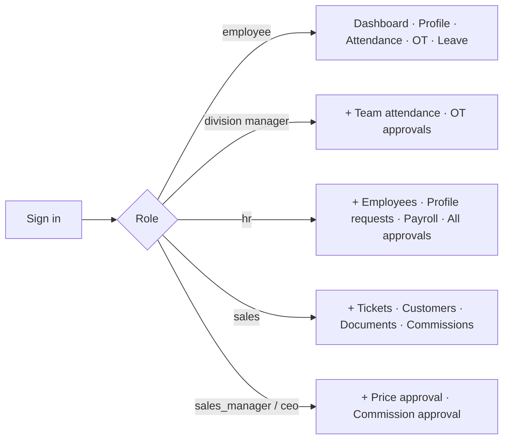
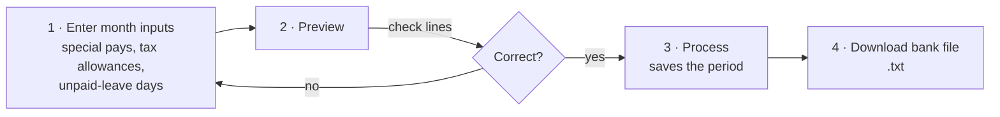

# GL&R ERP — User Manual

| | |
|---|---|
| **Document** | 02 — User Manual |
| **Version** | 1.0 · 2 July 2026 |
| **Audience** | All system users (employees, managers, HR, sales, executives) |

---

## Table of Contents

1. [Getting Started](#1-getting-started)
2. [For Every Employee](#2-for-every-employee)
3. [For Division Managers (ผู้จัดการฝ่าย)](#3-for-division-managers-ผู้จัดการฝ่าย)
4. [For HR](#4-for-hr)
5. [For Sales](#5-for-sales)
6. [For Sales Managers & Executives](#6-for-sales-managers--executives)
7. [For Foreign Purchasing (Import)](#7-for-foreign-purchasing-import)
8. [Notifications](#8-notifications)
9. [Frequently Asked Questions](#9-frequently-asked-questions)

---

## 1. Getting Started

### 1.1 Signing in

1. Open the portal in any modern browser (desktop or mobile).
   - Demo environment: `https://gl-r-erp.vercel.app` (API at `gl-r-erp.onrender.com`).
2. Enter your **company e-mail** and password.
3. **First sign-in:** the system forces you to set a new password before you can continue (temporary passwords are single-use by policy).

> 🔒 After several failed attempts the account is temporarily locked (rate limiting). Wait and retry, or contact HR.

### 1.2 What you see depends on who you are

Your menu is built from your role, which the system derives automatically from your division (ฝ่าย) and position — there is nothing to configure. See [01_ERP_Overview §4](01_ERP_Overview.md#4-user-roles--access-model).

### 1.3 Changing your password

**Menu → Change password** (or `POST /api/auth/change-password` behind the scenes). Enter your current password and the new one twice.

---

## 2. For Every Employee

### 2.1 Your dashboard

Shows your leave balances, recent attendance, pending requests, and company announcements.

### 2.2 Your profile & requesting corrections

You can view your own profile (personal details, assignment history). You **cannot edit it directly** — instead:

1. Open **Profile → Request change**.
2. Enter the corrected value (phone, address, emergency contact, …).
3. Submit. HR reviews the request; you can track its status under **My Requests** (`pending → approved / rejected`).

### 2.3 Attendance

**Attendance** shows your own clock-in/out history in real time, as collected from the SC700 card scanner. If a punch is missing, notify HR (they can backfill from the device's `.dat` archive).

### 2.4 Requesting overtime (OT)

OT must be requested **in advance** and approved before it counts toward pay:

1. **Overtime → New request**.
2. Choose the date, planned start/end time, day type (**workday** = 1.5× rate, **holiday** = 3.0× rate) and a reason (required).
3. Submit → status `SUBMITTED`. Your division manager (or HR) approves or rejects it.
4. After approval, actual worked minutes are recorded and the payable amount flows into that month's payroll automatically.
5. You can **cancel** your own request while it is still pending.

### 2.5 Requesting leave

1. **Leave → New request**.
2. Choose the type — the annual quotas are enforced automatically:

   | Type | Thai | Annual quota | Attachment |
   |---|---|---|---|
   | Sick | ลาป่วย | 30 days | Required (e.g., medical certificate) |
   | Vacation | ลาพักร้อน | 6 days | — |
   | Personal | ลากิจ | 3 days | — |

3. If your remaining balance is insufficient the system rejects the request immediately and tells you why.
4. Track status under **Leave**; you may cancel a pending request.

---

## 3. For Division Managers (ผู้จัดการฝ่าย)

Anyone whose position contains **ผู้จัดการ** (including assistant managers) automatically gets manager access over their own ฝ่าย:

| Action | Where |
|---|---|
| View attendance of everyone in your division | **Attendance** (division filter applied automatically) |
| Approve / reject OT requests from your division | **Overtime → Pending** |
| See the list of employees you can act on | **Overtime → Employees** |

Approving OT records you as the approver; rejected requests require no further action from the employee.

---

## 4. For HR

### 4.1 Employee management

- **Employees** lists the full employee master with search and filters (division, department, status). Large lists support pagination.
- **Add employee** creates the full record: personal data, assignment (division/department/position), bank account, addresses, family, education, salary history.
- **Edit** updates any section; assignment changes keep a dated history automatically.
- Access to sensitive fields (PII, salary) is **audit-logged** — every view/change of restricted data leaves a permanent trail.

### 4.2 Profile-change requests

**Profile Requests** shows all employee-submitted corrections. Approve (applies the change to the master record) or reject with a note.

### 4.3 Attendance administration

- View all punches across sites/devices; filter by employee, division, or date.
- **Import `.dat` file** (`Attendance → Import`) to backfill historical punches exported from the device or ZKAccess software.
- **Rotate device token** if an agent credential must be replaced (see [07_Hardware_Network_Documentation](07_Hardware_Network_Documentation.md)).

### 4.4 OT & leave administration

HR sees all OT and leave requests company-wide and can approve, reject, or cancel any of them, alongside division managers.

### 4.5 Payroll (monthly)

1. **Payroll → Preview**: pick the month. The system pulls every active employee, their approved OT pay and approved commissions for that month, applies SSO and progressive withholding tax, and shows the complete calculation per person.
2. Adjust per-employee inputs (special pays 1–8, tax allowances, unpaid-leave days, student-loan / legal-execution deductions) and re-preview.
3. **Process** finalizes the period. Processing is recorded with your identity and audit-logged.
4. **Bank export** downloads `glr-payroll-<period>.txt` — one line per employee (`bank account | employee code | name | net pay`).
   > ⚠️ This is a generic format. The KBank-specific upload format is on the roadmap ([01 Overview, Appendix A.1](01_ERP_Overview.md#a1-payroll-distribution-pipeline-)). Payslip PDF/e-mail is also not yet available — distribute statements manually for now.

---

## 5. For Sales

### 5.1 Sales tickets

A **ticket** tracks one customer deal from inquiry to closure:

1. **Tickets → New**: enter customer, items (product, size, quantity), and notes.
2. **Submit** the ticket into the queue.
3. Track its lifecycle on the ticket detail page — every action is recorded as an event, and you can comment on the ticket at any point.
4. When pricing is approved and the customer confirms, generate documents (below) and **close** the ticket.

See the full state machine in [03_Feature_Documentation §5](03_Feature_Documentation.md#5-sales-tickets).

### 5.2 Customers

**Customers** is a searchable directory used when creating tickets and documents.

### 5.3 Documents (quotation / deposit notice)

From a ticket: **Create deposit-notice draft** → pick a note template → edit line items and notes → **Preview** → **Issue**. Issued deposit notices get a running document number and a downloadable **XLSX** file. Corrections after issue go through a **revision** (the ticket's revision number increments; the old deposit notice stays on file).

### 5.4 Commissions

1. After a deal closes, **Commissions → Submit** with the invoice details (tax-invoice reference, amounts).
2. The system computes the commission from the configured tier structure automatically.
3. A sales manager approves it; approved commissions for the month flow into payroll automatically.
4. Use the **simulator** to preview a commission before submitting.

---

## 6. For Sales Managers & Executives

| Action | Where |
|---|---|
| Approve / reject proposed ticket prices | Ticket detail → price proposal |
| Approve commissions | **Commissions → Pending** |
| Record a **clawback** (e.g., cancelled invoice) | Commission detail → Clawback; the negative amount offsets the next payroll |
| Adjust commission deductions | Commission detail → Deductions |

Executives (`ceo`) see all of the above company-wide.

## 7. For Foreign Purchasing (Import)

The `import` role (PCIM division) participates in the ticket flow by picking up tickets that need foreign-purchase pricing and submitting **price proposals** for manager approval.

## 8. Notifications

The bell icon shows in-app notifications (e.g., a ticket assigned to you, a request decided). Click one to mark it read. *E-mail notifications are not yet implemented.*

## 9. Frequently Asked Questions

| Question | Answer |
|---|---|
| I forgot my password | Contact HR — they reset it; you'll be forced to set a new one at next sign-in. |
| My clock-in is missing | The device may have been offline; HR can backfill from the device `.dat` archive. |
| Why was my leave rejected instantly? | Your remaining quota for that leave type was insufficient — the system checks automatically. |
| Can I do OT without prior request? | No. OT must be requested and approved in advance to be payable. |
| Who can see my salary? | Only HR/payroll roles; every access is written to the audit log. |
| Can I use my phone? | Yes — the portal is responsive and works in any mobile browser. |

*End of document.*
