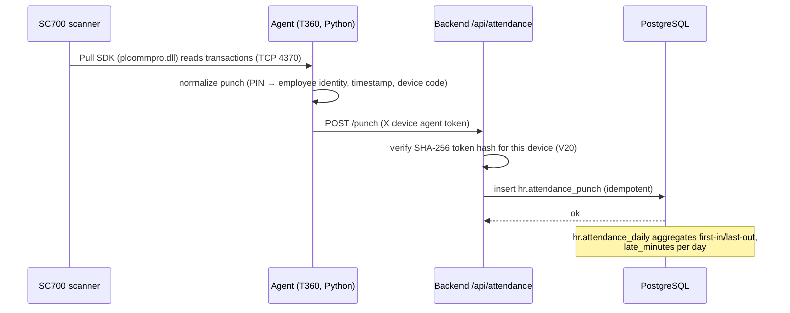
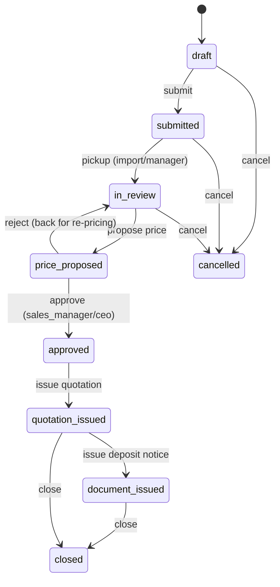
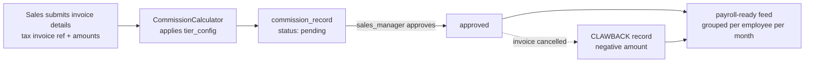
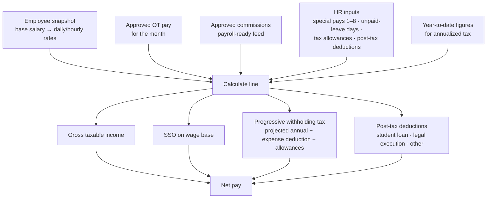

# GL&R ERP — Feature Documentation

| | |
|---|---|
| **Document** | 03 — Feature Documentation |
| **Version** | 1.0 · 2 July 2026 |
| **Audience** | Business owners, engineers, QA |
| **Scope** | Every implemented feature, its business rules and edge cases. Unbuilt items live in [01 Overview, Appendix A](01_ERP_Overview.md#appendix-a--future-work--roadmap). |

---

## Table of Contents

1. [Authentication & Access Control](#1-authentication--access-control)
2. [Employee Management](#2-employee-management)
3. [Attendance](#3-attendance)
4. [Overtime & Leave](#4-overtime--leave)
5. [Sales Tickets](#5-sales-tickets)
6. [Customers & Deposit Notices](#6-customers--deposit-notices)
7. [Commission](#7-commission)
8. [Payroll](#8-payroll)
9. [Dashboards, Notifications & Audit](#9-dashboards-notifications--audit)

---

## 1. Authentication & Access Control

**Code:** `backend/src/main/java/th/co/glr/hr/auth/`

| Rule | Detail |
|---|---|
| Credentials | Company e-mail + BCrypt-hashed password (`hr.employee.password_hash`, V11). E-mails are normalized on login. |
| First login | `must_change_password` forces a password change before any other action. |
| Rate limiting | `LoginRateLimitFilter` + `LoginAttemptTracker` lock out repeated failures. |
| Session | Server-side `HttpSession`, persisted to Postgres via Spring Session JDBC (V19) — sessions survive backend restarts and support horizontal scaling. |
| CSRF | Double-submit cookie pattern on mutating requests. |
| Role derivation | `DivisionAccessPolicy` maps division (ฝ่าย) + position → role at login. Roles: `admin`, `ceo`, `sales_manager`, `hr`, `sales`, `import`, `employee` (`ApplicationRoles`). No manually-assigned user table — V5 removed `app_user` UAM in favor of data-driven derivation. |
| Manager capability | Position containing **ผู้จัดการ** ⇒ `manager=true` on the session principal, scoped to the holder's `division_id`. |
| Enforcement | `SessionSecurityFilter` converts the session role to `ROLE_*` authorities; controllers guard with `@PreAuthorize` (e.g., payroll = `hasAnyRole('HR','ADMIN')`). Null-division employees fall back safely to `employee` (fixed in PR #55). |

## 2. Employee Management

**Code:** `employee/`, `profile/` · **Schema:** V1–V4

- Full employee master: identity, assignment (division → department → position with dated history), bank accounts, addresses, family, children, education, prior employment, salary history, resignation.
- **Restricted PII vault:** national-ID-grade fields live in a separate schema `hr_restricted.employee_pii`; HR reads of sensitive data are audit-logged (`aca8867`, V18).
- **Employee codes** are generated from a dedicated sequence (V3).
- **Self-service change requests** (`hr.profile_change_request`, V2): employees submit corrections; HR approves (auto-applies) or rejects. Performance indexes added in V4.
- **List pagination** is opt-in via query parameters (PR #59), keeping backward compatibility for existing consumers.

## 3. Attendance

**Code:** backend `attendance/` + Python agent `agents/attendance/` · **Schema:** V7, V20

| Rule | Detail |
|---|---|
| Device | ZKTeco SC700; the device **requires the Pull SDK** (`plcommpro.dll`) — the older `pyzk` protocol does not work with it (PR #66). Identity on device = employee **PIN**. |
| Agent auth | Each device has its own token; only the SHA-256 hash is stored (`attendance_device.agent_token_hash`). HR can **rotate** a token via `POST /api/attendance/devices/{deviceCode}/agent-token` (PR #61). |
| Historical backfill | `.dat` transaction files (from the device or ZKAccess) can be imported via `POST /api/attendance/imports/dat` or the CLI; an exporter regenerates `.dat` from device memory for backfill (PR #68). Import files and row-level errors are recorded (`attendance_import_file`, `attendance_import_error`). |
| Upload safety | `.dat` uploads are size-capped (hardening commit `96d768d`). |
| Coexistence | `pause-for-zkaccess.ps1` / `resume-agent.ps1` stop and restart the agent so ZKAccess maintenance can hold the single device session (PR #67). |
| Visibility | Employees see their own punches; division managers see their division; HR sees everything. |
| Lateness | `attendance_daily.late_minutes` is computed and stored. ⚠️ Not yet fed into payroll deductions (roadmap A.3). |

## 4. Overtime & Leave

**Code:** `overtime/`, `leave/` · **Schema:** V14, V13

### Overtime rules

| Rule | Value |
|---|---|
| Request timing | In advance, with mandatory reason |
| Day types & rates | `WORKDAY` → **1.50×** · `HOLIDAY` → **3.00×** (DB-enforced: `chk_overtime_multiplier`) |
| Statuses | `SUBMITTED → APPROVED / REJECTED / CANCELLED` (DB-enforced) |
| Approver | Division manager for their ฝ่าย, or HR/admin |
| Payroll feed | Approved OT's payable minutes × hourly rate × multiplier lands in that month's payroll automatically |
| Integrity | Planned end > start; actual minutes non-negative (DB constraints) |

### Leave rules

| Type | Quota/yr | Attachment required |
|---|---|---|
| ลาป่วย (Sick) | 30.00 days | ✅ |
| ลาพักร้อน (Vacation) | 6.00 days | — |
| ลากิจ (Personal) | 3.00 days | — |

- Balance check is automatic at submission; insufficient quota ⇒ immediate rejection with reason.
- Balances are **computed**, not stored: remaining = the `hr.leave_type` quota minus approved `hr.leave_request` days for the year. V13 drops the old `hr.leave_balance` stub — there is no live balance table to query.
- Approve/reject/cancel mirror the OT workflow.
- V13's duplicate `leave_type` creation vs. V1 was fixed for fresh databases (PR #52); CI now runs all migrations against real Postgres to prevent regressions (PR #53).

## 5. Sales Tickets

**Code:** `ticket/` · **Schema:** V6, V8–V10, V17

- Tickets carry customer info, line items (product, **size** (V9), quantity), priority (`LOW/NORMAL/HIGH`), payment/delivery status.
- Every transition writes a `ticket_event` (kind, from→to status, actor) — a complete audit trail per ticket. Comments are events too.
- Item edits after submission flag the ticket (`has_edits`, V10) so approvers see it changed.
- Item inserts are batched into a single round-trip (perf commit `888c645`).
- **Revisions:** correcting an issued deposit notice increments `ticket.revision_no` (V17) and keeps prior notices on file.

## 6. Customers & Deposit Notices

**Code:** `customer/`, `deposit/` · **Schema:** V16, V17 (tables renamed in V29)

- **Customer directory** (`sales.customer`): searchable read-only list feeding tickets/deposit notices (PR #56).
- **Note templates** (`sales.document_note_template`): reusable standard clauses (table name kept generic — not renamed in V29).
- **Deposit notices:** drafted from a ticket → line items copied/edited (`sales.deposit_notice_item`) → previewed → **issued** with a number from `sales.document_sequence` → file downloadable via `GET /api/deposit-notices/{id}/file`.
- **Issued as XLSX**, rendered from the `deposit_notice_template.xlsx` workbook (`?format=xlsx`). A `?format=pdf` branch exists but is a placeholder text stub — real PDF output is on the roadmap, not shipped.
- V29 renamed `sales.document`→`sales.deposit_notice` and `document_item`→`deposit_notice_item` (behavior-preserving); the deposit-notice API paths moved to `/api/deposit-notices/...` and `/api/tickets/{id}/deposit-notice/draft`. Quotation and invoice get their own tables.
- Document types/plans originate from `docs/QUOTATION_AND_REVISION_PLAN` and the quotation template workbook (`docs/quotation_template_source.xlsx`).

## 7. Commission

**Code:** `commission/` · **Schema:** V12

- **Tier structure** (`sales.tier_config`, seeded in V12): progressive rate by cumulative sales volume — 0.25 % on the first 250 000 THB, rising by 0.25 pp per 250 000 THB band (2.25 % at the 2.0–2.25 M band), with a high-roller flag for the top band. Rates are data — HR/management can retune without code changes.
- Kinds: `SALE` and `CLAWBACK` (negative, offsets future payroll).
- Deductions on a record are adjustable pre-approval (`PATCH /deductions`).
- A **simulator** endpoint lets sales preview a commission without saving.
- `GET /api/commissions/payroll-ready` aggregates approved amounts per employee for a payroll month — this is the contract the payroll module consumes.

## 8. Payroll

**Code:** `payroll/` · **Schema:** V15 (extends V1's `payroll_period`/`payroll_line`)

### Calculation pipeline (`PayrollCalculator`)

| Rule | Detail |
|---|---|
| Preview vs. process | **Preview** is side-effect-free; **Process** persists the period + lines with the processor's identity and timestamp. Both are HR/admin-only and audit-logged (`PROCESS_PAYROLL`). |
| Tax | Thai progressive PIT: projected annual income → expense deduction → allowances → annual tax → monthly withholding, using year-to-date data for accuracy. |
| SSO | Calculated on a capped wage base. |
| Bank export | `GET /api/payroll/{periodId}/bank-export` → `glr-payroll-<id>.txt`: header `GLR_PAYROLL\|month\|lineCount\|totalNet`, then `bankAccount\|employeeCode\|name\|netPay` per line. Export is audit-logged (`EXPORT_PAYROLL_BANK_FILE`). ⚠️ KBank's own format is roadmap A.1. |

## 9. Dashboards, Notifications & Audit

- **Dashboard** (`GET /api/dashboard/summary`): role-aware aggregates (headcounts, pending approvals, attendance summary) rendered as HR or employee dashboard in the SPA.
- **Notifications**: in-app feed with per-item mark-as-read (`PATCH /api/notifications/{id}/read`); populated by ticket-flow events. *No e-mail channel yet.*
- **Audit log** (`hr.audit_log`, V18): sensitive reads and payroll actions record actor, action, target, and touched fields (e.g., `bank_account,net_pay`). Log output is redaction-hardened (`96d768d`).

*End of document.*
