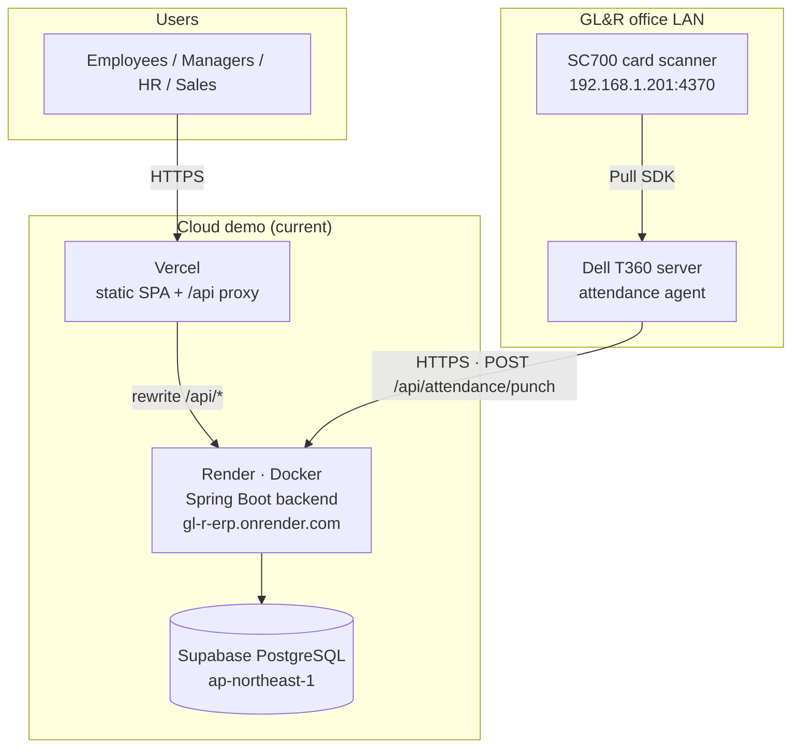
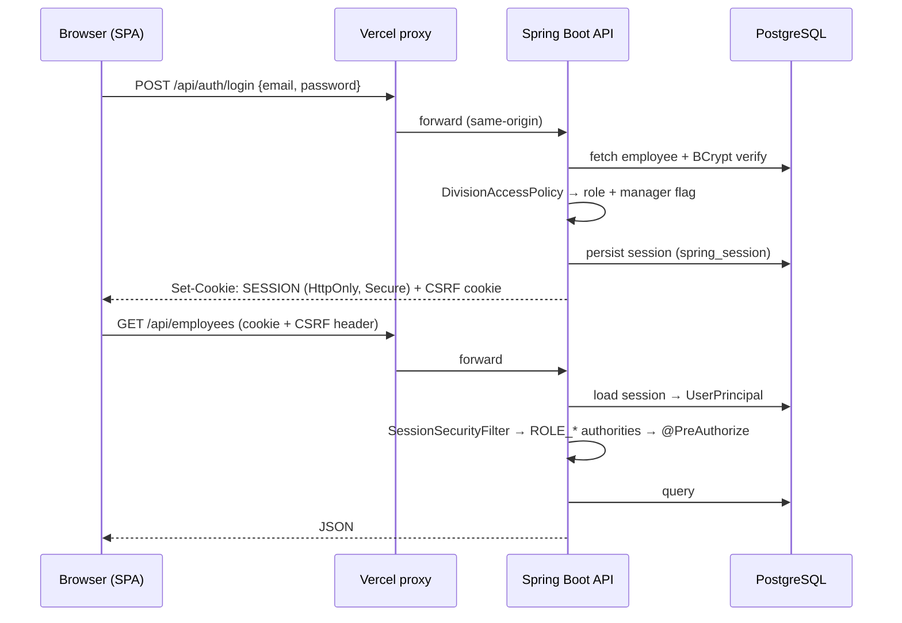
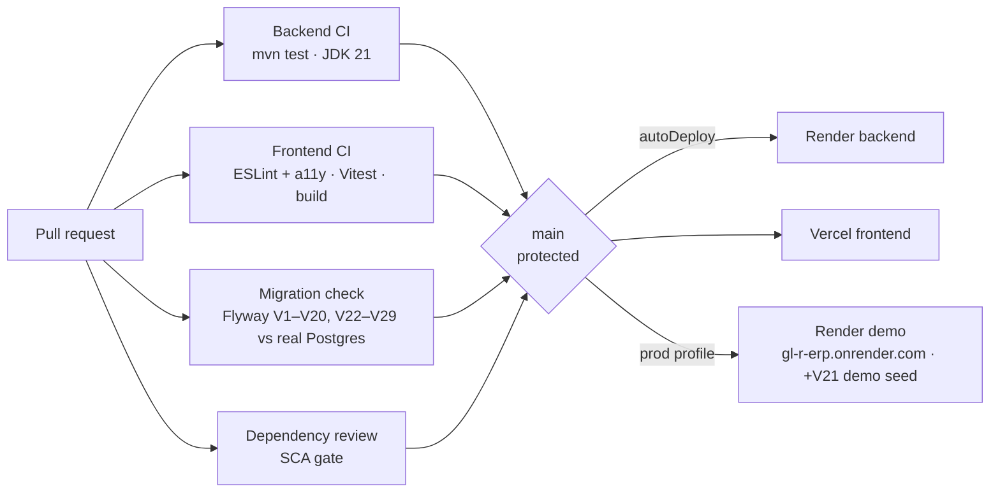

# GL&R ERP — Technical Architecture

| | |
|---|---|
| **Document** | 04 — Technical Architecture |
| **Version** | 1.0 · 2 July 2026 |
| **Audience** | Engineering |

---

## Table of Contents

1. [System Context](#1-system-context)
2. [Repository Layout](#2-repository-layout)
3. [Runtime Architecture](#3-runtime-architecture)
4. [Request Flow & Session Model](#4-request-flow--session-model)
5. [Security Architecture](#5-security-architecture)
6. [Data Architecture](#6-data-architecture)
7. [CI/CD](#7-cicd)
8. [Quality & Testing](#8-quality--testing)
9. [Key Architectural Decisions](#9-key-architectural-decisions)

---

## 1. System Context



The Vercel rewrite keeps browser calls **same-origin** (`/api/* → gl-r-erp.onrender.com`), so CORS is only a fallback and cookies stay first-party.

## 2. Repository Layout

```text
GL-R-ERP/
├── frontend/          React 18 + Vite SPA (features/, components/, api/)
├── backend/           Spring Boot 3.5.x (Java 21), Maven
│   └── src/main/java/th/co/glr/hr/
│       ├── auth/         login, sessions, role derivation, rate limiting
│       ├── employee/     employee master CRUD
│       ├── profile/      self-service change requests
│       ├── attendance/   punch ingestion, .dat import, device tokens
│       ├── overtime/     OT workflow
│       ├── leave/        leave workflow
│       ├── ticket/       sales ticket lifecycle
│       ├── customer/     customer directory
│       ├── deposit/      deposit-notice generation (XLSX; table renamed in V29)
│       ├── commission/   tier calc, approval, clawback
│       ├── payroll/      calculation, processing, bank export
│       ├── dashboard/    role-aware summary
│       ├── notification/ in-app notifications
│       ├── audit/        audit log writes
│       ├── common/       ApiException + handler
│       └── config/       CORS, properties, seeding
│   └── src/main/resources/db/migration/   Flyway V1–V20, V22–V29 (head V29; V21 in db/migration-demo, prod-only)
├── agents/attendance/  Python SC700 agent + ops scripts (Windows)
├── docker-compose.yml  local Postgres 16 + backend
├── render.yaml         Render blueprint (backend)
└── vercel.json         frontend build + /api proxy + security headers
```

Backend modules follow **package-by-feature**: each domain owns its controller, service, repository (plain JDBC/SQL), and DTOs. There is no shared ORM layer; repositories issue explicit SQL against Flyway-managed schemas.

## 3. Runtime Architecture

| Component | Technology | Responsibility |
|---|---|---|
| SPA | React 18, Vite | All UI; talks only to `/api/*`; role-gated navigation |
| API | Spring Boot 3.5.16, Java 21 | Business rules, authorization, persistence |
| DB | PostgreSQL 16 | Three schemas: `hr`, `hr_restricted`, `sales`; also stores HTTP sessions |
| Agent | Python 3 + Pull SDK DLL | Reads SC700 transactions, posts normalized punches |
| Proxy/CDN | Vercel | Static hosting, `/api` rewrite, security headers (CSP, HSTS, XFO…) |

## 4. Request Flow & Session Model



- `UserPrincipal` (serializable record) carries `id, email, name, role, employeeId, active, mustChangePassword, divisionId, manager`.
- Sessions live in `hr.spring_session` (V19) — restart-safe and multi-instance-ready.
- Unknown routes return **404** (not 500) via the API exception handler (PR #65).

## 5. Security Architecture

| Control | Implementation |
|---|---|
| Password storage | BCrypt (`password_hash`, V11); startup backfill runner for legacy rows |
| Forced rotation | `must_change_password` gate blocks all other endpoints |
| Brute-force defense | Login rate limiting + account lockout (`LoginRateLimitFilter`) |
| CSRF | Double-submit cookie |
| Transport/browser | Vercel headers: CSP (`default-src 'self'`), HSTS, `X-Frame-Options: DENY`, `nosniff`, no-referrer |
| AuthZ | `@PreAuthorize` role guards per endpoint; division-scoped manager checks in services |
| PII isolation | `hr_restricted.employee_pii` schema; HR reads audit-logged |
| Audit | `hr.audit_log` (V18): actor, action, target, fields — used for PII access, payroll process/export |
| Device auth | Per-device agent tokens, SHA-256-hashed at rest, rotatable (V20) |
| Upload safety | `.dat` size cap; log redaction; non-root container (`96d768d`) |
| Supply chain | Dependabot + `dependency-review-action` SCA gate; `npm audit` in CI |

## 6. Data Architecture

Details in [05_Database_Documentation](05_Database_Documentation.md). Principles:

- **Flyway-only schema changes** — head V29 (V1–V20, V22–V29 in the default path; V21 is demo-only, prod profile), forward-fix policy (no down-migrations).
- **Constraint-enforced business rules** — OT multipliers, ticket statuses, leave quotas are CHECK-constrained/seeded in the DB, not just app code.
- **Separation of sensitive data** — `hr_restricted` schema isolates PII from routine queries.
- **Event sourcing (light)** — `sales.ticket_event` records every ticket transition for traceability.

## 7. CI/CD



- `main` is protected; work lands via feature branch + PR (one issue per PR).
- Dependabot keeps GitHub Actions and dependencies current.

## 8. Quality & Testing

| Layer | Harness |
|---|---|
| Backend unit/controller | JUnit + Spring MockMvc (`backend/src/test/...`), incl. negative auth-access cases |
| Backend repositories | **Real-Postgres integration tests** (PR #63) — SQL runs against an actual database in CI |
| Migrations | Full Flyway run against real Postgres in CI (PR #53) |
| Frontend | Vitest + React Testing Library harness (PR #62); ESLint + `jsx-a11y` |
| Accessibility | Modal focus management, toast live regions, labeled controls (`36dac76`) |

## 9. Key Architectural Decisions

| Decision | Rationale |
|---|---|
| **Data-driven roles** (V5 removed `app_user` UAM) | Roles derive from division/position so bulk employee re-imports can't orphan permissions |
| **Pull SDK over pyzk** (PR #66) | The SC700 does not speak the pyzk protocol; `plcommpro.dll` verified against the real device |
| **Sessions in Postgres** (PR #60) | Restart-safe login on Render's ephemeral containers; enables scale-out |
| **LTS stack pin** (PR #51) | Spring Boot 3.5.x / Java 21 / Node LTS chosen over bleeding-edge (JDK 25 CI retired) for stability |
| **Same-origin proxy on Vercel** | Avoids CORS/third-party-cookie problems entirely |
| **Plain SQL repositories** | Transparent queries, no ORM magic; pairs with real-Postgres integration tests |
| **Forward-fix migrations** | V13's fresh-DB collision was fixed forward (PR #52) and guarded by CI, not rolled back |

*End of document.*
