# GL&R ERP — Database Documentation

| | |
|---|---|
| **Document** | 05 — Database Documentation |
| **Version** | 1.0 · 2 July 2026 |
| **Engine** | PostgreSQL 16 |
| **Migrations** | Flyway `backend/src/main/resources/db/migration/` — head **V30** (V1–V20 + V22–V30; forward-fix policy). V21 lives in `db/migration-demo/` and is applied under the `prod` profile only |

---

## Table of Contents

1. [Schema Overview](#1-schema-overview)
2. [Entity-Relationship Diagram](#2-entity-relationship-diagram)
3. [Table Catalog — HR Domain](#3-table-catalog--hr-domain)
4. [Table Catalog — Sales Domain](#4-table-catalog--sales-domain)
5. [Migration History](#5-migration-history)
6. [Conventions & Integrity Rules](#6-conventions--integrity-rules)

---

## 1. Schema Overview

| Schema | Purpose | Access posture |
|---|---|---|
| `hr` | Employee master, attendance, OT, leave, payroll, sessions, audit | Application role |
| `hr_restricted` | High-sensitivity PII (`employee_pii`) | Restricted; HR reads are audit-logged |
| `sales` | Tickets, quotations, deposit notices, customers, commissions | Application role |

## 2. Entity-Relationship Diagram

Core entities and relationships (attribute lists abridged for readability):

```mermaid
erDiagram
    EMPLOYEE ||--o{ EMPLOYEE_ASSIGNMENT : "has history of"
    EMPLOYEE ||--o{ SALARY_HISTORY : has
    EMPLOYEE ||--o{ EMPLOYEE_BANK_ACCOUNT : has
    EMPLOYEE ||--o| EMPLOYEE_PII : "restricted vault"
    EMPLOYEE ||--o{ PROFILE_CHANGE_REQUEST : submits
    DIVISION ||--o{ DEPARTMENT : contains
    DIVISION ||--o{ EMPLOYEE : "ฝ่าย of"
    POSITION ||--o{ EMPLOYEE_ASSIGNMENT : "role in"

    EMPLOYEE ||--o{ ATTENDANCE_PUNCH : generates
    ATTENDANCE_DEVICE ||--o{ ATTENDANCE_PUNCH : records
    ATTENDANCE_SITE ||--o{ ATTENDANCE_DEVICE : hosts
    EMPLOYEE ||--o{ ATTENDANCE_DAILY : "aggregated per day"

    EMPLOYEE ||--o{ OVERTIME_REQUEST : requests
    EMPLOYEE ||--o{ LEAVE_REQUEST : requests
    LEAVE_TYPE ||--o{ LEAVE_REQUEST : classifies
    %% Leave balances are computed from leave_type quotas minus approved leave_request days; there is no leave_balance table.

    PAYROLL_PERIOD ||--o{ PAYROLL_LINE : contains
    EMPLOYEE ||--o{ PAYROLL_LINE : "paid via"

    CUSTOMER ||--o{ TICKET : "subject of"
    TICKET ||--o{ TICKET_ITEM : contains
    TICKET ||--o{ TICKET_EVENT : "audit trail"
    TICKET ||--o{ QUOTATION : produces
    TICKET ||--o{ DEPOSIT_NOTICE : produces
    DEPOSIT_NOTICE ||--o{ DEPOSIT_NOTICE_ITEM : contains

    EMPLOYEE ||--o{ COMMISSION_RECORD : earns
    INVOICE_DETAILS ||--o{ COMMISSION_RECORD : "basis of"
    TIER_CONFIG ||..o{ COMMISSION_RECORD : "rates applied"

    EMPLOYEE ||--o{ AUDIT_LOG : "actions logged"
```

## 3. Table Catalog — HR Domain

### 3.1 Employee master (V1–V5, V11)

| Table | Purpose |
|---|---|
| `hr.employee` | Core employee record incl. `password_hash`, `must_change_password` (V11) |
| `hr.division` / `hr.department` | ฝ่าย / แผนก hierarchy |
| `hr.position`, `hr.employee_level`, `hr.title` | Position catalog, band (L/M…), name titles |
| `hr.employee_assignment` | Dated division/department/position history |
| `hr.salary_history` | Salary changes over time |
| `hr.employee_bank_account`, `hr.bank` | Payout account per employee |
| `hr.employee_address`, `hr.country` | Addresses |
| `hr.employee_family`, `hr.employee_child` | Family data |
| `hr.education_history`, `hr.prior_employment` | Background |
| `hr.employee_foreign_doc` | Work permits / foreign documents |
| `hr.employment_status`, `hr.resignation`, `hr.resignation_type` | Lifecycle |
| `hr.employee_emergency_contact` (V2) | Emergency contacts |
| `hr.profile_change_request` (V2, indexes V4) | Self-service corrections; status pending/approved/rejected |
| `hr_restricted.employee_pii` | Sensitive identifiers, isolated schema |
| `hr.employee_code_seq` (V3) | Employee-code generation |
| `hr.etl_error_log` | Import error capture |

> V5 dropped the standalone `app_user`/role/permission UAM tables — authentication now runs off `hr.employee` with data-derived roles.

### 3.2 Attendance (V7, V20)

| Table | Purpose |
|---|---|
| `hr.attendance_site` | Physical sites (e.g., SHOWROOM) |
| `hr.attendance_device` | Devices per site; `agent_token_hash CHAR(64)` + `agent_token_rotated_at` (V20) |
| `hr.attendance_punch` | Raw punches (employee, device, timestamp, direction) |
| `hr.attendance_daily` | Per-day aggregate: first-in/last-out, `late_minutes ≥ 0` |
| `hr.attendance_import_file` / `hr.attendance_import_error` | `.dat` import bookkeeping + row errors |

### 3.3 Leave & overtime (V13, V14)

| Table | Purpose / key constraints |
|---|---|
| `hr.leave_type` | Seeded: SICK 30 d (attachment ✅), VACATION 6 d, PERSONAL 3 d; the seeded per-type quota is the balance basis |
| `hr.leave_request` | Status workflow; FK cascade on employee |
| `hr.overtime_request` | `day_type ∈ (WORKDAY, HOLIDAY)`; `pay_rate_multiplier ∈ (1.50, 3.00)`; `status ∈ (SUBMITTED, APPROVED, REJECTED, CANCELLED)`; planned/actual minute integrity checks; `payroll_month` link |

> **No `hr.leave_balance` table.** V1 created a placeholder stub; V13 drops it and never recreates it. Remaining balances are **computed** at read time from the `leave_type` quota minus approved `leave_request` days — do not query a stored balance table.

### 3.4 Payroll (V1 base, V15)

| Table | Purpose |
|---|---|
| `hr.payroll_period` | One row per processed month; `processed_at`, `processed_by_id` (V15) |
| `hr.payroll_line` | Per-employee result: base salary, daily/hourly rates, special pays 1–8 (+ total), `overtime_pay`, `commission_pay`, unpaid-leave days/deduction, gross taxable income, `sso_wage_base` + `social_security`, projected annual income → expense deduction → allowances → `annual_tax` → `withholding_tax`, student-loan / legal-execution / other post-tax deductions, `calculation_note` (V15) |

### 3.5 Platform (V18, V19)

| Table | Purpose |
|---|---|
| `hr.audit_log` (V18) | Actor, action (e.g., `PROCESS_PAYROLL`, `EXPORT_PAYROLL_BANK_FILE`), target, touched fields, timestamp |
| `hr.spring_session` + `hr.spring_session_attributes` (V19) | Server-side session store (Spring Session JDBC) |

## 4. Table Catalog — Sales Domain

### 4.1 Tickets & quotations (V6, V8–V10, V17)

| Table | Purpose / key constraints |
|---|---|
| `sales.ticket` | Deal record; `status ∈ (draft, submitted, in_review, price_proposed, approved, quotation_issued, document_issued, closed, cancelled)`; `priority ∈ (LOW, NORMAL, HIGH)`; `has_edits` (V10); `revision_no` (V17); payment/delivery status |
| `sales.ticket_item` | Line items; product fields (V8) + `size` (V9) |
| `sales.ticket_event` | Every transition/comment: kind, from→to status, actor |
| `sales.quotation` | Issued quotations |
| `sales.notification` | In-app notification feed |

### 4.2 Deposit notices & customers (V16, V17, renamed V29)

| Table | Purpose |
|---|---|
| `sales.customer` (V16) | Customer directory |
| `sales.document_note_template` (V16) | Reusable clauses (kept generic — not renamed) |
| `sales.document_sequence` (V17) | Running document numbers per type (kept generic — not renamed) |
| `sales.deposit_notice` (V17, renamed from `sales.document` in V29) | Deposit-notice header, status (draft→issued), file; PK `deposit_notice_id` |
| `sales.deposit_notice_item` (V17, renamed from `sales.document_item` in V29) | Deposit-notice line items |

> **V29 rename.** `sales.document`/`document_item` were deposit-notice-specific in everything but name, so V29 renamed them to `deposit_notice`/`deposit_notice_item` (behavior-preserving; data, FKs, and identity sequences intact). Quotation and invoice get their own tables. The shared `document_sequence` and `document_note_template` are intentionally left generic.

### 4.3 Commission (V12)

| Table | Purpose |
|---|---|
| `sales.invoice_details` | Tax-invoice metadata backing a commission |
| `sales.commission_record` | Kind `SALE`/`CLAWBACK`, amounts, deductions, status, payroll month |
| `sales.tier_config` | Seeded progressive bands: 0.25 % per 250 k THB band up to 2.25 %+, `is_high_roller` top band; `upper_bound NULL` = open-ended; rates retunable as data |

## 5. Migration History

| Version | Name | Summary |
|---|---|---|
| V1 | `employee_master_schema` | Full HR master, lookup tables, PII vault, base leave/payroll/UAM |
| V2 | `backend_extensions` | Emergency contacts, profile change requests |
| V3 | `employee_code_sequence` | Employee code generator |
| V4 | `profile_request_performance_indexes` | Indexes for request queues |
| V5 | `remove_app_user_uam` | Drop manual UAM → data-derived roles |
| V6 | `sales_ticket_schema` | Tickets, items, events, quotations, notifications |
| V7 | `attendance_schema` | Sites, devices, punches, daily aggregates, import bookkeeping |
| V8 | `ticket_item_product_fields` | Product attributes on items |
| V9 | `ticket_item_add_size` | `size` column |
| V10 | `ticket_has_edits` | Post-submit edit flag |
| V11 | `employee_password_hash` | BCrypt hash + forced-change flag |
| V12 | `sales_commission_schema` | Invoices, commission records, tier config (seeded) |
| V13 | `leave_management_schema` | Leave types (seeded), balances, requests |
| V14 | `overtime_management_schema` | OT requests with rate/day-type constraints |
| V15 | `payroll_processing_schema` | Full payroll-line calculation columns, processing metadata |
| V16 | `customers_and_note_templates` | Customer directory, note templates |
| V17 | `documents_and_revision` | Documents, items, sequences, ticket revisions |
| V18 | `audit_log` | Audit trail table |
| V19 | `spring_session_jdbc` | Session persistence |
| V20 | `attendance_device_agent_token` | Per-device token hash + rotation timestamp |
| V21 | `demo_seed_accounts` | Demo seed accounts (Demo@2026, one per role) — **not in the default path**; lives in `db/migration-demo/` and runs under the `prod` profile only (Render demo). A clean on-prem/UAT deploy skips V21 by design |
| V22 | `ticket_item_factory` | `factory` column on `ticket_item` (brand→factory mapping) |
| V23 | `contacts_projects_ticket_fk` | `sales.contact` + `sales.project` tables; ticket FK links |
| V24 | `catalog_and_qty_sqm` | `sales.catalog` product master + `qty_sqm` on `ticket_item` (pcs↔sqm) |
| V25 | `factory_config_and_raw_price` | `sales.factory_config` (email/currency/unit) + raw-price fields on `ticket_item` |
| V26 | `price_calc_engine` | CEO price-calc engine: `sales.fx_rates` + versioned `sales.price_calc_config` |
| V27 | `quotation_fields_and_attachments` | Quotation issuance fields + `sales.attachment` (PO / signed-back files) |
| V28 | `revision_versioning` | Item snapshot in `ticket_event` + quotation versioning (Rev 1, 2, …) |
| V29 | `rename_document_to_deposit_notice` | Rename `sales.document`→`deposit_notice` and `document_item`→`deposit_notice_item` (behavior-preserving) |
| V30 | `normalize_manager_positions` | Collapse ฝ่าย-baked manager titles (e.g. `ผู้จัดการฝ่ายขาย`) to canonical `ผู้จัดการ`; `ผู้ช่วยผู้จัดการ` kept distinct; `กรรมการผู้จัดการ` (MD) untouched |

> **Head is V30.** The default migration path applies V1–V20 then V22–V30 (29 files); V21 is absent by design (demo-only, see above).

## 6. Conventions & Integrity Rules

- **Identity:** `BIGINT GENERATED ALWAYS AS IDENTITY` primary keys throughout.
- **Time:** `TIMESTAMPTZ` for instants; `DATE` for calendar concepts (payroll month normalized to day 1).
- **Money:** `NUMERIC(12,2)` (rates `NUMERIC(12,4)`, annual figures `NUMERIC(14,2)`) — never floating point.
- **Business rules in CHECK constraints** wherever stable (OT multipliers, statuses, tier bounds) so no code path can write invalid states.
- **Bilingual lookups:** reference tables carry `name_th` / `name_en`.
- **Forward-fix migrations:** never edit an applied migration; fix with a new version (see V13 incident, PR #52). CI executes the full chain against real Postgres on every PR.
- **Idempotent seeds:** `ON CONFLICT DO NOTHING` for seeded reference data.

*End of document.*
