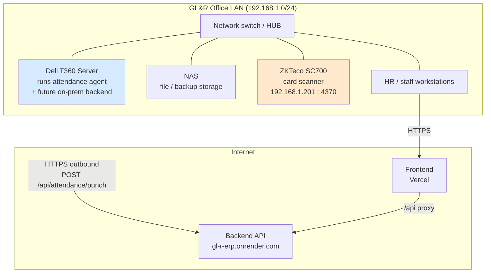

# GL&R ERP — Hardware & Network Documentation

| | |
|---|---|
| **Document** | 07 — Hardware & Network Documentation |
| **Version** | 1.0 · 2 July 2026 |
| **Audience** | IT / operations |
| **Sources** | `01 Diagram Network GL_R.pdf`, `agents/attendance/` (README, field-test & setup guides) |

---

## Table of Contents

1. [Overview](#1-overview)
2. [On-Premise Network Topology](#2-on-premise-network-topology)
3. [Hardware Inventory](#3-hardware-inventory)
4. [Attendance Device — ZKTeco SC700](#4-attendance-device--zkteco-sc700)
5. [The Attendance Agent](#5-the-attendance-agent)
6. [Network Security Rules](#6-network-security-rules)
7. [Connectivity Checks](#7-connectivity-checks)

---

## 1. Overview

GL&R's design keeps the **capture** of attendance on the local network (server, NAS, card scanner on one LAN — per the network diagram) while the **application** currently runs in the cloud demo. The only bridge between the two is the attendance agent, which pulls punches locally and posts them outbound over HTTPS to the backend. No inbound port to the office is required.

## 2. On-Premise Network Topology



> In the **target production** design, the backend and PostgreSQL move onto the T360 (see [08 Deployment](08_Deployment_Guide.md) and [01 Overview, Appendix A.4](01_ERP_Overview.md#a4-production-go-live-on-premises-)), so the whole system stays inside the LAN with only the web portal exposed via a domain + TLS.

## 3. Hardware Inventory

| Device | Role | Notes |
|---|---|---|
| **Dell T360 server** | Hosts the attendance agent (Windows service); planned host for backend + PostgreSQL in production | Zero incremental hosting cost — company-owned |
| **NAS** | File and backup storage on the LAN | Backup target for DB dumps (see [09 Backup & Recovery](09_Backup_Recovery.md)) |
| **ZKTeco SC700** | Fingerprint/card attendance terminal | IP `192.168.1.201`, TCP `4370`, comm key `0` (showroom default) |
| **Network switch/HUB** | Connects server, NAS, scanner, workstations | Single flat LAN in the current showroom setup |
| Workstations | HR/staff browser access | Any modern browser, desktop or mobile |

## 4. Attendance Device — ZKTeco SC700

| Property | Value |
|---|---|
| Model | ZKTeco SC700 |
| IP / Port | `192.168.1.201` / `4370` (TCP) |
| Communication key | `0` (showroom default) |
| Employee identity | Device **PIN** = employee identifier used to match punches |
| SDK | **Pull SDK via `plcommpro.dll`** — required; the older `pyzk` protocol does **not** work with this device (PR #66, verified against the real device) |

> ⚠️ **Single-session device.** The SC700 is unreliable with multiple simultaneous SDK sessions. Do not run ZKAccess and the agent at the same time — use the maintenance scripts in [§5](#5-the-attendance-agent).

## 5. The Attendance Agent

**Location:** `agents/attendance/` · **Runtime:** Python 3 on the Dell T360 (Windows), intended to run as a service.

| Script | Purpose |
|---|---|
| `showroom_agent.py` | Production agent: reads device transactions and posts punches to the backend. |
| `sc700_pull_test.py` | Pull SDK connectivity/diagnostic test. |
| `sc700_simple_test.py` / `sc700_local_test.py` | Scanner-only tests (no backend), for field validation. |
| `export_transactions_dat.py` | Export device memory to a `.dat` file for historical backfill (PR #68). |
| `import_dat.py` | CLI to import a `.dat` file into the backend. |
| `pause-for-zkaccess.ps1` | Stop the agent so ZKAccess can hold the device session (PR #67). |
| `resume-agent.ps1` | Restart the agent after maintenance. |

### Agent configuration (environment variables)

```powershell
$env:ZK_HOST = "192.168.1.201"
$env:ZK_PORT = "4370"
$env:ZK_PASSWORD = "0"
$env:ATTENDANCE_SITE_CODE = "SHOWROOM"
$env:ATTENDANCE_DEVICE_CODE = "SHOWROOM_SC700"
$env:ATTENDANCE_API_URL = "http://127.0.0.1:8080/api/attendance/punch"   # prod: the Render/T360 URL
$env:ATTENDANCE_AGENT_TOKEN = "replace-with-server-token"                # per-device token (rotatable)
$env:ATTENDANCE_AGENT_DATA_DIR = "C:\glr-attendance-agent"
```

### Agent → backend authentication

```mermaid
sequenceDiagram
    participant HR as HR (portal)
    participant API as Backend
    participant AG as Agent (T360)
    HR->>API: POST /api/attendance/devices/SHOWROOM_SC700/agent-token
    API-->>HR: plaintext token (shown once)
    Note over API: stores SHA-256(token) in attendance_device.agent_token_hash
    HR->>AG: set ATTENDANCE_AGENT_TOKEN
    AG->>API: POST /punch (token header)
    API->>API: hash and compare; accept if match
```

Tokens are per-device and rotatable; only the hash is stored server-side (V20).

## 6. Network Security Rules

- **Never expose** the scanner IP or TCP `4370` to the public internet (field-test guide).
- The agent connects **outbound** only — no inbound firewall opening to the office is needed for the cloud demo.
- One active device session at a time (ZKAccess vs. agent — use pause/resume).
- Production web exposure should be domain + Let's Encrypt TLS only; the API and DB stay on the LAN in the target design.
- Device tokens are secrets — set via environment, never committed (`APP_ATTENDANCE_AGENT_TOKEN` is `sync:false` in `render.yaml`).

## 7. Connectivity Checks

Run from the **T360 server** (not a laptop) to confirm it can reach the scanner:

```powershell
ping 192.168.1.201
Test-NetConnection 192.168.1.201 -Port 4370
```

Then validate the SDK path without touching the backend:

```powershell
python agents\attendance\sc700_pull_test.py --check
python agents\attendance\showroom_agent.py --once-catchup --dry-run
```

| Symptom | Likely cause |
|---|---|
| `ping` ok, port `4370` fails | Windows Firewall, VLAN/subnet ACL, device comms settings, or another app holding the session |
| SDK connects but no new punches | Another session open (ZKAccess) — run `pause-for-zkaccess.ps1` |
| Punches read but backend rejects | Wrong/rotated agent token — re-mint via the portal |

See [10 Troubleshooting](10_Troubleshooting_Guide.md) for the full matrix.

*End of document.*
