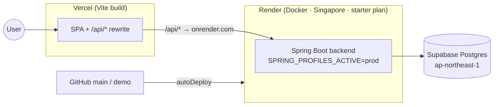

# GL&R ERP — Deployment Guide

| | |
|---|---|
| **Document** | 08 — Deployment Guide |
| **Version** | 1.0 · 2 July 2026 |
| **Audience** | DevOps / engineering |

---

## Table of Contents

1. [Environments](#1-environments)
2. [Prerequisites](#2-prerequisites)
3. [Local Development](#3-local-development)
4. [Docker Compose](#4-docker-compose)
5. [Cloud Demo — Render + Vercel + Supabase](#5-cloud-demo--render--vercel--supabase)
6. [Configuration Reference](#6-configuration-reference)
7. [Database Migrations](#7-database-migrations)
8. [Target Production — On-Premise T360](#8-target-production--on-premise-t360)

---

## 1. Environments

| Environment | Frontend | Backend | Database | Purpose |
|---|---|---|---|---|
| Local | Vite dev server (`:5173/5174`) | `mvn spring-boot:run` (`:8080`) | Local Postgres or Docker | Development |
| Docker | — | `docker-compose` backend (`:8080`) | `docker-compose` Postgres 16 (`:5432`) | Integrated local run |
| Cloud demo | Vercel | Render (Docker, Singapore) | Supabase Postgres (ap-northeast-1) | Showcase — `gl-r-erp.onrender.com`, DB at V21 with demo accounts |
| Production (target) | LAN / domain | Dell T360 | T360 Postgres | On-premise go-live (pending) |

## 2. Prerequisites

- **Java 21** (LTS) and **Maven** for the backend.
- **Node.js LTS** + npm for the frontend.
- **PostgreSQL 16** (local, Docker, or Supabase).
- **Docker** (optional, for the compose path).

## 3. Local Development

### Backend

```bash
cd backend
# Secrets live in the git-ignored .env.local (copy from .env.example)
set -a; source .env.local; set +a
mvn spring-boot:run
```

### Frontend

```bash
cd frontend
npm install
# Point the SPA at a local backend:
VITE_API_BASE_URL=http://127.0.0.1:8080 npm run dev
```

### Tests & build

```bash
cd backend && mvn test                 # unit + controller + real-Postgres integration tests
cd backend && mvn -DskipTests package  # build jar
cd frontend && npm run build           # build SPA
```

## 4. Docker Compose

`docker-compose.yml` brings up Postgres 16 + the backend with Flyway enabled:

```bash
docker compose up --build
```

| Service | Detail |
|---|---|
| `db` | `postgres:16-alpine`, DB `hris`, healthcheck via `pg_isready`, volume `pgdata` |
| `backend` | Built from `backend/Dockerfile`, waits for DB health, `:8080`, `APP_FLYWAY_ENABLED=true` |

The backend container is configured for a frontend origin of `http://127.0.0.1:5174` (CORS) and non-secure cookies for local HTTP.

## 5. Cloud Demo — Render + Vercel + Supabase



### Render (backend) — `render.yaml`

- `type: web`, `runtime: docker`, `rootDir: backend`, region **Singapore** (closest to the Supabase `ap-northeast-1` DB).
- **starter plan** (not free) — the free tier's CPU throttling makes slow cold-starts lose Render's port scan.
- `autoDeploy: true` on the connected branch.
- Secrets are `sync:false` (set in the Render dashboard, never in git): `SPRING_DATASOURCE_URL/USERNAME/PASSWORD`, `APP_CORS_ALLOWED_ORIGINS`, `APP_ATTENDANCE_AGENT_TOKEN`.
- Service name pinned so the URL is deterministic: `https://gl-r-erp.onrender.com`.

### Vercel (frontend) — `vercel.json`

- Framework `vite`; builds `frontend/`, output `frontend/dist`.
- **Rewrites:** `/api/:path* → https://gl-r-erp.onrender.com/api/:path*` (same-origin calls, no CORS/third-party cookies); SPA fallback `/(.*) → /index.html`.
- **Security headers on every response:** CSP (`default-src 'self'`, no inline scripts), `X-Content-Type-Options: nosniff`, `X-Frame-Options: DENY`, `Referrer-Policy: no-referrer`, `Strict-Transport-Security` (1 year, includeSubDomains).

> **Demo branch:** the `demo` branch deploys to `gl-r-erp.onrender.com` with the database at V21 (`Demo@2026` accounts, one per role). It is an intentional showcase, not real production data.

## 6. Configuration Reference

| Variable | Where | Meaning |
|---|---|---|
| `SPRING_DATASOURCE_URL/USERNAME/PASSWORD` | backend | Postgres connection (secret in prod) |
| `SPRING_PROFILES_ACTIVE` | backend | `prod` on Render; default local |
| `APP_FLYWAY_ENABLED` | backend | Run migrations on startup |
| `APP_CORS_ALLOWED_ORIGINS` | backend | Allowed browser origins (CORS fallback) |
| `SERVER_SESSION_COOKIE_SECURE` | backend | `true` in prod (HTTPS), `false` local |
| `APP_ATTENDANCE_AGENT_TOKEN` | backend | Device agent auth secret (`sync:false`) |
| `VITE_API_BASE_URL` | frontend | API base for local dev (prod uses the proxy) |

Local secrets belong in `backend/.env.local` (git-ignored); commit only `backend/.env.example`.

## 7. Database Migrations

- Flyway runs automatically when `APP_FLYWAY_ENABLED=true`, applying `V1..V21` in order.
- **Never edit an applied migration** — add a new version (forward-fix). The V13 fresh-DB collision was fixed this way (PR #52).
- CI runs the full migration chain against a real Postgres on every PR (PR #53) to catch ordering/collision issues before merge.

## 8. Target Production — On-Premise T360

Planned go-live (not yet executed — see [01 Overview, Appendix A.4](01_ERP_Overview.md#a4-production-go-live-on-premises-)):

1. Install PostgreSQL 16 and deploy the backend on the Dell T360 (the compose file is a starting point).
2. Register a domain (`~500–800 THB/yr`) and issue TLS via Let's Encrypt (free).
3. Serve the SPA and reverse-proxy `/api` to the local backend.
4. Mint a **production** per-device agent token; install the attendance agent as a Windows service on the T360.
5. Configure NAS-based database backups ([09 Backup & Recovery](09_Backup_Recovery.md)).
6. **Parallel run** against the manual payroll for one full pay cycle, reconcile, then sign off go-live.

*End of document.*
