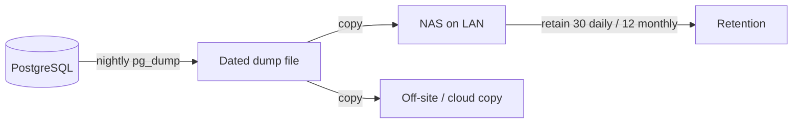
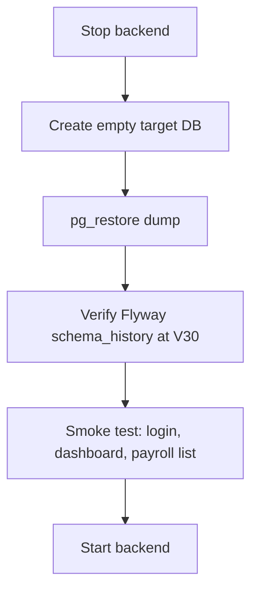

# GL&R ERP — Backup & Recovery

| | |
|---|---|
| **Document** | 09 — Backup & Recovery |
| **Version** | 1.0 · 2 July 2026 |
| **Audience** | IT / operations |
| **Status note** | The procedures below are the **recommended operational runbook**. Automated backup jobs are not yet codified in the repository (roadmap item). |

---

## Table of Contents

1. [What Must Be Protected](#1-what-must-be-protected)
2. [Backup Strategy](#2-backup-strategy)
3. [Database Backup Procedures](#3-database-backup-procedures)
4. [Restore Procedures](#4-restore-procedures)
5. [Schema Recovery via Flyway](#5-schema-recovery-via-flyway)
6. [Session & Application Recovery](#6-session--application-recovery)
7. [Disaster Recovery Runbook](#7-disaster-recovery-runbook)
8. [Known Gaps](#8-known-gaps)

---

## 1. What Must Be Protected

| Asset | Store | Criticality | Notes |
|---|---|---|---|
| PostgreSQL database | Supabase (demo) / T360 (prod) | 🔴 Critical | All HR, payroll, sales, attendance data |
| Restricted PII | `hr_restricted` schema (inside DB) | 🔴 Critical | Encrypt backups at rest |
| Payroll periods & bank exports | DB + generated `.txt` | 🔴 Critical | Financial record retention |
| Attendance `.dat` archives | Device / T360 / NAS | 🟡 Important | Source for backfill/replay |
| Device agent tokens | Environment secrets | 🟡 Important | Re-mintable, not backed up as data |
| Application secrets | Render dashboard / `.env.local` | 🟡 Important | Store in a password manager, not git |

## 2. Backup Strategy

Recommended baseline (3-2-1 aligned):



| Backup type | Frequency | Retention |
|---|---|---|
| Full logical dump (`pg_dump`) | Nightly | 30 daily + 12 monthly |
| Point-in-time (WAL) — prod option | Continuous | 7 days |
| Attendance `.dat` export | Weekly / on demand | Keep per pay cycle |
| Config/secrets snapshot | On change | Current + previous |

> On **Supabase** (demo), managed automated backups are available on the platform; treat the demo DB as reproducible (head schema **V30** plus the demo-only V21 seed accounts, applied under the `prod` profile) rather than a source of record.

## 3. Database Backup Procedures

### Full logical backup

```bash
pg_dump \
  --host="$PGHOST" --port=5432 --username="$PGUSER" \
  --dbname=hris \
  --format=custom --file="glr-hris-$(date +%Y%m%d).dump"
```

### Verify the dump

```bash
pg_restore --list "glr-hris-YYYYMMDD.dump" | head
```

### Copy to NAS (LAN)

Store dated dumps on the NAS (same LAN as the T360 per the network diagram), and keep at least one off-site copy.

## 4. Restore Procedures



```bash
# 1. Stop the backend so nothing writes during restore.
# 2. (Re)create the database.
createdb --username="$PGUSER" hris_restore

# 3. Restore.
pg_restore --host="$PGHOST" --username="$PGUSER" \
  --dbname=hris_restore --clean --if-exists \
  "glr-hris-YYYYMMDD.dump"

# 4. Verify migration state.
psql --dbname=hris_restore -c \
  "SELECT MAX(version) FROM flyway_schema_history WHERE success;"
```

Expected max version: **29** (the demo/`prod` profile also has V21 applied, but 29 is still the max).

## 5. Schema Recovery via Flyway

If the **data** is intact but the **schema** is in doubt, Flyway is the source of truth:

- On startup with `APP_FLYWAY_ENABLED=true`, Flyway applies any missing migrations up to the head (**V30**; the default path is V1–V20, V22–V30 — V21 is demo/prod-only).
- Migrations are **forward-only** (no down scripts). To recover a bad state, restore from a dump, then let Flyway re-apply.
- CI proves the full `V1–V20, V22–V30` chain against a clean Postgres on every PR, so a fresh rebuild from migrations is a supported recovery path.

## 6. Session & Application Recovery

- **Sessions** live in `hr.spring_session` (Spring Session JDBC, V19). A backend restart or redeploy does **not** log users out — sessions survive in the database.
- A full DB restore also restores active sessions as of the dump; users simply re-authenticate if their session is gone.
- The backend is stateless otherwise; redeploying the Render service (or T360 service) requires no local state.

## 7. Disaster Recovery Runbook

| Scenario | Action | Target time |
|---|---|---|
| Backend down (Render/T360) | Redeploy from `main`/image; sessions and data intact | Minutes |
| Database corruption | Restore latest nightly dump → verify V30 → smoke test | < 1 hour |
| Full environment loss | Provision Postgres → restore dump (or rebuild schema via Flyway + import) → redeploy backend + frontend | Hours |
| Attendance data gap | Re-import device `.dat` for the affected window (`import_dat.py`) | Minutes–hours |
| Lost device token | Re-mint via portal; update agent env | Minutes |

## 8. Known Gaps

These are recommended but **not yet automated in the repo**:

- No scheduled backup job is committed — set one up on the DB host / Supabase.
- No automated restore-verification (test-restore) job.
- Backup encryption for PII-bearing dumps must be configured operationally.
- Document a formal retention policy aligned to Thai payroll record-keeping requirements.

*End of document.*
