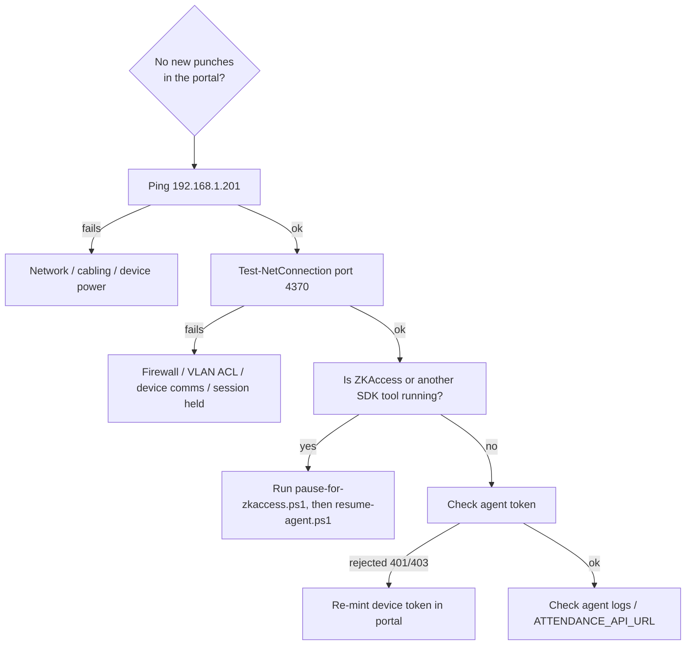

# GL&R ERP — Troubleshooting Guide

| | |
|---|---|
| **Document** | 10 — Troubleshooting Guide |
| **Version** | 1.0 · 2 July 2026 |
| **Audience** | Support, IT, engineering |

---

## Table of Contents

1. [How to Use This Guide](#1-how-to-use-this-guide)
2. [Authentication & Login](#2-authentication--login)
3. [Attendance & Device](#3-attendance--device)
4. [Overtime, Leave & Approvals](#4-overtime-leave--approvals)
5. [Payroll & Commission](#5-payroll--commission)
6. [Sales Tickets & Documents](#6-sales-tickets--documents)
7. [Deployment & Database](#7-deployment--database)
8. [Diagnostic Quick Reference](#8-diagnostic-quick-reference)

---

## 1. How to Use This Guide

Each entry lists a **symptom**, the **likely cause**, and the **resolution**. Start with the module that matches the symptom; the [quick reference](#8-diagnostic-quick-reference) at the end maps common signals to sections.

## 2. Authentication & Login

| Symptom | Likely cause | Resolution |
|---|---|---|
| Cannot log in, credentials correct | Account temporarily locked after repeated failures (rate limiting) | Wait for the lockout window; if persistent, HR resets the password |
| Forced to a change-password screen | `must_change_password` set (first login or HR reset) | Set a new password to continue — expected behavior |
| Logged in but menu is missing modules | Role derived from division/position doesn't grant that module | Verify the employee's division (ฝ่าย) and position; roles are data-driven (`DivisionAccessPolicy`) |
| Login returns 500 for some users | Historically a null `division_id` NPE | Fixed in PR #55 — null-division employees safely fall back to `employee`; if seen again, check the employee's division mapping |
| Session lost after redeploy | Should not happen — sessions persist in Postgres (V19) | If it does, verify `hr.spring_session` exists and the DB is reachable |
| Mutating request fails with 403 | Missing/expired CSRF token | Reload the page to obtain a fresh CSRF cookie |

## 3. Attendance & Device

| Symptom | Likely cause | Resolution |
|---|---|---|
| Ping ok, port 4370 fails | Firewall, VLAN ACL, device comm settings, or another app holding the session | Open 4370 on the LAN path; ensure only one SDK session |
| Agent connects but reads nothing | ZKAccess or another tool holds the single device session | `pause-for-zkaccess.ps1` before maintenance; `resume-agent.ps1` after |
| Punches read locally but backend rejects (401/403) | Wrong or rotated device token | Re-mint via `POST /api/attendance/devices/{code}/agent-token`; update `ATTENDANCE_AGENT_TOKEN` |
| `pyzk` errors / no connection | SC700 requires the **Pull SDK** (`plcommpro.dll`), not pyzk | Use `showroom_agent.py` / `sc700_pull_test.py` (PR #66) |
| Historical punches missing | Device was offline during capture | Export `.dat` (`export_transactions_dat.py`) and import (`import_dat.py` or `POST /api/attendance/imports/dat`) |
| `.dat` upload rejected | File exceeds the size cap (hardening) | Split the file or import via CLI in batches |
| Punch not linked to an employee | Device PIN doesn't match an employee identifier | Correct the PIN↔employee mapping |

## 4. Overtime, Leave & Approvals

| Symptom | Likely cause | Resolution |
|---|---|---|
| Leave rejected instantly | Insufficient remaining quota for that type | Check balance; quotas: Sick 30, Vacation 6, Personal 3 (days/yr) |
| OT didn't reach payroll | Request not **approved**, or wrong `payroll_month` | Ensure a manager/HR approved it before payroll preview for that month |
| Manager can't approve a request | Requester is outside the manager's ฝ่าย (division) | Only division managers/HR can approve within scope |
| OT save rejected by DB | Invalid multiplier/day-type or times | Multiplier must be 1.50/3.00; planned end > start (CHECK constraints) |
| Sick-leave submission blocked | Attachment required for sick leave | Attach the required document |

## 5. Payroll & Commission

| Symptom | Likely cause | Resolution |
|---|---|---|
| Bank file format rejected by bank | Export is generic, not KBank's format | Interim: reformat manually; permanent fix is roadmap A.1 |
| Employees didn't get payslips | PDF/e-mail pipeline not built | Distribute manually until roadmap A.1 lands |
| OT/commission missing from a payroll line | Not approved for that month, or approved after preview | Re-preview after approvals; process again |
| Commission amount looks wrong | Tier config or invoice amount | Check `sales.tier_config` bands and the invoice details; use the simulator to reproduce |
| Cannot access payroll endpoints | Role not HR/ADMIN | Payroll is `@PreAuthorize("hasAnyRole('HR','ADMIN')")` |
| Late minutes not deducted | Lateness→payroll link not implemented | Tracked (`attendance_daily.late_minutes`); deduction is roadmap A.3 |

## 6. Sales Tickets & Documents

| Symptom | Likely cause | Resolution |
|---|---|---|
| Cannot approve a price | Not `SALES_MANAGER`/`CEO`/`ADMIN` | Only those roles approve proposed prices |
| Ticket stuck after edits | `has_edits` flag set for approver review | Approver re-reviews the changed items |
| Document number missing | Document still a draft (not issued) | Issue the document to draw a number from `document_sequence` |
| Need to correct an issued document | Immutable once issued | Open a **revision** (`POST /api/tickets/{id}/revision`) — bumps `revision_no`, keeps the original |
| Notification list broke on empty | Historically a bare-array response | Guarded (`09c8713`); if seen, check the notifications payload shape |

## 7. Deployment & Database

| Symptom | Likely cause | Resolution |
|---|---|---|
| Unknown API route returns 500 | Old behavior | Now returns **404** via the exception handler (PR #65) |
| Render deploy slow / times out on port scan | Free-tier CPU throttling | Use the **starter** plan (already set in `render.yaml`) |
| Flyway fails on a fresh DB | Migration ordering/collision (historical V13 vs V1) | Fixed forward (PR #52); never edit applied migrations — add a new version |
| CORS error in the browser | Direct cross-origin call bypassing the proxy | Use the same-origin `/api` path (Vercel rewrite); check `APP_CORS_ALLOWED_ORIGINS` |
| Backend can't reach DB | Wrong `SPRING_DATASOURCE_*` or DB down | Verify secrets in the Render dashboard; confirm Supabase/DB availability |
| Migration state unclear after restore | — | `SELECT MAX(version) FROM flyway_schema_history WHERE success;` should be **21** |

## 8. Diagnostic Quick Reference

| Signal | Go to |
|---|---|
| 401 / 403 | [§2 Auth](#2-authentication--login) (users) · [§3](#3-attendance--device) (device token) |
| 404 on API | [§7](#7-deployment--database) — expected for unknown routes |
| No attendance data | [§3](#3-attendance--device) |
| Instant leave rejection | [§4](#4-overtime-leave--approvals) |
| Payroll numbers off | [§5](#5-payroll--commission) |
| Bank file / payslip issues | [§5](#5-payroll--commission) + roadmap A.1 |
| Deploy/migration failures | [§7](#7-deployment--database) |

*End of document.*
