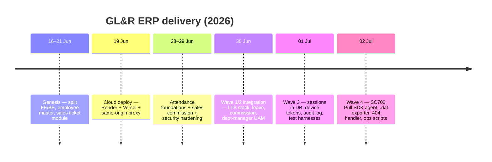

# GL&R ERP — Change Log

| | |
|---|---|
| **Document** | 12 — Change Log |
| **Version** | 1.0 · 2 July 2026 |
| **Source** | Reconstructed from git history and pull requests (`main`) |
| **Convention** | Grouped by delivery wave, newest first. Migration versions and PR/commit refs included where useful. |

---

## Table of Contents

1. [Release Waves at a Glance](#1-release-waves-at-a-glance)
2. [Wave 4 — Attendance Hardening & Device SDK](#2-wave-4--attendance-hardening--device-sdk)
3. [Wave 3 — Platform Hardening & Test Infrastructure](#3-wave-3--platform-hardening--test-infrastructure)
4. [Wave 2 — HR & Sales Modules](#4-wave-2--hr--sales-modules)
5. [Wave 1 — Security Hardening](#5-wave-1--security-hardening)
6. [Wave 0 — Attendance & Sales Foundations](#6-wave-0--attendance--sales-foundations)
7. [Genesis — Platform & Employee Master](#7-genesis--platform--employee-master)
8. [Migration Timeline](#8-migration-timeline)

---

## 1. Release Waves at a Glance

## 2. Wave 4 — Attendance Hardening & Device SDK
*(2 Jul 2026)*

| Change | Ref |
|---|---|
| Device transaction `.dat` exporter for historical backfill | #68 |
| Pause/resume helper scripts for ZKAccess maintenance | #67 |
| **SC700 Pull SDK agent (`plcommpro.dll`) replacing pyzk** — verified against the real device | #66 |
| API returns **404** instead of 500 for unknown/unmapped routes | #65 |

## 3. Wave 3 — Platform Hardening & Test Infrastructure
*(1 Jul 2026)*

| Change | Migration | Ref |
|---|---|---|
| Real-Postgres repository integration tests | — | #63 |
| Frontend test harness (Vitest + React Testing Library) | — | #62 |
| Per-device attendance agent tokens with rotation | V20 | #61 |
| Externalize HTTP session to Postgres (Spring Session JDBC) | V19 | #60 |
| HR audit log + opt-in list pagination | V18 | #59 |
| Dependency scanning (SCA) + audit-logging groundwork | — | (Wave 3) |

## 4. Wave 2 — HR & Sales Modules
*(30 Jun – 1 Jul 2026)*

| Change | Migration | Ref |
|---|---|---|
| Customer directory + deposit-notice document generation | V16, V17 | #56 |
| Department-manager UAM access for OT + attendance | — | #55 |
| Overtime + payroll modules | V14, V15 | #54 |
| Leave management | V13 | #4878d07 |
| Sales commission management (tiered, clawback) | V12 | #eb73345 |
| Move to stable **LTS stack** (Spring Boot 3.5.16, Java 21, Node LTS) | — | #51 |
| Fix: V13 fresh-DB collision with V1 `leave_type` | V13 | #52 |
| CI: run Flyway migrations against real Postgres | — | #53 |
| Frontend ESLint + a11y + CI; audit fixes | — | #57 |

## 5. Wave 1 — Security Hardening
*(29–30 Jun 2026)*

| Change | Migration | Ref |
|---|---|---|
| Replace employee-code login with **BCrypt-hashed** credentials | V11 | c180e73 |
| Forced change-password gate + self-service UI | V11 | a73715d |
| Login rate limiting and lockout | — | 4c86127 |
| Log HR access to sensitive employee PII (audit) | — | aca8867 |
| Security hardening: headers, `.dat` size cap, non-root container, log redaction | — | 96d768d |
| Accessibility: modal focus, toast live region, control labels | — | 36dac76 |
| Perf: batch ticket-item inserts | — | 888c645 |
| Dependabot + dependency-review SCA gate | — | 8c6b2b6 |

## 6. Wave 0 — Attendance & Sales Foundations
*(21–28 Jun 2026)*

| Change | Migration | Ref |
|---|---|---|
| Attendance Flyway schema | V7 | 7e95d7b |
| Attendance punch endpoint | V7 | a1f1975 |
| Attendance import + history APIs | V7 | cb11ac7 |
| Attendance `.dat` import CLI | — | 60c80a8 |
| Attendance frontend views | — | 065c0c1 |
| Showroom attendance agent (initial) | — | 7d9c19e |
| SC700 field-test & new-computer setup docs | — | 3c46b5d, 6b85173 |
| Sales ticket module (M1–M4.5) | V6, V8–V10 | 892965d |
| Split ticket dashboard into its own gated tab | — | #19, #20 |
| Assign sales role to showroom/sales-support divisions | — | 8055732 |

## 7. Genesis — Platform & Employee Master
*(16–21 Jun 2026)*

| Change | Migration | Ref |
|---|---|---|
| Initial React SPA scaffold | — | 303e90b |
| **Split into `frontend/` + `backend/`**; Spring Boot API introduced | V1, V2 | 9f7a6ea |
| Employee master schema + backend extensions | V1, V2 | — |
| Employee-code sequence; profile-request indexes | V3, V4 | — |
| Remove `app_user` UAM → data-derived roles | V5 | — |
| Render backend deploy + same-origin Vercel `/api` proxy | — | 24cffd9 |
| CSRF protection (double-submit cookie) | — | 1013650 |
| Secure session cookie; restrict passwordless login to demo | — | 6e11065 |
| Perf: eliminate post-mutation full reload; fix users.list N+1 | — | c4a15a5 |
| Division-based role access (UAM) | — | #14 |
| Senior cleanup / refactor / dead-code removal | — | #13 |

## 8. Migration Timeline

| V | Migration | Wave |
|---|---|---|
| V1 | employee_master_schema | Genesis |
| V2 | backend_extensions | Genesis |
| V3 | employee_code_sequence | Genesis |
| V4 | profile_request_performance_indexes | Genesis |
| V5 | remove_app_user_uam | Genesis |
| V6 | sales_ticket_schema | Wave 0 |
| V7 | attendance_schema | Wave 0 |
| V8 | ticket_item_product_fields | Wave 0 |
| V9 | ticket_item_add_size | Wave 0 |
| V10 | ticket_has_edits | Wave 0 |
| V11 | employee_password_hash | Wave 1 |
| V12 | sales_commission_schema | Wave 2 |
| V13 | leave_management_schema | Wave 2 |
| V14 | overtime_management_schema | Wave 2 |
| V15 | payroll_processing_schema | Wave 2 |
| V16 | customers_and_note_templates | Wave 2 |
| V17 | documents_and_revision | Wave 2 |
| V18 | audit_log | Wave 3 |
| V19 | spring_session_jdbc | Wave 3 |
| V20 | attendance_device_agent_token | Wave 3 |
| V21 | demo_seed_accounts | Demo env — **not in default path** (`db/migration-demo/`, `prod` profile only) |
| V22 | ticket_item_factory | Quotation Workflow |
| V23 | contacts_projects_ticket_fk | Quotation Workflow |
| V24 | catalog_and_qty_sqm | Quotation Workflow |
| V25 | factory_config_and_raw_price | Quotation Workflow |
| V26 | price_calc_engine | Quotation Workflow |
| V27 | quotation_fields_and_attachments | Quotation Workflow |
| V28 | revision_versioning | Quotation Workflow |
| V29 | rename_document_to_deposit_notice | Quotation Workflow |
| V30 | normalize_manager_positions | Position Data Cleanup |

> **Head is V30.** The default path is V1–V20 then V22–V30; V21 is demo-only and absent from a clean deploy.

---

### Roadmap (not yet released)

See [01 Overview, Appendix A](01_ERP_Overview.md#appendix-a--future-work--roadmap): KBank bank-file format, PDF payslips + e-mail (SendGrid), AI policy assistant (Gemini), lateness→payroll deduction, and on-premise production go-live with parallel-run sign-off.

*End of document.*
