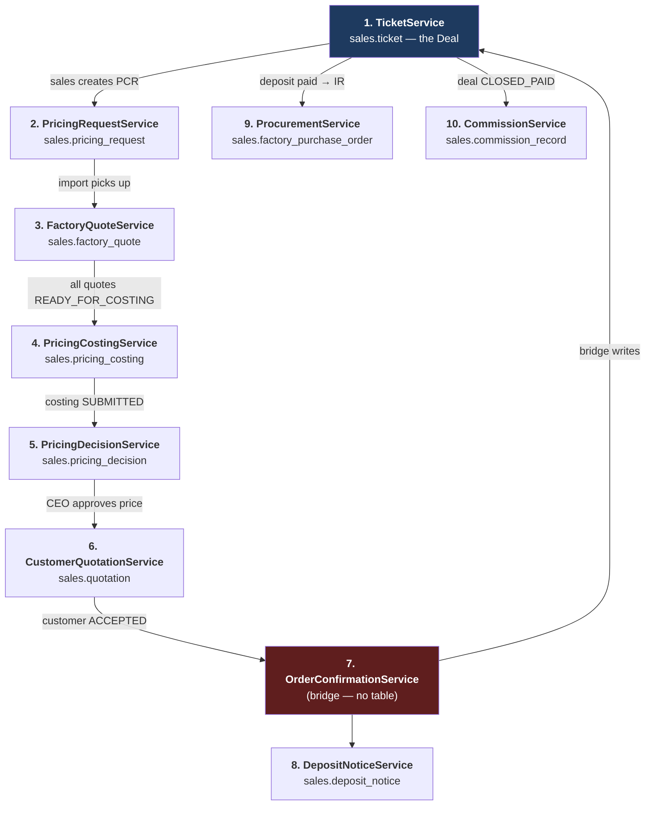
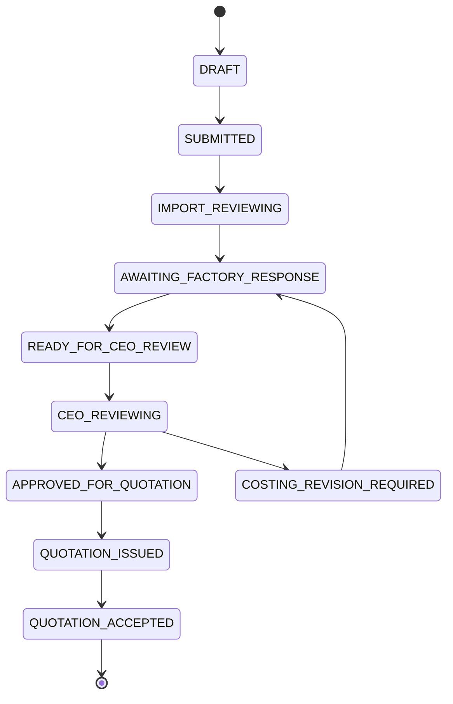
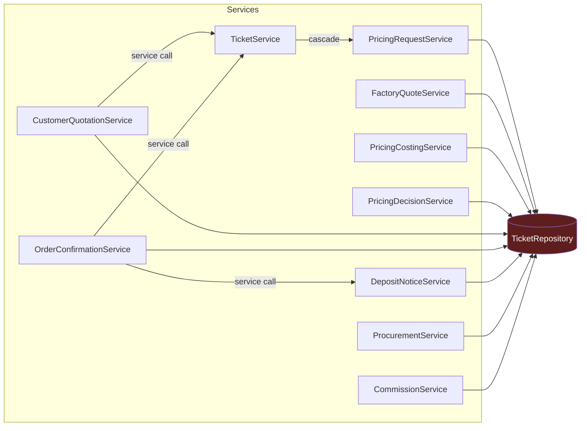

> ⚠️ **Snapshot, not live documentation.** Generated against `origin/main` @ `824f3270` (2026-08-12).
> As of 2026-08-18 main is **269 commits** further on, and this file is known to be stale in at least
> these places: `discountCeilingPct` was removed entirely (#821-era cleanup), `POST /pricing-decisions/{id}/recalculate`
> was deleted, `minimumSellingPrice` is now auto-populated at approval rather than typed, and the
> selling-price formula was rewired onto the CEO's V109 config (V152). Treat this as a map of the chain's
> *shape*, not as an authoritative field reference. See `docs/tools/` for the generator.

# Sales Pipeline — Forensic Service Breakdown

**Base:** `origin/main` @ `824f3270` · **Date:** 2026-08-12 · **Backend:** `backend/src/main/java/th/co/glr/hr/`

A complete map of the sales/CRM pipeline: every core chain service, every supporting
service, how they integrate, and where the integration seams look defect-prone.

Written because integration bugs — not per-service bugs — are the current pain. The
per-service sections exist to make Part 3 (cross-cutting maps) and Part 4 (findings)
readable; if you are debugging, start at Part 4.

**Field-level detail lives in the companion:**
[`sales-pipeline-dtos.md`](sales-pipeline-dtos.md) — all 191 `record` types (1,366 fields)
across these packages, with types and Bean Validation constraints.

**Both documents are combined and searchable as one page:**
<https://claude.ai/code/artifact/39fdd144-f18f-4f36-a337-c7661ac2bd71> — services with their
DTOs inline, an end-to-end deal trace, the 150-endpoint API table, a role × stage matrix,
the schema timeline, and these findings.

> **⚠️ Rebased 2026-08-12.** This document was originally written against a local `uat`
> that was 218 commits behind. It now describes **`origin/main` @ `824f3270`**.
> The biggest correction: **V140 already collapsed the pricing-request status machine**
> — `COSTING_IN_PROGRESS` was merged into `AWAITING_FACTORY_RESPONSE` and
> `MORE_INFO_REQUIRED` was deleted with its whole round-trip. The machine has **12
> statuses, not 14**, and Import has three visible states. Counts below are from main:
> 150 endpoints, 191 DTOs, 24,569 LOC.

---

## 0. Scope & method

**What was read.** All 10 core chain services + 12 supporting services/controllers, their
repositories, all 10 state-machine classes, the `sales.*` schema across 140 Flyway
migrations, the notification fan-out, `frontend/src/api/{routes,hrApi,mockApi,contract.test}.js`,
and 240 backend test files.

**What was executed.**

| Command | Result |
|---|---|
| `./mvnw test -Dtest='PricingChainEndToEnd…,PricingRequestFlow…,PricingFactoryQuoteCosting…,OrderConfirmation…'` | **63 passed**, 0 failures |
| `./mvnw test -Dtest='PricingDecision…,CustomerQuotation…,ProcurementService…'` | **51 passed**, 0 failures, BUILD SUCCESS |
| `npx vitest run src/api/contract.test.js` | **6 passed** |

Postgres was available (local `:5432` + Docker), so integration tests genuinely ran —
they were not skipped.

**What is NOT verified.** No finding below was reproduced by writing a failing test and
mutation-checking it. Findings are marked **CONFIRMED** when the code and a command output
establish them directly, **PLAUSIBLE** when they follow from reading but a runtime repro
was not attempted. Per `CLAUDE.md`, nothing here counts as authz evidence — the role tables
are the *declared* gates, read from source.

---

## 1. The chain at a glance

**The invariant that shapes everything:** `1 Ticket = 1 Deal`, `1 Deal → 0..N Pricing
Requests`. The Deal is the long-lived customer-facing record; the PricingRequest is the
per-revision pricing aggregate. Steps 2–7 all hang off a `pricing_request_id`, not a
`ticket_id`.

**Deployability warning (still current).** `TicketService.submit()` permanently 409s. The
legacy `submit → pickup → proposePrice → approve` loop is severed; a deal is priced only
through the PCR chain.

---

## 2. Core chain services

### 2.1 TicketService — the Deal

| | |
|---|---|
| **File** | `ticket/TicketService.java` (1,955 lines — the largest service in the repo) |
| **API** | `/api/tickets` |
| **Tables written** | `sales.ticket`, `ticket_item`, `ticket_event`, `quotation`, `quotation_item`, `payment_receipt`, `delivery_record`, `delivery_record_item`, `deal_activity` |
| **Calls out to** | `PricingRequestService` (dead-deal cascade only), `PriceCalcService`, `CustomerRepository`, `NotificationRepository`, `QuotationRenderer` |
| **Called by** | `CustomerQuotationService`, `OrderConfirmationService` (the only two services that use the *service*, not the repository) |
| **`@Transactional`** | 41 methods |
| **Advisory locks** | **none** |
| **Tests** | 9 files; 6 are real-DB ITs |

**Six concurrent state tracks live on one `sales.ticket` row:**

| Column | Governed by | Values |
|---|---|---|
| `status` | `TicketStatus` | draft, submitted, in_review, price_proposed, approved, rejected, quotation_issued, document_issued, closed, cancelled |
| `sales_stage` | `DealStage` (ordered list of 14) | LEAD_APPROACH → … → CLOSED_PAID |
| `lifecycle` | `DealLifecycle` | ACTIVE, ON_HOLD, DORMANT, CLOSED_LOST, CANCELLED, COMPLETED |
| `fulfillment_status` | `FulfilmentStatus` | IR_ISSUED, IR_SENT, PICKED_UP, SHIPPING, CUSTOMS_CLEARANCE, GOODS_RECEIVED, FROM_STOCK, PARTIALLY_DELIVERED, FULLY_DELIVERED |
| `payment_status` | **nothing — free text** | CUSTOMER_CONFIRMED, DEPOSIT_NOTICE_ISSUED, DEPOSIT_PAID, AWAITING_FINAL_PAYMENT, FULLY_PAID |
| *(derived)* `paymentStage` | `PaymentStage` | NOT_REQUIRED, DEPOSIT_PENDING, DEPOSIT_RECEIVED, PARTIALLY_PAID, BALANCE_PENDING, FULLY_PAID |

Only `lifecycle` and `sales_stage` have real guards (`requireActive`, `DealStage.indexOf`
ordering). `payment_status` has none — see **F4**.

**Role sets** (7 constants, lines 35–56):

| Constant | Value | Live methods |
|---|---|---|
| `SALES_ROLES` | `{sales}` | `create`, `confirmCustomer` |
| `IMPORT_ROLES` | `{import}` | `assertFactoryEmailAllowed` |
| `CEO_ROLES` | `{ceo}` | `verifyClose` |
| `FULFILMENT_ROLES` | `{import, ceo}` | `issueImportRequest`, `markIrSent`, `markShipping`, `markGoodsReceived`, `reserveStock`, `recordPartialDelivery`, `completeDelivery` |
| `ACCOUNT_ROLES` | `{account, ceo}` | `confirmDepositPaid`, `confirmFinalPayment`, `recordPayment`, `setBilling`, `waiveDeposit`, `revokeCloseConfirmation` |
| `CLOSE_CONFIRM_ROLES` | `{account}` | `confirmCloseReady` — **excludes `ceo` deliberately**: CEO signs `verifyClose`, so admitting them collapses a two-signature gate into one person |
| `VIEWER_ROLES` | alias of `TicketAccessPolicy.VIEWER_ROLES` = `{sales, import, ceo, account, sales_manager}` | all reads |

**Composite guards:**

- `requireDealOwnership` (9 methods: activity, tracking, lost, reopen, hold, dormant, resume, tender, entry-channel) — deal owner **or** `sales_manager` **or** `ceo`.
- `requireStageWriteAccess` — `ceo` passes for any target; otherwise the *target stage* picks the role: `SALES_TARGET_STAGES` (11 stages) → `sales_manager` or owning `sales`; `ACCOUNT_TARGET_STAGES` (DEPOSIT_RECEIVED, CLOSED_PAID) → `account`; `IMPORT_TARGET_STAGES` (PROCUREMENT) → `import`.
- `cancel` and `editItems` — **ownership only, no role gate**.

**Deprecated with no route** (gates intact but unreachable): `submit` (always 409s),
`pickup`, `proposePrice`, `approve`, `reject`, `generateQuotation`, `calculatePrices`,
`overrideItemPrice`, `markQuotationSent/Accepted/Rejected`.

**Import read-projection** — `import` passes `requireViewAccess` then is stripped/denied in
three places: `projectForRole` nulls the quotations list, `loadQuotationContext` 403s file
downloads, `listPayments` 403s the ledger. Documented residual gap: mutation responses
built via `requireTicket` directly (import's own `reserveStock` / `recordDelivery` /
`markGoodsReceived`) **skip the projection and still embed quotations**.

---

### 2.2 PricingRequestService — the PCR aggregate

| | |
|---|---|
| **File** | `pricingrequest/PricingRequestService.java` |
| **API** | `/api/pricing-requests`, `/api/tickets/{id}/pricing-requests` |
| **Tables written** | `pricing_request`, `pricing_request_item`, `pricing_request_attachment`, `pricing_request_event` — **plus** `factory_quote`, `pricing_costing`, `pricing_decision`, `quotation` (cascades) |
| **Calls out to** | `TicketRepository` (**direct**), `ContactRepository`, `FileStorageService`, `NotificationRepository` |
| **`@Transactional`** | 12 |
| **Advisory locks** | `lockPricingRequest(id)`; `createCustomerChangeRevision` locks on `root_pricing_request_id` |
| **Tests** | 6 files; `PricingRequestFlowIntegrationTest` (17), `PricingFactoryQuoteCostingIntegrationTest` (36), `PricingRequestRepositoryIntegrationTest` |

**The state machine — the only rigorous one in the pipeline.** 12 statuses since V140, an explicit
`ALLOWED` transition map, a `VALUES` set matching the DB's `chk_pricing_request_status`
CHECK, and `transition()` throws `IllegalStateException` on an illegal edge *before*
issuing SQL, then applies it as a compare-and-set (`WHERE … AND status = :expected`).

Two design decisions worth knowing, both deliberate:

- **V140 collapsed Import's workflow to three visible states** (owner ruling 2026-08-11):
  `IMPORT_REVIEWING` = รับเรื่อง, `AWAITING_FACTORY_RESPONSE` = เจรจาราคากับโรงงาน (now also
  covers costing), `READY_FOR_CEO_REVIEW` = รอ CEO อนุมัติราคา. `COSTING_IN_PROGRESS` merged
  away; `MORE_INFO_REQUIRED` deleted with its whole round-trip.
- **Costing still runs, it just no longer owns a status.** Import clicks one button that
  chains `markReady → createCosting → recalculate → submit`.
- **No `QUOTATION_REJECTED`.** Rejection lives entirely on `quotation.doc_status`; the
  pricing request does not roll back. Same for `EXPIRED`.

**Role gates:** `SALES_ROLES {sales}` — createDraft, updateDraft, submit,
respondInformation, createCustomerChangeRevision, uploadAttachment, deleteAttachment.
`IMPORT_ROLES {import}` — pickup, requestInformation, setAttachmentIncludeInFactoryEmail.
`VIEWER_ROLES` (mirrors TicketService's) for reads, with **`DRAFT` visible only to the
owning rep + CEO/sales_manager**.

**`cancel` diverges from `TicketService.cancel` on purpose:** ownership **or** `ceo`, so a
manager can unwind an abandoned draft without the rep's session. `TicketService.cancel` has
no such override.

**Cross-aggregate cascades** (documented, one-way by design):

- `cancelOpenStep2Children(prId)` → `UPDATE sales.factory_quote`, `UPDATE sales.pricing_costing`
- `supersedeOpenPricingDecisionAndQuotation(prId)` → `UPDATE sales.pricing_decision`, `UPDATE sales.quotation`
- `cancelOpenForTicket(ticketId)` — called by `TicketService.markLost` / `cancel`

The repository carries a class-level invariant: *never call `TicketRepository`*. The
**service** does inject it; the repository does not.

---

### 2.3 FactoryQuoteService — supplier RFQ

| | |
|---|---|
| **API** | `/api/factory-quotes`, `/api/pricing-requests/{id}/factory-quotes` |
| **Tables** | `factory_quote`, `factory_quote_item`, `factory_quote_email_dispatch`, `factory_quote_response_receipt` — **plus** `UPDATE sales.pricing_costing` (`markOpenCostingsStale`) |
| **Calls out to** | `PricingRequestRepository` (**direct**), `TicketRepository` (**direct**), `FactoryConfigRepository`, `FactoryEmailService`, `FileStorageService` |
| **`@Transactional`** | 14 |
| **Advisory locks** | `createRevision` → `pg_advisory_xact_lock(root_factory_quote_id)`; `lockResponseIdempotencyKey` → `hashtextextended("actorId:clientRequestId")` |
| **Tests** | **1 file — `FactoryQuoteServiceAttachmentTest` (attachments only)** |

**Statuses:** DRAFT → REQUESTED → RESPONSE_RECEIVED → NEGOTIATING → READY_FOR_COSTING;
terminal NOT_AVAILABLE / SUPERSEDED / CANCELLED. **No `ALLOWED` transition map** — gating is
by ad-hoc status sets (`DRAFT_STATUSES`, `RESPONSE_STATUSES`, `MUTABLE_STATUSES`,
`ATTACHMENT_DELETE_STATUSES`) checked per method.

**Roles:** `IMPORT_ROLES {import}` for all 9 mutations; `RAW_QUOTE_ROLES {import, ceo}` for
reads. Sales never sees a factory quote — this is the confidentiality boundary of the whole
chain.

**Async email dispatch.** `send()` enqueues a `factory_quote_email_dispatch` row;
`FactoryQuoteEmailDispatchWorker` (`@Scheduled`, 5s) claims and sends it. The provider id
is persisted immediately after `FactoryEmailService.send` returns so a crash-then-retry
does not double-send. Attachment inclusion is resolved **at worker time**, not enqueue
time, because Import can keep toggling `include_in_factory_email` until the mail actually
goes out.

`ATTACHMENT_DELETE_STATUSES` is deliberately narrower than `MUTABLE_STATUSES` —
`READY_FOR_CEO_REVIEW` is excluded, because a submitted costing may already depend on the
evidence.

---

### 2.4 PricingCostingService — landed cost

| | |
|---|---|
| **API** | `/api/pricing-costings`, `/api/pricing-requests/{id}/costings` |
| **Tables** | `pricing_costing`, `pricing_costing_item` |
| **Calls out to** | `FactoryQuoteRepository`, `PricingRequestRepository`, `TicketRepository` (all **direct**), `FxRateRepository`, `PriceCalcConfigRepository`, `FactoryConfigRepository` |
| **`@Transactional`** | 3 |
| **Advisory locks** | **none** |
| **Tests** | **zero files in `pricingcosting/`** |

**Statuses:** DRAFT, CALCULATED, SUBMITTED, SUPERSEDED, CANCELLED — constants only, no
transition map.

**Roles:** `IMPORT_ROLES {import}` writes, `RAW_COSTING_ROLES {import, ceo}` reads.

`COSTING_CREATE_STATUSES` excludes `READY_FOR_CEO_REVIEW` and includes
`COSTING_REVISION_REQUIRED` — this is the enforcement half of the "submitted costing is
immutable" rule described in 2.2.

This service computes the landed cost that every downstream selling price derives from. It
has **no dedicated test package**; it is exercised only indirectly through
`pricingrequest/PricingFactoryQuoteCostingIntegrationTest` (36 tests) and
`pricingchain/PricingChainEndToEndIntegrationTest` (2 tests). See **F7**.

---

### 2.5 PricingDecisionService — CEO selling price

| | |
|---|---|
| **API** | `/api/pricing-decisions`, `/api/pricing-requests/{id}/pricing-decisions` |
| **Tables** | `pricing_decision`, `pricing_decision_item` |
| **Calls out to** | `PricingCostingRepository`, `PricingRequestRepository`, `TicketRepository` (all **direct**), `FxRateRepository`, `FxResolver` |
| **`@Transactional`** | 5 |
| **Advisory locks** | `lockPricingRequest` in `startReview`, `approve`, `returnToImport` |
| **Tests** | `PricingDecisionIntegrationTest` — 17 passed; **one of only 4 files in the repo that builds a real `TransactionTemplate`** |

**Statuses:** DRAFT → APPROVED | RETURNED; SUPERSEDED.

**Roles:** `CEO_ROLES {ceo}` for every write (startReview, update, recalculate, approve,
returnToImport). `RAW_DECISION_ROLES {import, ceo}` for the raw read.
**`SALES_VIEW_ROLES {sales, sales_manager, ceo, import}`** for `/sales-view` — the one
endpoint that exposes a price to Sales without exposing cost.

`approve()` **never trusts a stored or client-supplied selling price** — it recomputes from
the frozen cost and the margin being frozen in. `approve` and `returnToImport` are the two
mutually-exclusive terminal exits from DRAFT and lock against each other, so a CEO
returning in one tab while approving in another cannot have both win.

---

### 2.6 CustomerQuotationService — the customer-facing document

| | |
|---|---|
| **API** | `/api/customer-quotations`, `/api/pricing-requests/{id}/quotations` |
| **Tables** | `quotation`, `quotation_item` |
| **Calls out to** | **`TicketService`** (`advanceStageForCustomerQuotationIssue`), `PricingDecisionRepository`, `PricingRequestRepository`, `TicketRepository`, `CustomerRepository`, `QuotationRenderer` |
| **`@Transactional`** | 7 |
| **Advisory locks** | `lockPricingRequest` in `create`, `issue`, `createRevision`, `recordOutcome` |
| **Tests** | `CustomerQuotationIntegrationTest` — 21 passed |
| **Worker** | `QuotationExpiryWorker` (`@Scheduled`, 1h) → `expireOverdueQuotations()` |

**Roles:** `SALES_ROLES {sales}` for every write. `VIEW_ROLES {sales, sales_manager, ceo,
import}` for reads — **`account` is excluded end-to-end**, deliberately: the brief says
"no quotation editing" for account, and Step 3 already excludes it from every
raw-pricing-adjacent view, so there is no positive read grant either.

**Discount Policy B:** Sales may discount down to, but never below, the CEO-approved
minimum selling price. Below-minimum is a hard 422 — no auto-escalation.

Only the **first** `issue()` transitions the pricing request (`APPROVED_FOR_QUOTATION →
QUOTATION_ISSUED`); a revision's re-issue is a no-op transition. `recordOutcome(ACCEPTED)`
is the single forward exit to `QUOTATION_ACCEPTED`.

This is one of only two services that calls `TicketService` rather than `TicketRepository`
— specifically to reuse the *existing* stage transition rather than invent a second path.

---

### 2.7 OrderConfirmationService — the bridge

| | |
|---|---|
| **API** | `POST /api/pricing-requests/{id}/confirm-order`, `POST …/deposit-notice` |
| **Tables** | none of its own |
| **Calls out to** | **`TicketService`**, **`DepositNoticeService`**, `CustomerQuotationRepository`, `PricingRequestRepository`, `TicketRepository` |
| **`@Transactional`** | 3 |
| **Advisory locks** | `lockPricingRequest` + replay check |
| **Tests** | `OrderConfirmationIntegrationTest` (8) + `InventoryDeliveryFulfilmentIntegrationTest` |

**The highest-risk service in the chain, structurally.** It is the single point where the
PCR aggregate writes back into the Deal aggregate, and it does four things in one
transaction:

1. Guarded compare-and-set of `ticket.status` from `'draft'` only — never clobbers a real
   legacy status.
2. `reconcileTicketItems` — rewrites `sales.ticket_item.qty` to whatever *this* pricing
   request settled on, because `TicketService.reserveStock` / `completeDelivery` read
   quantities from there.
3. `ticketService.confirmCustomer(...)` — **conditionally**. A bug found and fixed in the
   same step: `confirmOrder` runs once per accepted pricing request (so reconciliation
   happens for every accepted revision), but `confirmCustomer` is a one-time ticket-level
   action whose own guard 409s once payment has progressed past `CUSTOMER_CONFIRMED`.
   Calling it unconditionally broke confirming a *second* accepted revision on a deal whose
   deposit was already paid.
4. Optional deposit-notice creation from the quotation.

`SALES_ROLES {sales}` on both methods.

---

### 2.8 DepositNoticeService — ใบแจ้งมัดจำ

| | |
|---|---|
| **API** | `/api/deposit-notices`, `/api/tickets/{id}/deposit-notice`, `/api/tickets/{id}/remaining-invoice/file` |
| **Tables** | `deposit_notice`, `deposit_notice_item`, `document_sequence` (renamed from `sales.document` in V29) |
| **Calls out to** | `CustomerQuotationRepository`, `TicketRepository` (**direct**), `CustomerRepository` |
| **`@Transactional`** | 4 |
| **Tests** | 4 files — **none is a real-DB IT** |

**Roles:** `SALES_ROLES {sales}` for createDraft, issue, requestRevision.
`VIEWER_ROLES` — a **third hand-written copy** of `{sales, import, ceo, account,
sales_manager}`, *not* aliased to `TicketAccessPolicy`, because the gate additionally 403s
`import` immediately after the role check (deposit notices are customer financial
documents). `TicketAccessPolicy`'s own Javadoc flags that an edit there must be checked
against this file by hand.

`issue()` is the **single** action that sets `payment_status = 'DEPOSIT_NOTICE_ISSUED'` —
the former `issueDepositNotice` endpoint (advance the track with no document) was removed.

---

### 2.9 ProcurementService — factory purchase orders

| | |
|---|---|
| **API** | `/api/factory-purchase-orders` (8 endpoints) |
| **Tables** | `factory_purchase_order`, `factory_purchase_order_item` |
| **Calls out to** | `PricingRequestRepository`, `TicketRepository` (**direct**) |
| **`@Transactional`** | 5 |
| **Advisory locks** | `lockPricingRequest` |
| **Tests** | `ProcurementServiceIntegrationTest` — 13 passed |
| **Status** | ⚠️ **orphaned — no frontend caller** (see **F6**) |

**Statuses:** OPEN → SHIPPING → RECEIVED; CANCELLED. `CLOSED = {RECEIVED, CANCELLED}`.

**Roles:** `RAW_PO_ROLES {import, ceo}` on all 8 methods — reusing the confidentiality
pattern of `RAW_QUOTE_ROLES` / `RAW_DECISION_ROLES`.

---

### 2.10 CommissionService — rep payout

| | |
|---|---|
| **API** | `/api/commissions` |
| **Tables** | `commission_record`, `invoice_details` |
| **Calls out to** | `TicketRepository` (**direct**), `AttachmentRepository`, `FileStorageService`, `AuditService`, `NotificationService`, `CeoApproverRepository` |
| **`@Transactional`** | 8 |
| **Tests** | **16 files**, 13 of them real-DB ITs — by far the best-covered service in the pipeline |

**Statuses:** SUBMITTED → MANAGER_APPROVED → APPROVED; REJECTED, VOID. A genuine
two-signature chain (`sales_manager` then `ceo`).

**Roles** — the most granular in the codebase:

| Constant | Value | Purpose |
|---|---|---|
| `SUBMIT_ROLES` | `{account, sales_manager, ceo}` | submit |
| `CREATE_FROM_DEAL_ROLES` | `{account}` | **the only path that files a tax invoice** |
| `MANAGER_ROLES` | `{sales_manager}` | first approval |
| `CEO_ROLES` | `{ceo}` | second approval, reject, clawback |
| `MANUAL_CREATE_ROLES` | `{sales_manager, ceo}` | manual commission |
| `PAYROLL_ROLES` | `{hr}` | payroll-ready feed only |
| `LIST_VIEWER_ROLES` | `{sales, sales_manager, ceo, hr}` | `sales` scoped to own rows |

`createFromDeal` dual-writes the invoice file as an `AttachType.INVOICE` ticket attachment
**and** creates the rep's commission in one transaction. This is why
`TicketAccessPolicy.DOCUMENT_WRITER_ROLES` excludes `account`: a second account-writable
upload path would satisfy the close gate's `invoiceOnFile` check *without* creating the
commission, and the rep would silently lose it.

---

## 3. Supporting services

| Service / controller | API | Roles | Notes |
|---|---|---|---|
| `CustomerService` | `/api/customers` | aliases `TicketAccessPolicy.VIEWER_ROLES` | customer, contact, project |
| `PriceCalcService` | — | **no gate of its own** | called by `TicketService` under `ceo` |
| `FxRateController` | `/api/fx-rates` | read `{ceo, import, sales}`, write `{ceo}` | read widened by owner ruling (#438/V112) |
| `PriceCalcConfigController` | `/api/price-calc-configs` | read `{ceo, import}`, write `{ceo}` | |
| `PricingFormulaConfigController` | `/api/pricing-formula-config` | read `{ceo, import}`, write `{ceo}` | freight/duty/clearance-fee tables |
| `DealEstimateMarkupController` | `/api/deal-estimate-markup` | write `{ceo}` | |
| `CatalogController` | `/api/catalog` | `{ceo, import}` | `sales.product_prices`, `price_list_versions` |
| `PriceImportService` | `/api/price-import` | `{ceo, import}` | staging → validate → commit |
| `FactoryConfigController` | `/api/factory-configs` | `{ceo, import}` | |
| `FactoryEmailService` | — | — | wraps `Mailer`; skips a missing file with a warning rather than failing the send |
| `DashboardService` | `/api/dashboard` | tickets all-`{import,ceo}` / own-`{sales}`; commissions all-`{sales_manager,ceo}` / own-`{sales}` | |
| `BotFxFetchService` | — | system | `@Scheduled` cron `0 0 18 * * *` Asia/Bangkok |
| `FactoryQuoteEmailDispatchWorker` | — | system | `@Scheduled` 5s |
| `QuotationExpiryWorker` | — | system | `@Scheduled` 1h |

---

## 4. Cross-cutting integration maps

### 4.1 Who calls whom

**Nine of ten services reach `TicketRepository` directly. Only two call `TicketService`.**

### 4.2 Multi-writer tables

| Table | Writers | Risk |
|---|---|---|
| `sales.quotation` | `TicketRepository` (I/U), `CustomerQuotationRepository` (I/U), `PricingRequestRepository` (U) | **3 writers** — legacy ticket-native quotations and the Step 4 aggregate share one table |
| `sales.pricing_costing` | `PricingCostingRepository` (I/U), `FactoryQuoteRepository` (U), `PricingRequestRepository` (U) | **3 writers** |
| `sales.factory_quote` | `FactoryQuoteRepository` (I/U), `PricingRequestRepository` (U) | 2 |
| `sales.pricing_decision` | `PricingDecisionRepository` (I/U), `PricingRequestRepository` (U) | 2 |
| `sales.ticket` | `TicketRepository` only | 1 — but reached by 9 services |

### 4.3 Advisory lock keyspace

`pg_advisory_xact_lock(bigint)` shares **one global 64-bit keyspace per database**.

| Caller | Key | Keyspace family |
|---|---|---|
| `PricingRequestRepository.lockPricingRequest` | raw `pricing_request_id` | A |
| `CustomerQuotationRepository.lockPricingRequest` | raw `pricing_request_id` | A |
| `PricingDecisionRepository.lockPricingRequest` | raw `pricing_request_id` | A |
| `PricingRequestRepository.createCustomerChangeRevision` | raw `root_pricing_request_id` | A |
| `FactoryQuoteRepository.createRevision` | raw `root_factory_quote_id` | **B — collides with A** |
| `FactoryQuoteRepository.lockResponseIdempotencyKey` | `hashtextextended("actorId:clientRequestId")` | C (safe — hashed) |

**Who locks:** Steps 5 (decision), 6 (quotation), 7 (order confirmation), 9 (procurement).
**Who does not:** Steps 3 (factory quote) and 4 (costing) — even though both transition
`pricing_request.status`. Protected by CAS, not by the lock. See **F8**, **F9**.

### 4.4 Notification fan-out

| Service | Channels |
|---|---|
| `TicketService` | `notifyByRole`, `notifyEmployee` |
| `PricingRequestService` | `notifyByRoleForPricingRequest`, `notifyCeo`, `notifyEmployeeForPricingRequest` |
| `FactoryQuoteService`, `PricingCostingService` | `notifyByRoleForPricingRequest`, `notifyCeo` |
| `PricingDecisionService` | `notifyByRoleForPricingRequest`, `notifyEmployeeForPricingRequest` |
| `CustomerQuotationService`, `OrderConfirmationService`, `ProcurementService` | `notifyByRoleForPricingRequest` |
| `DepositNoticeService` | `notifyByRole` |
| `CommissionService` | `notifySubmitted`, `notifyManagerApproved`, `notifyCeoApproved`, `notifyRejected`, `notifyManualCreated` |

CEO notifications route to the Managing Director only, by **position-string match with no
fallback**.

### 4.5 Frontend / mock surface

All of Steps 2–7 live inside the **`pricingRequests`** namespace in
`frontend/src/api/routes.js` (54 methods), not as separate namespaces —
`factoryQuoteSend`, `costingSubmit`, `pricingDecisionApprove`, `customerQuotationIssue`,
`confirmOrder`, and so on.

`contract.test.js` passes with **`KNOWN_GAPS` empty** — full bidirectional parity between
`hrApi.js` and `mockApi.js`. Its own comments enumerate what that does *not* prove:
parameters bundled in a params bag, whether a declared parameter is used, ordering, types,
and DTO field coverage. `mockApi.js` takes the honest "not supported in mock mode" option
in 51 places.

---

## 5. Findings

Ranked by how likely each is to be producing integration bugs right now.

---

### F1 — `@Transactional` is inert across the entire integration suite · **CONFIRMED** · HIGH

`support/AbstractPostgresIntegrationTest` is a plain abstract class: **no `@SpringBootTest`,
no `@ExtendWith(SpringExtension.class)`, no transaction manager.** It builds a raw
`DriverManagerDataSource` + `NamedParameterJdbcTemplate`. Every integration test then
constructs services with `new` — `PricingChainEndToEndIntegrationTest` has **zero
`@Autowired`** and 7 `new XxxService(...)` calls.

Spring's `@Transactional` works through AOP proxies. A hand-constructed service is not
proxied, so **every JDBC statement auto-commits independently**.

Consequences:

1. **No rollback path is ever exercised.** A `@Transactional` method that writes A, B, then
   throws at C rolls back A and B in production; in these tests A and B commit. A partial-write
   bug is structurally invisible.
2. **`pg_advisory_xact_lock` is released immediately** — it is transaction-scoped, so under
   auto-commit the lock lives only for the duration of its own `SELECT`. Every
   lock-then-read-then-write idempotency guard (`OrderConfirmationService.confirmOrder`,
   `CustomerQuotationService.issue`, `PricingDecisionService.approve`, `ProcurementService`)
   is unprotected in test and its concurrency guarantee unverified.

Only **4 files in the whole repository** build a real `TransactionTemplate`:
`CommissionInvoiceSentinelRollbackIntegrationTest`, `PricingDecisionIntegrationTest`,
`PricingFactoryQuoteCostingIntegrationTest`, `PayrollDraftOptimisticConcurrencyIntegrationTest`.

**The codebase already knows.** `CommissionInvoiceSentinelRollbackIntegrationTest` says it
outright:

> Every commission integration test hand-wires `new CommissionService(...)`, which has NO
> Spring proxy and therefore NO transaction at all — so those tests would stay green even
> if `@Transactional` were deleted from `submit`/`createFromDeal`, while production started
> committing sentinel rows.

That observation was acted on for **one** finding and never generalised. It applies to all
131 real-DB integration tests.

**Why this matters for the reported bug pattern.** "Bugs when many services integrate" is
almost the definition of partial-write and concurrency failure — and both are exactly what
this harness cannot see. 114 chain tests pass; that is real evidence about happy-path
behaviour and worth nothing about atomicity.

**Fix shape.** Either promote the sales ITs to `@SpringBootTest` with real proxies, or
follow the `CommissionInvoiceSentinelRollback` precedent and wrap the multi-write entry
points in an explicit `TransactionTemplate`. Start with `OrderConfirmationService.confirmOrder`
(4 writes across 3 aggregates) and `CommissionService.createFromDeal` (dual-write).

---

### F2 — Nine of ten services bypass `TicketService` to write ticket state · **CONFIRMED** · HIGH

`PricingRequestService`, `FactoryQuoteService`, `PricingCostingService`,
`PricingDecisionService`, `CustomerQuotationService`, `OrderConfirmationService`,
`DepositNoticeService`, `ProcurementService` and `CommissionService` all inject
`TicketRepository` directly. Only `CustomerQuotationService` and `OrderConfirmationService`
also call `TicketService`.

Every guard `TicketService` owns is therefore bypassable from inside the chain:

- the 7 role sets and `requireRole`
- `requireActive` (the ACTIVE-lifecycle gate)
- `requireViewAccess` / `projectForRole` (the import quotation strip-out)
- `requireStageWriteAccess` (stage-target role mapping)

These are internal calls, not HTTP endpoints, so this is not a privilege-escalation hole —
the *entry* controller still gates the actor. It is a **consistency** hazard: a rule added
to `TicketService` does not reach nine of the ten writers, and each downstream service
re-derives whichever subset of the invariants its author remembered.

**Fix shape.** Not "route everything through `TicketService`" — that would create cycles
(`TicketService` already depends on `PricingRequestService`). Extract the ticket-state
invariants (`requireActive`, stage-advance monotonicity, payment-track monotonicity) into a
policy class the way `TicketAccessPolicy` was extracted for document access after #389, and
have `TicketRepository`'s mutators consult it.

---

### F3 — `sales.quotation` has three independent writers · **CONFIRMED** · MEDIUM

`TicketRepository` (INSERT + UPDATE, legacy ticket-native quotations),
`CustomerQuotationRepository` (INSERT + UPDATE, the Step 4 aggregate) and
`PricingRequestRepository` (UPDATE, `supersedeOpenPricingDecisionAndQuotation`) all write
the same table. `QuotationStatus` has 10 values, several reachable only from one writer
(`READY_TO_ISSUE`, `REVISION_REQUESTED`) and no transition map at all.

`sales.pricing_costing` has the same shape: `PricingCostingRepository`,
`FactoryQuoteRepository.markOpenCostingsStale`, `PricingRequestRepository.cancelOpenStep2Children`.

The cascades are deliberate and documented. The risk is that a status a downstream writer
sets is not in the vocabulary the upstream writer's guards were written against — and no
`ALLOWED` map exists to catch it.

---

### F4 — `payment_status` is an ungoverned free-text column · **CONFIRMED** · MEDIUM

`sales.ticket.payment_status` is `VARCHAR(40)` (widened from 20 by V44 after V39's
`ADD COLUMN IF NOT EXISTS` turned out to be a no-op). It has **no CHECK constraint and no
enum class.** Five values circulate as bare string literals:

| Value | Written at |
|---|---|
| `CUSTOMER_CONFIRMED` | `TicketService:643` |
| `DEPOSIT_NOTICE_ISSUED` | `DepositNoticeService:189` |
| `DEPOSIT_PAID` | `TicketService:1030` |
| `AWAITING_FINAL_PAYMENT` | `TicketService:749`, `:1035` |
| `FULLY_PAID` | `TicketService:924`, `:1014` |

Read back by `TicketService` (`:1108`, `canConfirmFinalPaymentNow`), `TicketRepository:78`,
a `CASE` expression in migration `V50`, and — unguarded — by the **frontend**:
`frontend/src/features/tickets/salesViewScope.js:102` hardcodes
`PAYMENT_ACTION_PENDING = new Set(['DEPOSIT_NOTICE_ISSUED', 'AWAITING_FINAL_PAYMENT'])`.

Compare `PricingRequestStatus`: a `VALUES` set, an `ALLOWED` transition map, a matching DB
CHECK, and `transition()` throwing before it issues SQL. The payment track — which gates
`confirmFinalPayment`, `issueImportRequest` and deal close — has none of that. A typo in
one of the seven write sites is a silent deadlock of the payment track, and nothing fails
fast.

**Fix shape.** A `PaymentTrack` constants class + `ALLOWED` map + a `chk_ticket_payment_status`
CHECK, mirroring `PricingRequestStatus`. Cheap, and it converts a class of silent stall
into a 409.

---

### F5 — Two payment vocabularies sharing one value · **CONFIRMED** · MEDIUM

`payment_status` (stored, workflow: CUSTOMER_CONFIRMED → DEPOSIT_NOTICE_ISSUED →
DEPOSIT_PAID → AWAITING_FINAL_PAYMENT → FULLY_PAID) and `PaymentStage` (derived by
`TicketRepository.derivePaymentStage` from payable/paid/outstanding: NOT_REQUIRED,
DEPOSIT_PENDING, DEPOSIT_RECEIVED, PARTIALLY_PAID, BALANCE_PENDING, FULLY_PAID).

Disjoint except for **`FULLY_PAID`, which exists in both** with different provenance — one
written by a workflow action, one computed from money. Both surface on `TicketSummaryDto`
as `paymentStatus` and `paymentStage`. `TicketService:1805` reads `paymentStage`;
everything else reads `paymentStatus`.

Two same-named states on the same DTO, one authored and one derived, is a naming trap
rather than a defect — but it is the kind that produces a wrong guard when someone reaches
for the wrong field.

---

### F6 — `ProcurementService` is orphaned: 8 live endpoints, no client · **CONFIRMED** · MEDIUM

Commit `ebaf6888` (2026-08-11, owner ruling) deleted `/procurement`,
`/factory-purchase-orders`, the whole `features/procurement/` directory, and the
`api.procurement` namespace from `hrApi` + `mockApi` + `routes` **together**, so
`contract.test.js` stays green.

The **backend was not touched.** `ProcurementController` still maps 8 endpoints,
`ProcurementService` still has 8 role-gated methods, and
`ProcurementServiceIntegrationTest` still passes 13 tests. A grep of `frontend/src` for
`factory-purchase-orders` returns only a CSS comment, a `permissions.test.js` assertion
that the routes are gone, and an `AccessDeniedPage` comment.

So there is a live, authenticated, `{import, ceo}`-gated write surface that no client
calls and no one is looking at. That is a maintenance and attack-surface liability, and a
trap for the next reader who assumes tests passing means a feature is in use.

**Decision needed from the owner:** delete the backend module too, or keep it as API-only.
Right now it is neither.

---

### F7 — Coverage holes concentrated on the money path · **CONFIRMED** · MEDIUM

| Package | Test files | Gap |
|---|---|---|
| `pricingcosting/` | **0** | The landed-cost computation every selling price derives from has no dedicated test. Covered only indirectly by `PricingFactoryQuoteCostingIntegrationTest` (36) and the 2-test end-to-end. |
| `factoryquote/` | 1 | `FactoryQuoteServiceAttachmentTest` only. No test for `receive`, `startNegotiation`, `markReadyForCosting`, `send`, or the async dispatch worker. |
| `deposit/` | 4 | **None is a real-DB IT.** All Mockito/unit. This is also the service carrying the third hand-written `VIEWER_ROLES` copy — so per `CLAUDE.md`'s own rule, its authz is **unverified**. |
| `factory/` | 1 | Controller test only. |

`commission/` by contrast has 16 files, 13 of them real-DB ITs. The coverage is inverted
relative to risk: the best-tested service is the one furthest downstream, and the
least-tested are the ones computing money in the middle.

---

### F8 — Advisory lock keyspace collision between two aggregates · **PLAUSIBLE** · LOW

`pg_advisory_xact_lock(bigint)` has one global keyspace. `lockPricingRequest` keys on a raw
`pricing_request_id`; `FactoryQuoteRepository.createRevision` keys on a raw
`root_factory_quote_id`. Both are bigints from independent sequences, so they overlap for
small values.

Effect: creating a revision on factory-quote chain `42` blocks — and is blocked by — every
`lockPricingRequest`-taking operation on pricing request `42`, which is unrelated work.

This is **false contention, not incorrectness**: state transitions are compare-and-set
guarded, so nothing corrupts. Marked PLAUSIBLE because no contention was reproduced — and
under F1's auto-commit test harness it could not have been.

`lockResponseIdempotencyKey` already does this correctly, via
`hashtextextended("actorId:clientRequestId")`. Applying the same namespacing —
`hashtextextended('pricing_request:' || id)` vs `hashtextextended('factory_quote:' || id)`
— removes the collision entirely.

---

### F9 — Steps 3 and 4 mutate `pricing_request.status` without the lock every other step takes · **CONFIRMED** · LOW

`FactoryQuoteService.receive` and `PricingCostingService.createDraft` / `submit` transition
the pricing request but never call `lockPricingRequest`, while Steps 5, 6, 7 and 9 all do.

Correctness holds: `PricingRequestRepository.transition` is a compare-and-set
(`WHERE pricing_request_id = :id AND status = :expected`) and returns a row count the
callers check, so a lost race surfaces as a 409 rather than a corrupt state.

It is an **asymmetry worth knowing** rather than a bug: half the chain relies on the lock
and half on the CAS, so a future change that weakens the CAS in one place has no lock
underneath it.

---

### F10 — Role-set duplication across seven services · **CONFIRMED** · INFO

`SALES_ROLES`, `IMPORT_ROLES` and `CEO_ROLES` are re-declared as private constants in seven
services. `PricingRequestService` documents the duplication as intentional — *"Keep the two
lists in sync by inspection, not by sharing a mutable reference."*

`VIEWER_ROLES` exists in **three** forms: `TicketAccessPolicy.VIEWER_ROLES` (the source),
aliased by `TicketService` and `CustomerService`, and hand-copied by `DepositNoticeService`
because its gate additionally 403s `import`.

This exact pattern already caused issue #389: `AttachmentController` kept its own copy of
"who may reach a deal" and the two drifted — `hr` gained every deal's documents while
`account` lost the ones it confirms money against. The fix extracted `TicketAccessPolicy`
and aliased two of the three copies. **The third was left, and is the one with no real-DB
authz test (F7).**

---

### F11 — Two documented residual gaps worth re-reading · **CONFIRMED** · INFO

1. **Import quotation projection is incomplete.** `TicketService.projectForRole` strips
   quotations from `import`'s view, but mutation responses built via `requireTicket`
   directly — import's own `reserveStock`, `recordPartialDelivery`, `completeDelivery`,
   `markGoodsReceived` — skip the projection and still embed the quotation list carrying
   the approved customer price. Recorded in-code as "a narrower, accepted residual gap".
2. **`advanceStageForCustomerQuotationIssue` has no authz check.** It is `public`, exposed
   by no controller, and relies entirely on `CustomerQuotationService.issue`'s
   `SALES_ROLES` gate. Correct today; a landmine if a route is ever added.

---

## 6. Suggested order of attack

1. **F1** — until the harness can see a rollback, every other fix is unverifiable. Wrap
   `OrderConfirmationService.confirmOrder` and `CommissionService.createFromDeal` in a real
   `TransactionTemplate` test first; that is the highest-value hour in this document.
2. **F4** — a `PaymentTrack` class + CHECK constraint. Small, mechanical, converts silent
   payment-track stalls into loud 409s.
3. **F7** on `pricingcosting/` — the money math with no test of its own.
4. **F6** — an owner decision, not an engineering one. Ask, then act.
5. **F2** — the large one. Worth planning, not worth starting before F1 lands.

---

## 7. Verification log

| Item | Method | Result |
|---|---|---|
| 114 chain integration tests | `./mvnw test` ×2, real Postgres | all pass, BUILD SUCCESS |
| mock/API contract parity | `npx vitest run src/api/contract.test.js` | 6 pass, `KNOWN_GAPS` empty |
| Role gates | source read | declared gates only — **not** authz evidence per `CLAUDE.md` |
| F1 (no proxies) | source read + in-repo confirmation | CONFIRMED |
| F8 (lock collision) | source read | PLAUSIBLE — not reproduced |
| Everything else | source read + command output | CONFIRMED |

**Not done:** no mutation-checks, no wrong-way-round authz tests, no runtime concurrency
repro. Any finding acted on should get its own failing test first.
