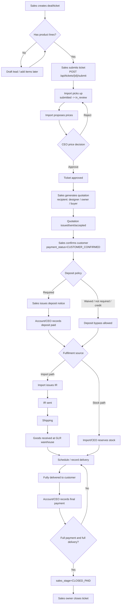

# Sales Workflow

This document describes the deal workflow as implemented after Phases 1-5. One deal is one
ticket, stored as one `sales.ticket` row. The UI presents a single journey, but the model is four
independent tracks:

- Lifecycle: whether the deal is active, paused, lost, cancelled, completed.
- Sales stage: the 14-stage commercial journey shown in the pipeline.
- Payment: customer confirmation, deposit notice, receipts, due date, and derived payment stage.
- Fulfilment: import request, shipping, stock declaration, delivery progress.

The display stage is mostly the stored `sales_stage`, with monotonic auto-advance after commercial
milestones. Auto-advance never moves a deal backward and does not run on lost/inactive deals.

## Executable Flow On `main`

The current `main` backend still uses the ticket-level pricing path. A sales owner submits the
ticket directly with `POST /api/tickets/{id}/submit`; the newer standalone pricing-request chain is
not present on this branch.

## The 14 Stages

| No. | Code | Thai label | Phase | S-map | Mode |
|---:|---|---|---:|---|---|
| 1 | `LEAD_APPROACH` | เข้าถึงเจ้าของ/ผู้ออกแบบโครงการ | 1 | S1 | Manual |
| 2 | `PRESENTATION` | นำเสนอสินค้า | 1 | S2 | Manual |
| 3 | `SPEC_APPROVED` | ผู้ออกแบบอนุมัติสเปค | 2 | S3 | Manual |
| 4 | `QUOTE_DESIGN_SIDE` | เสนอราคาผู้ออกแบบ/เจ้าของ | 2 | S4-S5 | Manual or quotation auto-advance |
| 5 | `OWNER_SIGNOFF` | เจ้าของอนุมัติสเปค | 2 | S6 | Manual |
| 6 | `AWAITING_BUYER` | รอผลประมูล / รอผู้ซื้อ | 3 | S7 | Manual |
| 7 | `QUOTE_BUYER` | เสนอราคาผู้ซื้อ/ผู้รับเหมา | 3 | S8 | Manual or buyer quotation auto-advance |
| 8 | `NEGOTIATION` | เจรจา ติดตามใบสั่งซื้อ/มัดจำ | 3 | S9 | Manual |
| 9 | `ORDER_RECEIVED` | ได้รับใบสั่งซื้อ | 4 | S10 | Auto from customer confirmation |
| 10 | `DEPOSIT_RECEIVED` | ได้รับเงินมัดจำ | 4 | S11 | Auto from deposit receipt |
| 11 | `PROCUREMENT` | จัดซื้อและนำเข้าสินค้า | 4 | S12-S17 | Auto from IR or full stock declaration |
| 12 | `DELIVERY_SCHEDULING` | นัดส่งสินค้า / นัดรับเงินส่วนที่เหลือ | 5 | S18 | Manual |
| 13 | `DELIVERED` | ส่งมอบสินค้าครบถ้วน | 5 | S19 | Auto from full delivery |
| 14 | `CLOSED_PAID` | ปิดงาน - รับเงินครบถ้วน | 5 | S20 | Auto from full payment |

## Auto-stage Rules

- `generateQuotation` creates recipient-scoped quotations and may advance to
  `QUOTE_DESIGN_SIDE` for `DESIGNER`/`OWNER`, or `QUOTE_BUYER` for `BUYER`.
- `confirmCustomer` sets `payment_status=CUSTOMER_CONFIRMED` and advances to
  `ORDER_RECEIVED`.
- `confirmDepositPaid` sets `payment_status=DEPOSIT_PAID` and advances to
  `DEPOSIT_RECEIVED`. If goods were already received, it carries payment to
  `AWAITING_FINAL_PAYMENT`.
- `issueImportRequest` sets `fulfillment_status=IR_ISSUED` and advances to `PROCUREMENT`.
- `reserveStock` with every line fully covered sets `fulfillment_status=FROM_STOCK` and advances
  to `PROCUREMENT`.
- `markGoodsReceived` sets `fulfillment_status=GOODS_RECEIVED`. It means goods reached GLR's
  warehouse, not that the customer received them.
- `recordPartialDelivery`/`completeDelivery` set `PARTIALLY_DELIVERED` or `FULLY_DELIVERED`.
  Full delivery advances to `DELIVERED`.
- `confirmFinalPayment` or a balancing `recordPayment` can set `payment_status=FULLY_PAID`.
  `CLOSED_PAID` auto-advances only after both `FULLY_PAID` and `FULLY_DELIVERED`.
- `close` changes ticket status to `closed` only after both payment and delivery gates pass.

## State Vocabularies

Lifecycle:
- `ACTIVE`: normal mutable deal.
- `ON_HOLD`: paused; most mutations are blocked, comments remain allowed.
- `DORMANT`: longer pause; resume restores `ACTIVE`.
- `CLOSED_LOST`: lost deal with a preserved stage and lost reason; can be reopened by owner.
- `CANCELLED`: operational cancellation.
- `COMPLETED`: terminal lifecycle label for completed deals.

Payment status:
- `CUSTOMER_CONFIRMED`: customer accepted commercial path.
- `DEPOSIT_NOTICE_ISSUED`: deposit notice issued.
- `DEPOSIT_PAID`: deposit received.
- `AWAITING_FINAL_PAYMENT`: goods received while only deposit is paid.
- `FULLY_PAID`: cumulative receipts cover payable amount.

Derived payment stage:
- `NOT_REQUIRED`, `DEPOSIT_PENDING`, `DEPOSIT_RECEIVED`, `PARTIALLY_PAID`,
  `BALANCE_PENDING`, `FULLY_PAID`.
- Payable precedence is latest accepted quotation by recipient preference (`BUYER`, `OWNER`, any),
  then latest issued/sent quotation, then latest issued deposit notice, then approved line prices.
- `overdue` is true when `due_date < CURRENT_DATE` and outstanding amount is positive.

Fulfilment status:
- `IR_ISSUED`, `IR_SENT`, `PICKED_UP`, `SHIPPING`, `CUSTOMS_CLEARANCE`,
  `GOODS_RECEIVED`, `FROM_STOCK`, `PARTIALLY_DELIVERED`, `FULLY_DELIVERED`.
- `PICKED_UP` and `CUSTOMS_CLEARANCE` are display vocabulary only in this branch; there are no
  mutations for them yet.

Policies:
- Tender requirement: `REQUIRED`, `NOT_REQUIRED`, `UNKNOWN`; set by deal owner roles.
- Deposit policy: `REQUIRED`, `NOT_REQUIRED`, `WAIVED`, `CREDIT_CUSTOMER`; account/CEO set the
  non-required paths with reason.
- Entry channel: `DESIGNER_LED`, `OWNER_DIRECT`, `BUYER_DIRECT`; deal owner roles set it.

Lost reasons:
- `PRODUCT_FIT`, `PRICE`, `LEAD_TIME`, `PAYMENT_TERMS`, `RELATIONSHIP`,
  `PROJECT_ON_HOLD`, `PROJECT_CANCELLED`, `ALREADY_PURCHASED`.

## Actions Matrix

| Action | Source state | Roles | Required fields | Effect |
|---|---|---|---|---|
| `SUBMIT` | `draft`, owner, has items, active | sales owner | - | `submitted` |
| `PICKUP` | `submitted`, active | import | - | `in_review` |
| `PROPOSE_PRICE` | import review statuses, active | import | items | writes proposed/approved prices, `price_proposed` |
| `APPROVE` | `price_proposed`, active | CEO | - | `approved` |
| `REJECT` | `price_proposed`, active | CEO | reason | returns to `in_review` |
| `CALCULATE_PRICES` | `price_proposed`, active | CEO | - | returns calculated breakdown |
| `OVERRIDE_ITEM_PRICE` | `price_proposed`, active | CEO | itemId, manualPrice | writes manual price and audit event |
| `GENERATE_QUOTATION` | `approved` or `quotation_issued`, owner, active | sales owner | recipientType; reason after accepted/payment | creates versioned quotation snapshot |
| `MARK_QUOTATION_SENT` | quotation `ISSUED`/`SENT`, active | sales owner or CEO | quotationId | marks quotation sent |
| `MARK_QUOTATION_ACCEPTED` | quotation `ISSUED`/`SENT`, active | sales owner or CEO | quotationId | marks quotation accepted |
| `MARK_QUOTATION_REJECTED` | quotation `ISSUED`/`SENT`, active | sales owner or CEO | quotationId | marks quotation rejected |
| `CONFIRM_CUSTOMER` | `quotation_issued`, active | sales owner | - | `CUSTOMER_CONFIRMED`, auto `ORDER_RECEIVED` |
| `ISSUE_DEPOSIT_NOTICE` | confirmed customer, deposit required | sales owner | - | creates deposit notice, `DEPOSIT_NOTICE_ISSUED` |
| `DEPOSIT_PAID` | `DEPOSIT_NOTICE_ISSUED` | account or CEO | - | `DEPOSIT_PAID`, auto `DEPOSIT_RECEIVED` |
| `RECORD_PAYMENT` | payable > 0 and not fully paid, active | account or CEO | kind, amount | inserts receipt; may set `FULLY_PAID` |
| `SET_BILLING` | visible active deal | account or CEO | dueDate | stores billing/follow-up dates |
| `WAIVE_DEPOSIT` | active | account or CEO | policy, reason | sets `WAIVED`, `NOT_REQUIRED`, or `CREDIT_CUSTOMER` |
| `ISSUE_IMPORT_REQUEST` | quotation issued and deposit ready/bypassed, no fulfilment | import or CEO | - | `IR_ISSUED`, auto `PROCUREMENT` |
| `IR_SENT` | `IR_ISSUED` | import or CEO | - | `IR_SENT` |
| `SHIPPING` | `IR_SENT` | import or CEO | - | `SHIPPING` |
| `GOODS_RECEIVED` | `SHIPPING` | import or CEO | - | `GOODS_RECEIVED`; may move deposit-paid deals to awaiting final payment |
| `RESERVE_STOCK` | active, items remain | import or CEO | lines | records manual stock declaration; full coverage sets `FROM_STOCK` |
| `RECORD_PARTIAL_DELIVERY` | goods/stock available, active | import or CEO | source, lines | inserts delivery record and updates delivered quantities |
| `COMPLETE_DELIVERY` | remaining quantity and goods/stock available | import or CEO | note | delivers the remaining quantity |
| `UPDATE_STAGE` | active, role allowed for target | sales owner, sales manager, CEO, import/account for owned stages | note for jumps/backward | updates manual stage |
| `MARK_LOST` | active owner deal | sales owner or CEO | reason | sets `CLOSED_LOST` |
| `PLACE_ON_HOLD` | active owner deal | sales owner or CEO | note | sets `ON_HOLD` |
| `MARK_DORMANT` | active/on-hold owner deal | sales owner or CEO | note | sets `DORMANT` |
| `RESUME` | `ON_HOLD`/`DORMANT` | sales owner or CEO | note | restores `ACTIVE` |
| `REOPEN` | `CLOSED_LOST` | sales owner or CEO | note | restores `ACTIVE` |
| `CANCEL` | not closed/cancelled, owner | sales owner | - | `cancelled` |
| `CLOSE` | owner; legacy `document_issued` with no payment track or full payment; dual-track `quotation_issued` with payment and delivery complete | sales owner | - | `closed` |

## The 12 Branching Cases

| # | Case | Concrete sequence |
|---:|---|---|
| 1 | Quote before spec formally approved | Sales may generate a quotation when operational status is `approved`; the stage can auto-advance to `QUOTE_DESIGN_SIDE` without forcing `SPEC_APPROVED` first. |
| 2 | Owner is also buyer | Set `entry_channel=OWNER_DIRECT`; issue/accept an `OWNER` quotation; continue to customer confirmation without a required `BUYER` quotation. |
| 3 | Buyer-direct entry | Set `entry_channel=BUYER_DIRECT`; issue/accept a `BUYER` quotation; designer-side quotation is skipped by policy, not by a new state. |
| 4 | Multiple recipients / re-quote | Generate recipient-scoped quotation chains for `DESIGNER`, `OWNER`, and/or `BUYER`; later versions supersede within the same recipient chain. |
| 5 | Deposit waived | Account/CEO sets `deposit_policy=WAIVED` with reason; import can issue IR after customer confirmation without deposit notice/payment. |
| 6 | Deposit not required | Account/CEO sets `deposit_policy=NOT_REQUIRED`; import can issue IR through the same bypass path. |
| 7 | Product fully in stock | Import/CEO reserves stock for all lines; as built this sets `FROM_STOCK` and `PROCUREMENT`, with no IR required. Note: an earlier handoff phrase said `GOODS_RECEIVED`; code uses `FROM_STOCK`. |
| 8 | Partial stock / partial delivery | Reserve stock for covered quantities, deliver stock first if needed, then warehouse remainder after goods are available; status moves `PARTIALLY_DELIVERED` to `FULLY_DELIVERED`. |
| 9 | Pay in full before delivery | Account/CEO records balance/full payment before delivery; payment becomes `FULLY_PAID`, but `close` still waits for delivery complete. |
| 10 | Credit customer | Account/CEO sets `CREDIT_CUSTOMER` and billing due date; overdue is derived from due date plus outstanding amount; close remains blocked while outstanding is positive. |
| 11 | Quotation amendment after acceptance | Generate a new quotation version with amendment reason; issued snapshots remain immutable. |
| 12 | On hold / dormant then resumed | Owner places deal on hold or dormant; active mutations are blocked; resume restores `ACTIVE` at the preserved stage. |

## S1-S20 Cross-reference

| Legacy | New model |
|---|---|
| S1 | `LEAD_APPROACH` |
| S2 | `PRESENTATION` |
| S3 | `SPEC_APPROVED` |
| S4 | `QUOTE_DESIGN_SIDE`; designer/owner quotation generated |
| S5 | `QUOTE_DESIGN_SIDE`; quotation sent/issued aliases are quotation doc states |
| S6 | `OWNER_SIGNOFF` |
| S7 | `AWAITING_BUYER` |
| S8 | `QUOTE_BUYER`; buyer quotation generated/sent/accepted |
| S9 | `NEGOTIATION` |
| S10 | `ORDER_RECEIVED`; auto from `CUSTOMER_CONFIRMED` |
| S11 | `DEPOSIT_RECEIVED`; auto from deposit paid |
| S12 | `PROCUREMENT`; IR issued or full stock declaration |
| S13 | `IR_SENT`; fulfilment substate under `PROCUREMENT` |
| S14 | `PICKED_UP`; vocabulary only, no mutation yet |
| S15 | `SHIPPING`; fulfilment substate under `PROCUREMENT` |
| S16 | `CUSTOMS_CLEARANCE`; vocabulary only, no mutation yet |
| S17 | `GOODS_RECEIVED`; goods arrived at GLR warehouse |
| S18 | `DELIVERY_SCHEDULING`; manual stage |
| S19 | `DELIVERED`; auto from `FULLY_DELIVERED` |
| S20 | `CLOSED_PAID`; auto only when `FULLY_PAID` and `FULLY_DELIVERED`; ticket close still runs the close gate |

Aliases: `SENT` and `ISSUED` are document statuses, not separate sales stages. `GOODS_RECEIVED`
is warehouse arrival; customer delivery is represented by delivery records and
`FULLY_DELIVERED`.

## Close, Lost, And Cancel Semantics

Close has two paths:
- Legacy document path: `status=document_issued` may close if payment status is null or
  `FULLY_PAID`.
- Dual-track path: `status=quotation_issued`, `payment_status=FULLY_PAID`, and delivery complete.

Delivery complete means `FULLY_DELIVERED`, or `GOODS_RECEIVED` only for coarse legacy deals that
have no delivery records. If a deal has delivery records, it must reach `FULLY_DELIVERED`.

Lost and cancelled are different:
- `CLOSED_LOST` preserves the sales stage and stores a lost reason; owners can reopen.
- `cancelled` is an operational terminal ticket status.
- `COMPLETED` exists as lifecycle vocabulary, while ticket closing is represented by
  `status=closed`.
