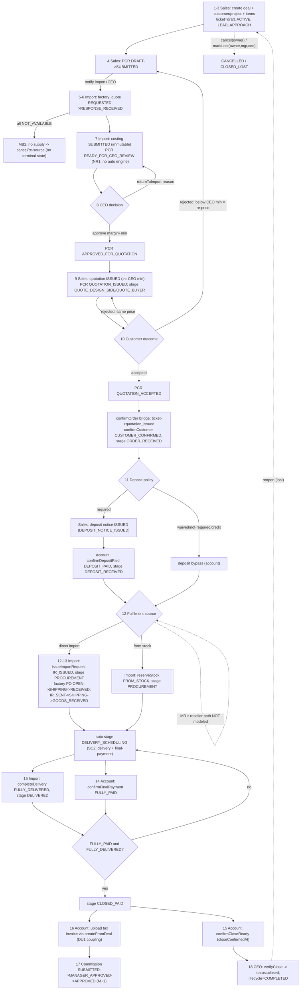

# Sales Lifecycle Deep Review (Step 2.2)

An independent review of the proposed Phase-2 ticket/deal architecture
([TICKET_INFORMATION_ARCHITECTURE](TICKET_INFORMATION_ARCHITECTURE.md),
[ROLE_HANDOFF_MAP](ROLE_HANDOFF_MAP.md), [WORK_STATE_MODEL](WORK_STATE_MODEL.md)) across the
full 18-stage sales lifecycle, cross-checked against the actual routes, permissions,
statuses, stages, documents, role-scoped pages, and the existing workflow diagram at
[`../../sales-workflow.md`](../../sales-workflow.md).

**No production code written.** Recommended backend changes are labelled **[OUT OF SCOPE —
backend]**. The state machine below uses **existing backend names only** — no new states
invented.

## Reconciliation basis

- The existing diagram `docs/sales-workflow.md` is the authoritative as-built reference; this
  review aligns with it and uses its names.
- **Defect found in the existing diagram (not a Phase-2 doc, so flagged not edited):** its
  "Actions Matrix" (`sales-workflow.md:151-184`) still lists the **deprecated** ticket-level
  pricing loop (`SUBMIT`, `PICKUP`, `PROPOSE_PRICE`, `APPROVE`, `REJECT`, `CALCULATE_PRICES`,
  `OVERRIDE_ITEM_PRICE`, `GENERATE_QUOTATION`, `MARK_QUOTATION_*`) as if live, while the same
  doc's intro and Mermaid correctly describe the PCR chain and note those endpoints hard-409.
  → **Recommendation:** reconcile that table to the PCR chain (owner of `sales-workflow.md`;
  out of Phase-2-doc scope). The Phase-2 IA already follows the PCR chain, not the stale table.

---

## Lifecycle table (18 stages)

Backend names: `DealStage` (stage), `TicketStatus` (status), `paymentStatus` (string),
`FulfilmentStatus`, `PricingRequestStatus` (PCR). R=responsible, S=supporting.

| # | Stage (backend) | R | S | Manual/Auto | Status/stage effect | Return | Cancel | Next-action message | Notification |
|---|---|---|---|---|---|---|---|---|---|
| 1 | create → `draft`,`ACTIVE`,`LEAD_APPROACH` | sales | — | Manual | ticket `draft` | — | `cancel` (owner) | "ดำเนินการดีล / บันทึกกิจกรรม" | — |
| 2 | customer & project | sales | — | Manual | (deal fields) | — | (part of create) | "เลือก/สร้างลูกค้า+โครงการ" | — |
| 3 | items (`ticket_item`) | sales | — | Manual | (lines) | — | — | "เพิ่มรายการสินค้า" | — |
| 4 | PCR `DRAFT`→`SUBMITTED` | sales(owner) | import | Manual | PCR submitted | `MORE_INFO_REQUIRED` | PCR `cancel` (owner/CEO) | "ส่งใบขอราคา" | → import + CEO |
| 5 | factory quote `REQUESTED`→`RESPONSE_RECEIVED` | import | — | Manual | factory_quote | supersede/revise | quote `CANCELLED` | "ติดต่อโรงงาน / บันทึกราคา" | → CEO |
| 6 | factory `READY_FOR_COSTING`; PCR `AWAITING_FACTORY_RESPONSE`/`COSTING_IN_PROGRESS` | import | — | Manual | costing draft | `NOT_AVAILABLE`→re-source | quote `CANCELLED` | "สร้างต้นทุน (landed cost)" | → CEO |
| 7 | **costing submit** → PCR `READY_FOR_CEO_REVIEW` *(NOT an auto "system price calc")* | import | — | Manual | costing `SUBMITTED` (immutable) | (CEO returns) | — | "ส่งต้นทุนให้ CEO" | → CEO |
| 8 | CEO decision → `APPROVED_FOR_QUOTATION` or `COSTING_REVISION_REQUIRED` | ceo | — | Manual | decision `APPROVED`/`RETURNED` | `returnToImport`→`COSTING_IN_PROGRESS` | PCR `cancel` (CEO) | "อนุมัติราคา / ส่งกลับ" | approve→rep; return→import |
| 9 | quotation `create`/`issue` → PCR `QUOTATION_ISSUED`; stage `QUOTE_DESIGN_SIDE`/`QUOTE_BUYER` | sales(owner) | — | Manual→Auto(stage) | quotation `ISSUED` | `createRevision` | quotation `cancel`(draft) | "ออกใบเสนอราคา" | → CEO |
| 10 | `recordOutcome` ACCEPTED→PCR `QUOTATION_ACCEPTED` | sales(owner) | — | Manual | quotation `ACCEPTED`/`REJECTED`/`EXPIRED` | REJECTED→re-quote/**re-price** | (mark lost) | "บันทึกผลจากลูกค้า" | → CEO |
| 11 | deposit: `issue`(sales)→`DEPOSIT_NOTICE_ISSUED`; `confirmDepositPaid`(account)→`DEPOSIT_PAID`,stage `DEPOSIT_RECEIVED` | account | sales(doc) | Manual→Auto(stage) | paymentStatus; stage | `requestRevision` (deposit) | waive/policy bypass | "ออกใบแจ้งมัดจำ" / "ยืนยันรับมัดจำ" | deposit events |
| 12 | `issueImportRequest`→`IR_ISSUED`,stage `PROCUREMENT`; factory PO `OPEN` | import | ceo | Manual→Auto(stage) | fulfilment; PO | PO `cancel` | markLost cascades PCR | "เปิดใบสั่งซื้อ/นำเข้า" | PO→CEO |
| 13 | `IR_SENT`→`SHIPPING`→`GOODS_RECEIVED`/`FROM_STOCK`; auto→`DELIVERY_SCHEDULING` | import | ceo | Manual→Auto(stage) | fulfilment | — | — | "อัปเดตการนำเข้า/รับสินค้า" | fulfilment events |
| 14 | `confirmFinalPayment`→`FULLY_PAID` | account | ceo | Manual→Auto(stage) | paymentStatus | (adjust payment) | — | "รับชำระส่วนที่เหลือ" | payment events |
| 15 | `completeDelivery`→`FULLY_DELIVERED`,stage `DELIVERED`; `confirmCloseReady`(account) | import+account | — | Manual | fulfilment; `closeConfirmedAt` | `revokeCloseConfirmation` | — | "ส่งมอบครบ" / "ยืนยันพร้อมปิดงาน" | close events |
| 16 | tax invoice **uploaded** (account via `createFromDeal`) | account | — | Manual | `INVOICE` attachment | — | — | "บันทึกใบกำกับ" | — |
| 17 | commission `SUBMITTED`→`MANAGER_APPROVED`→`APPROVED` | account→sm→ceo | — | Manual (dual) | commission status | `reject`(reason) | `VOID`/clawback | "อนุมัติค่าคอม" | commission events |
| 18 | `verifyClose`(CEO)→`status=closed`,`COMPLETED`; or `cancel`/`markLost` | ceo | account | Manual | terminal | reopen (lost) | `cancel`(owner)/`markLost` | "ตรวจและปิดงาน" | close events |

Full 16-attribute detail per stage follows.

---

## Per-stage detail (16 attributes each)

Fields: **R**esponsible · **S**upporting · **Data** · **Docs** · **Entry** · **Exit** ·
**Manual** · **Auto** · **Status effect** · **Return** · **Cancel** · **Blocker (user-visible)**
· **Next-action msg** · **Notification** · **Audit** · **Mobile**.

**1 · Lead/deal creation** — R sales · S — · Data customer/project/≥1 line (progressive) ·
Docs none · Entry role=sales · Exit deal exists `draft`/`ACTIVE`/`LEAD_APPROACH` · Manual
`create` · Auto — · Status `draft` · Return — · Cancel `cancel`(owner) · Blocker unlinked-user
seed must degrade quietly (F-16) · Msg "สร้างดีล" · Notif — · Audit create event · Mobile
**yes** (create on phone → dedicated flow, CREATE_TICKET_FLOW).

**2 · Customer & project** — R sales · Data customer (search/create), project, contact ·
Docs — · Entry inside create/edit · Exit customer+project set · Manual select/create-inline ·
Status — · Cancel part of deal cancel · Blocker none · Msg "เลือก/สร้างลูกค้า" · Mobile yes.

**3 · Product/item** — R sales · Data ≥1 `ticket_item` (catalog **or** provisional/non-catalog;
partial specs allowed) · Entry deal exists · Exit ≥1 line · Manual add lines · Blocker catalog
snapshot only mandatory at **PCR-submit**, not here · Msg "เพิ่มรายการสินค้า" · Mobile yes.

**4 · Pricing request** — R sales(owner) · S import · Data recipient(DESIGNER/OWNER/BUYER),
quantityType, unit-basis, catalog-snapshot lines · Docs optional spec attachment (DRAFT/
`MORE_INFO_REQUIRED` only) · Entry deal `ACTIVE`, PCR `DRAFT` · Exit PCR `SUBMITTED` · Manual
`createDraft`→`submit` · Status PCR submitted · Return `MORE_INFO_REQUIRED` · Cancel PCR
`cancel`(owner **or CEO**) · Blocker missing catalog snapshot/recipient · Msg "ส่งใบขอราคา" ·
Notif import+CEO · Audit PCR status · Mobile partial (draft on phone; heavy build desktop).

**5 · Factory contact** — R import · Data factory selection, request · Docs factory-quote
attachments · Entry PCR `IMPORT_REVIEWING` · Exit factory quote `REQUESTED`/sent · Manual
`generateDrafts`/`send` · Auto async dispatch worker · Status factory_quote · Return supersede/
revise · Cancel quote `CANCELLED` · Blocker — · Msg "ติดต่อโรงงาน" · Notif CEO · Audit quote
status · Mobile no (desktop).

**6 · Factory price response** — R import · Data factory prices, lead time · Entry quote
`REQUESTED` · Exit `RESPONSE_RECEIVED`→`READY_FOR_COSTING`; first response moves PCR→
`AWAITING_FACTORY_RESPONSE` · Manual `receive`/`markReadyForCosting`/`markNotAvailable` ·
Status factory_quote · Return `NEGOTIATING`; **`NOT_AVAILABLE`** (all factories → no supply,
see MB2) · Cancel quote `CANCELLED` · Blocker — · Msg "บันทึกราคาโรงงาน" · Notif CEO · Mobile
plausible (record a number from the floor).

**7 · "System price calculation"** — **R import (there is NO automatic system step — see NR1).**
Data landed-cost inputs (goods+freight+insurance+duty+inland, FX) · Entry factory response in ·
Exit costing `CALCULATED`→`submit`→PCR `READY_FOR_CEO_REVIEW`, costing `SUBMITTED` (immutable) ·
Manual `createDraft`/`recalculate`/`submit` · Auto — · Status PCR review-ready · Return CEO
returns · Cancel — · Blocker every item must be costed · Msg "สร้าง & ส่งต้นทุน" · Notif CEO ·
Audit costing status + freeze · Mobile no (desktop costing).

**8 · CEO price approval** — R ceo · Data per-item margin+minimum · Entry PCR
`READY_FOR_CEO_REVIEW`; `startReview`→`CEO_REVIEWING` (freezes costing) · Exit `approve`→
`APPROVED_FOR_QUOTATION`+decision `APPROVED`; **or** `returnToImport`(reason)→
`COSTING_REVISION_REQUIRED` · Manual startReview/update/approve/return · Auto approve recomputes
selling price · Status PCR/decision · Return `returnToImport`→`COSTING_IN_PROGRESS` (the one
reopen path) · Cancel PCR `cancel`(CEO override) · Blocker every item needs margin+min · Msg
"อนุมัติราคา / ส่งกลับให้แก้ไข" · Notif approve→rep, return→import · Audit decision + margin
snapshot · Mobile **yes for approve**, desktop for margin entry.

**9 · Quotation generation** — R sales(owner) · Data approved sales-view lines, optional
discount (≥ CEO minimum, else 422) · Docs customer quotation PDF/XLSX (system-generated on
`issue`) · Entry PCR `APPROVED_FOR_QUOTATION` + current `APPROVED` decision · Exit quotation
`ISSUED`; **first** issue→PCR `QUOTATION_ISSUED` + auto stage `QUOTE_DESIGN_SIDE`/`QUOTE_BUYER` ·
Manual `create`/`update`/`issue` · Auto stage advance on first issue · Status quotation/PCR/stage ·
Return `createRevision` · Cancel cancel(draft) · Blocker **disabled until CEO approves — show
WHY** (DA1) · Msg "ออกใบเสนอราคา" · Notif CEO · Audit quotation status · Mobile partial.

**10 · Customer response** — R sales(owner) · Data outcome + note · Entry quotation `ISSUED` ·
Exit ACCEPTED→PCR `QUOTATION_ACCEPTED`; REJECTED/REVISION_REQUESTED **do not change PCR**;
EXPIRED via sweep · Manual `recordOutcome` · Auto expiry worker · Status quotation · Return
REJECTED→re-quote (`createRevision`) **or re-price** (new PCR via `createCustomerChangeRevision`
— see IR1) · Cancel markLost(reason) · Blocker — · Msg "บันทึกผลจากลูกค้า" · Notif CEO · Audit
outcome+note · Mobile yes.

**11 · Deposit** — R **account** (confirm) · S **sales(owner)** (issue doc) · Data deposit %
(def 0.50), items · Docs deposit notice PDF/XLSX (system, on sales `issue`) · Entry
`status=quotation_issued`+`CUSTOMER_CONFIRMED` (via order-confirmation bridge) · Exit
`DEPOSIT_NOTICE_ISSUED`→(account)`confirmDepositPaid`→`DEPOSIT_PAID`, auto stage
`DEPOSIT_RECEIVED` · Manual issue(sales)/confirm(account) · Auto stage advance · Status
paymentStatus · Return deposit `requestRevision` (QTY/PRICE/NEW_ITEM) · Cancel `waiveDeposit`/
policy bypass (account) · Blocker import denied deposit reads; import's next step gated on this
(B-08, no notification) · Msg sales:"ออกใบแจ้งมัดจำ" · account:"ยืนยันรับมัดจำ" · Notif deposit
events (no role broadcast) · Audit `DEPOSIT_NOTICE_ISSUED`/`DEPOSIT_PAID` · Mobile confirm=yes.

**12 · Procurement** — R import · S ceo · Data (PO) factory, frozen costing items · Docs
supplier proforma (recorded) · Entry `issueImportRequest`: `status=quotation_issued`+deposit
ready/bypassed+fulfilment null; factory PO needs PCR `QUOTATION_ACCEPTED`+stage `PROCUREMENT` ·
Exit `IR_ISSUED`, auto stage `PROCUREMENT`; PO `OPEN` · Manual issueImportRequest/createPO ·
Auto stage advance · Status fulfilment; PO · Return PO `cancel` · Cancel markLost cascades PCR ·
Blocker **IR disabled until deposit confirmed — show WHY** (DA2); import not notified deposit
paid (B-08) · Msg "เปิดใบสั่งซื้อ/นำเข้า" · Notif PO→CEO · Audit fulfilment/PO · Mobile
plausible (issue from floor). **⚠ combines subflows — SC1.**

**13 · Import/fulfilment** — R import · S ceo · Data shipping (container/etd/eta — free text),
receipt qty + `qc_note` (free text) · Entry `IR_ISSUED` · Exit `IR_SENT`→`SHIPPING`→
`GOODS_RECEIVED`(warehouse arrival, **not** customer delivery — CS3) **or** `FROM_STOCK`; auto
stage `DELIVERY_SCHEDULING` · Manual markIrSent/markShipping/markGoodsReceived/reserveStock ·
Auto stage advance; `GOODS_RECEIVED` on a deposit-paid deal → `AWAITING_FINAL_PAYMENT` · Status
fulfilment · Return — · Cancel — · Blocker no QC gate (only free-text note — MB1/OUT-OF-SCOPE) ·
Msg "อัปเดตการนำเข้า/รับสินค้า" · Notif fulfilment events · Audit fulfilment status · Mobile
**yes** (floor updates). **⚠ combines S12–S17 — SC1.** `PICKED_UP`/`CUSTOMS_CLEARANCE` are
display-only vocabulary (no mutation).

**14 · Remaining payment** — R **account** · S ceo · Data payment kind/amount · Entry
`AWAITING_FINAL_PAYMENT`/`DEPOSIT_PAID`/bypass · Exit `confirmFinalPayment`→`FULLY_PAID` (if
outstanding≤0) · Manual `confirmFinalPayment`/`recordPayment` · Auto `maybeAdvanceClosedPaid`
(if also fully delivered→`CLOSED_PAID`) · Status paymentStatus · Return adjustment payment ·
Cancel — · Blocker overdue = computed flag, **no push** (D-09) · Msg "รับชำระส่วนที่เหลือ" /
"ติดตามชำระ"(overdue) · Notif payment events · Audit payment records · Mobile confirm=yes.

**15 · Delivery / close-ready** — R **import** (deliver) + **account** (confirm-ready) · Data
delivery lines; close prereqs · Entry goods available; prereqs met · Exit `completeDelivery`→
`FULLY_DELIVERED`,stage `DELIVERED`; `confirmCloseReady`(account)→`closeConfirmedAt` · Manual
completeDelivery(import)/confirmCloseReady(account) · Auto stage `DELIVERED` · Status fulfilment;
close-confirm · Return `revokeCloseConfirmation`(account/CEO) · Cancel — · Blocker close-ready
**disabled until fully-paid+fully-delivered+invoice-on-file — show WHICH is missing** (DA3) ·
Msg import:"ส่งมอบครบ" · account:"ยืนยันพร้อมปิดงาน" · Notif close events · Audit
`CLOSE_CONFIRMED` · Mobile deliver=yes. **⚠ stage `DELIVERY_SCHEDULING` combines delivery +
final-payment-collection — SC2; ambiguous owner — AO1.**

**16 · Invoice** — R **account** · Data tax-invoice file · Docs **uploaded** tax invoice
(ใบกำกับภาษี — external, not generated) · Entry deal `salesStage=CLOSED_PAID` · Exit `INVOICE`
attachment on file (satisfies close gate) · Manual `createFromDeal` (upload doubles the invoice
into commission + close-gate) · Auto — · Status attachment · Return — · Cancel — · Blocker
**invoice upload is coupled to commission creation — no standalone upload** (DU1) · Msg
"บันทึกใบกำกับ + ออกค่าคอม" · Notif — · Audit attachment · Mobile file-upload=plausible.

**17 · Commission** — R account(create)→sales_manager(hop1)→ceo(hop2) · Data invoice, gross
(def payable), rep=`createdById` · Docs tax invoice (required) · Entry `CLOSED_PAID` · Exit
`SUBMITTED`→`MANAGER_APPROVED`→`APPROVED`; pays **M+1** · Manual createFromDeal/managerApprove/
ceoApprove · Auto — · Status commission · Return `reject`(reason) at either hop · Cancel `VOID`/
`createClawback` · Blocker duplicate guard; account has **no list access** (deep-link only) ·
Msg "อนุมัติค่าคอม" · Notif submitted/pending-manager/pending-ceo/approved/rejected · Audit
commission status + approver ids · Mobile approve=yes. **⚠ two-hop — D-08.**

**18 · Closure / cancellation** — R **ceo** (verify-close) · S account (confirm-ready) · Entry
`closeConfirmedAt` set + prereqs re-checked · Exit `verifyClose`→`status=closed`+`COMPLETED` ·
Manual verifyClose(CEO)/cancel(owner)/markLost(owner/mgr/ceo) · Auto — · Status terminal ·
Return **reopen** (from `CLOSED_LOST`, owner/mgr/ceo) · Cancel `cancel`(owner-only)/`markLost`
(reason) · Blocker two-signature — CEO re-checks prereqs · Msg "ตรวจและปิดงาน" · Notif
`CLOSED` event · Audit `CLOSED`/`CANCELLED`, two distinct actors · Mobile verify=yes.
**⚠ two-signature — D-08.**

---

## Findings (the 11 required classes)

### Missing branches
- **MB1 · Only 2 of 3 sourcing paths modeled.** Direct-import + from-stock exist; "buy from
  another importer/reseller" is not (`sales-workflow.md:66-68`). The deal IA must not imply a
  third path exists. **[OUT OF SCOPE — backend]** to add; IA records it as a known limit.
- **MB2 · No "no supply" terminal.** If every factory quote is `NOT_AVAILABLE`, costing can't
  proceed and there is no explicit PCR outcome except `cancel`. The IA should surface a clear
  "no factory can supply → cancel/re-source" path; a dedicated terminal is **[OUT OF SCOPE —
  backend]**.
- **MB3 · Price-driven rejection loops further than the diagram shows.** The existing diagram
  loops "Rejected → re-quote → quotation" (same approved price). A rejection *on price below the
  CEO minimum* cannot be met by `createRevision` (floor = CEO min); it needs a new pricing cycle
  (`createCustomerChangeRevision` → new PCR → re-cost → re-approve). The IA/Pricing tab must make
  the two distinct return paths visible (re-quote vs re-price).

### Ambiguous ownership
- **AO1 · `DELIVERY_SCHEDULING`/`DELIVERED` — sales-settable, import-driven.** Both are in
  `SALES_TARGET_STAGES` (sales can manually set) yet the delivery actions that auto-advance them
  are `FULFILMENT_ROLES={import,ceo}`, and the stage's own label names a *third* role's job
  ("นัดรับเงินส่วนที่เหลือ" = account). Three roles in one stage. The IA must show per-role
  next-actions here, not a single "owner."
- **AO2 · Deposit: document owner ≠ money owner.** Sales issues the deposit-notice document;
  account confirms the money. Correct, but the UI must attribute each half to the right role.
- **AO3 · Implicit unblock (B-08).** Account's deposit confirmation unblocks import's
  `issueImportRequest`, with **no notification** — import learns only by looking. The procurement
  worklist must surface "deposit paid — ready to issue IR."

### Conflicting status meanings
- **CS1 · Name collisions across axes.** `DEPOSIT_RECEIVED` is both a `DealStage` and a
  `PaymentStage`; `FULLY_PAID` is both a `paymentStatus` string and a `PaymentStage`. The UI must
  never show a raw enum name without its axis, or users conflate "stage" with "payment."
- **CS2 · `ticket.status=quotation_issued` is semantically stretched.** It persists from
  order-confirmation through delivery to just-before-close — it no longer means "a quotation was
  issued." UI must **never key work-state off `ticket.status`** (see MS1).
- **CS3 · `GOODS_RECEIVED` ≠ delivered.** It means warehouse arrival at GLR, not customer
  delivery (`sales-workflow.md:101-102`). A label reading "received" as "delivered" would be
  wrong; the Fulfilment tab must distinguish warehouse-in from customer-delivered.

### Impossible / non-obvious return paths
- **IR1 · Re-price after acceptance is heavy and hidden.** Once accepted/priced, a genuine price
  change needs `createCustomerChangeRevision` (supersede → new PCR). Quotation "amendment after
  acceptance" (branching case 11) only re-versions at the same price basis. Not impossible, but
  the path to *re-open pricing* is non-obvious — the Pricing tab should expose it explicitly.
- **IR2 · Rejected quotation leaves PCR at `QUOTATION_ISSUED`.** REJECTED/REVISION_REQUESTED do
  not change PCR status, so a rejected quotation's PCR looks identical to an awaiting-outcome one
  — the work-state must disambiguate via the quotation doc status (see MS2), not the PCR status.

### Actions with no responsible role
- **NR1 · Stage 7 "system price calculation" has no automatic actor.** There is no auto pricing
  engine (`calculatePrices` deprecated). "The system applies pricing logic" = manual import
  costing + manual CEO margin. The IA must not render a "system calculates price" step; it is two
  human steps (import cost → CEO margin). **Corrected in the lifecycle table (stage 7 = import).**

### Documents with no uploader
- **DU1 · Tax-invoice upload is coupled to commission creation.** The only path to put the
  invoice on file is account's `createFromDeal` — there is no standalone "upload tax invoice"
  action. A deal that needs its invoice on file but no commission yet has no clean uploader. The
  IA's Documents tab should note this coupling; decoupling is **[OUT OF SCOPE — backend]**.

### Generated documents with no trigger
- **GD1 · Remaining-invoice XLSX has no lifecycle.** It's generated on-demand (`getRemainingInvoiceXlsx`)
  with no "issued/sent" status, no number lifecycle, and no notification — unlike the deposit
  notice and quotation. The Documents tab should treat it as an ad-hoc download, not a tracked
  document; giving it a lifecycle is **[OUT OF SCOPE — backend]**. (No orphan *auto*-generated
  doc was found — every generated doc has an explicit trigger.)

### Disabled actions with no explanation
- **DA1 · "ออกใบเสนอราคา"** disabled until PCR `APPROVED_FOR_QUOTATION` — must show "รอ CEO
  อนุมัติราคา." **DA2 · "เปิดใบสั่งซื้อ/นำเข้า"** disabled until deposit confirmed — must show
  "รอยืนยันมัดจำ." **DA3 · "ยืนยันพร้อมปิดงาน"** disabled until fully-paid + fully-delivered +
  invoice-on-file — must show *which* prerequisite is missing. All three are the audit's WHY gap;
  the action bar (TICKET_IA) already requires disabled-with-reason — these are the concrete cases.

### Stages combining independent subflows
- **SC1 · `PROCUREMENT`** spans S12–S17 (IR issue → sent → shipping → customs → goods received)
  **plus** factory-PO management **plus** stock reservation — several independent subflows under
  one stage label. The Fulfilment tab must expose the sub-status, not just the stage.
- **SC2 · `DELIVERY_SCHEDULING`** literally combines two subflows in its label
  ("นัดส่งสินค้า / นัดรับเงินส่วนที่เหลือ") owned by different roles (import delivery + account
  final payment). Split them in the UI.
- **SC3 · `QUOTE_DESIGN_SIDE`** folds doc generation + send (S4–S5). Minor.

### One backend status → many UX work-states
- **MS1 · `ticket.status=quotation_issued`** maps to ≥6 distinct work-states across 3 roles
  (awaiting deposit / in procurement / awaiting delivery / awaiting final payment / close-ready /
  awaiting verify-close). **This validates WORK_STATE_MODEL's rule: compute work-state from
  `salesStage`+`paymentStatus`+`fulfilmentStatus`+viewer, never from `ticket.status`.**
- **MS2 · PCR `QUOTATION_ISSUED`** maps to both "awaiting customer" and "rejected — needs
  re-quote" (rejection doesn't change it). Disambiguate via the quotation doc status.

### Confidential cost / salary exposure risk
- **CF1 · Cost/margin must be import+ceo only.** `RAW_DECISION_ROLES={import,ceo}`,
  `RAW_QUOTE_ROLES={import,ceo}`; sales **and sales_manager** get `salesView` (approved selling
  price only, **no cost, no margin, no factory raw price**). **Correction applied to TICKET_IA:**
  the Pricing tab's cost/margin/factory-quote **sub-sections are import+ceo only**; the broader
  viewer set sees only the approved-price summary. A single "Pricing tab visible to sales_manager"
  line must not be read as cost visibility.
- **CF2 · Salary/PII** never appears on the deal (HR-only employee record) — no leak vector on
  the ticket. Keep the two record types' sensitive surfaces separate (TICKET_IA already states).
- **CF3 · Factory raw prices** (RAW_QUOTE_ROLES) must not reach sales — the factory-quote
  sub-section of the Pricing tab is import+ceo only.

---

## Mermaid — lifecycle with roles & backend names

*Note: `ticket.status=quotation_issued` (set at the confirmOrder bridge) persists from node J
through node Z — do not read it as the work-state (MS1/CS2).*

---

## Out-of-scope backend recommendations (labelled, not for this effort)

1. **[OUT OF SCOPE — backend]** Add the 3rd sourcing path (buy-from-reseller) and a real QC
   inspection gate before delivery (today only a free-text `qc_note`) — long-standing deferred
   work.
2. **[OUT OF SCOPE — backend]** A "no factory supply" terminal for a PCR where all quotes are
   `NOT_AVAILABLE` (MB2).
3. **[OUT OF SCOPE — backend]** Decouple tax-invoice upload from commission creation (DU1), or
   give the remaining-invoice a document lifecycle (GD1).
4. **[OUT OF SCOPE — backend]** Push notifications for account (deposit-ready, overdue) and the
   implicit deposit→procurement unblock (B-08/AO3) — today pull-only.
5. **[OUT OF SCOPE — doc]** Reconcile `docs/sales-workflow.md`'s stale Actions Matrix to the PCR
   chain.

None of these blocks Phase 3; all are recorded for their owning workflow.

---

## Verdict

**CONDITIONAL PASS — Phase 3 may begin**, provided the following Phase-2 doc corrections (all
applied in this review, see the change list) are carried into the design foundation:

1. **Work-state is computed from stage+payment+fulfilment+viewer, never from `ticket.status`**
   (MS1/CS2) — already the WORK_STATE_MODEL rule; reinforced.
2. **Cost/margin/factory-raw-price are import+ceo only** (CF1/CF3) — TICKET_IA tightened so the
   Pricing tab's cost sub-sections are not readable by sales/sales_manager.
3. **Ambiguous-ownership stages show per-role next-actions** (AO1/SC2 for `DELIVERY_SCHEDULING`;
   SC1 for `PROCUREMENT`) — TICKET_IA/landing note added.
4. **Disabled actions show WHY** for the three concrete gates (DA1/DA2/DA3).
5. **Two distinct return paths** (re-quote vs re-price, MB3/IR1) and **rejected-quotation
   disambiguation** (MS2/IR2) are visible in the Pricing tab.

These are documentation refinements, not architecture failures — the Phase-2 model is sound and
consistent with the code and the existing diagram. The remaining gaps (MB1/MB2/DU1/GD1/AO3) are
**backend limitations correctly recorded as out-of-scope**, not IA defects. No BLOCK-level issue
(no impossible core path, no unroutable action in the live chain, no confidential-data leak in
the proposed IA once CF1 is applied).
